# FlowIA Master Engine — Fonte da Verdade

> **Este documento é a fonte canônica do projeto.** Em caso de divergência com outros arquivos em `docs/`, prevalece o `CLAUDE.md`.
>
> **Produto ativo:** MVP salão (`PRODUCT_LINE=salon`) · **Versão API:** 1.2.0 · **Última revisão doc:** Jun/2026 (doc v1.28)
>
> **Escopo de implementação:** Partes I–VII descrevem o **MVP ativo**. A [Parte VIII — Futuras implementações](#parte-viii--futuras-implementações-não-mvp) é **somente visão estratégica** — agentes e devs **não devem implementar** sem pedido explícito do usuário.

---

## Índice

- [Parte I — Visão e negócio](#parte-i--visão-e-negócio) — MVP ativo
- [Parte II — Arquitetura técnica](#parte-ii--arquitetura-técnica)
- [Parte III — Segurança e governança](#parte-iii--segurança-e-governança)
- [Parte IV — Motor de IA](#parte-iv--motor-de-ia)
- [Parte V — Frontend](#parte-v--frontend)
- [Parte VI — Operações](#parte-vi--operações)
- [Parte VII — Desenvolvimento e governança](#parte-vii--desenvolvimento-e-governança)
- [**Parte VIII — Futuras implementações (NÃO MVP)**](#parte-viii--futuras-implementações-não-mvp) — **não implementar sem aprovação**

---

# Parte I — Visão e negócio

## 1. Identidade do produto

**FlowIA Master Engine** é uma plataforma SaaS multi-tenant B2B para gestão inteligente de salões de beleza. Combina:

- **Dashboard administrativo** — agenda, clientes, catálogo de serviços
- **Assistente conversacional** — WhatsApp e chat de teste, powered by LangGraph + OpenAI
- **Base de conhecimento (RAG)** — pipeline Medallion Bronze → Silver → Gold com busca semântica

**Proposta de valor:** automatizar recepção, agendamento e suporte via IA, com isolamento rigoroso por salão (tenant), operação white-label por organização e credenciais WhatsApp próprias por cliente. O MVP cobre recepção, agenda e RAG. Visões pós-MVP (ex.: jornada completa pré→durante→pós-atendimento) ficam isoladas na [**Parte VIII**](#parte-viii--futuras-implementações-não-mvp).

**Modelo comercial:** cada cliente é uma `organization` no banco. Um codebase, um Supabase, N tenants isolados por `organization_id` + Row Level Security (RLS).

## 2. Modelo multi-tenant: plataforma vs produto

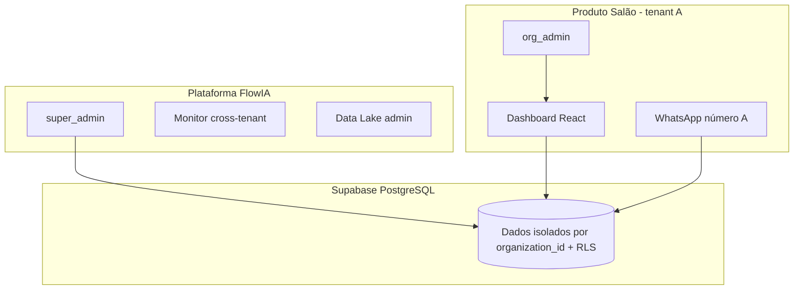

| Camada | Quem usa | Escopo de dados |
|--------|----------|-----------------|
| **Produto** | Dono/funcionário do salão + clientes via WhatsApp | Apenas dados da própria organização |
| **Plataforma** | Equipe FlowIA (`super_admin`) | Cross-tenant para operação, BI e dev |

**Princípios:**

- 1 codebase, 1 banco Supabase, N clientes
- Isolamento por `organization_id` em toda query de negócio
- `super_admin` pode operar cross-tenant; `org_admin` não pode trocar tenant
- Credenciais WhatsApp por org: `organizations.whatsapp_phone_id`, `whatsapp_access_token`

### Ambiente vs cliente (não confundir)

| Conceito | O que é | Escala 200+ salões |
|----------|---------|-------------------|
| **Ambiente** | dev / staging / **prod FlowIA** (Render + Supabase prod) | Poucos ambientes |
| **Cliente (salão)** | 1 row em `organizations` + dados com `organization_id` | **N orgs**, mesmo Render/Supabase |
| **Isolamento** | RLS + JWT + `validated_tenant_context` | **RLS permanece** — não remove ao crescer |

**Padrão comercial:** 1 Render + 1 Supabase prod + N organizations. **Enterprise:** Supabase dedicado por contrato — [`docs/TENANCY_AND_SCALE.md`](docs/TENANCY_AND_SCALE.md).

## 3. Personas e RBAC

| Persona | Role JWT | O que vê |
|---------|----------|----------|
| Dono / recepção do salão | `org_admin` | Overview, Agenda, Clientes, Catálogo, **Ensaie seu assistente** (`/chat-test`) — **sem** Data Lake nem seletor de org |
| Profissional do salão | `professional` | Overview resumida + Agenda **apenas da própria coluna** — **sem** Clientes nem Catálogo |
| Operador plataforma | `super_admin` | Mesmo dashboard + seletor de org (filtro `vertical=salon`) |
| Dev local | `super_admin` + `import.meta.env.DEV` | Rota extra `/admin/data-lake` (Data Lake) |

**Regras de acesso:**

- `org_admin`: header `x-organization-id` deve coincidir com `org_id` do JWT → **403** se divergir; autoconfigura a Integração WhatsApp da própria org em **Configurações** (`/organizations/whatsapp*`, `tenant_context`)
- `professional`: JWT carrega `professional_id`; queries de agenda/overview filtram automaticamente por esse profissional (`professional_scope` dependency). Nav esconde Clientes, Catálogo e Configurações.
- `super_admin`: pode usar `ALL` ou qualquer org válida
- Rotas admin dev protegidas por `AdminDevRoute` (super_admin + ambiente DEV)

## 4. Regras de negócio detalhadas

### 4.1 Agendamento

- Serviço tem nome, duração (`duration_minutes`), preço e profissionais elegíveis via **M:N** `service_professionals` (FK 1:1 `service_catalog.professional_id` é legado/compat)
- Cliente identificado por **nome + telefone** (tabela `patients`; UI exibe "Clientes")
- **Motor de disponibilidade** (`packages/scheduling/service.py`) deriva slots de dados reais, não de horário fixo:
  - Lê `professionals.working_hours` do dia da semana (timezone via `organizations.timezone`)
  - Subtrai `professionals.break_times`, `schedule_blocks` (folga/feriado/manual) e appointments ativos
  - Slot step de `organizations.settings.scheduling.default_slot_minutes` (default 15)
  - Duração efetiva = `service.duration_minutes` + `professionals.appointment_buffer_minutes`
  - Mesmo motor serve dashboard e tools LangGraph (`check_availability` / `book_time`)
- Quem pode atender serviço X: se `service_professionals` tem linhas → só esses pros; se vazio → todos pros ativos (fallback)
- Conflito de horário (double booking) → HTTP **409** (`DoubleBookingError`)
- Criação via dashboard (modal ou drag-and-drop) ou agente IA (`check_availability` → `book_time`)
- **Agenda dashboard:** aba **Operacional** (default) — timeline por profissional, move/resize no dia; aba **Semana** — grade 5 dias **de um profissional** (sem filtro “Todos”; equipe inteira só na Operacional)
- Reagendamento passa por checagem de conflito antes de persistir; `POST /scheduling/calendar/{id}` aceita `scheduled_at` e/ou `duration_minutes`
- Lembretes automáticos via APScheduler (`packages/scheduling/reminder_service.py`)
- Detecção de no-show via `no_show_service.py`
- **Guardrails booking (fail-closed):** `packages/scheduling/guardrails.py` — sanitização de texto (blocklist SQL/jailbreak), telefone 10–13 dígitos, janela de datas (`max_advance_days` em `organizations.settings.scheduling`), resolução de serviço **somente via catálogo** (sem ILIKE user-controlled), rate limit in-process nas tools (20 `check_availability`/min, 3 `book_time`/h por sender)
- **WhatsApp booking:** `book_time` vincula telefone ao `sender_phone` do webhook (impede agendar terceiros via prompt injection)
- **Parsing de datas coloquiais PT-BR:** pacote `packages/scheduling/date_parsing/` — relativas (`hoje`, `amanhã`, `ontem`), weekday composto (`próxima sexta`), semana/fim de semana, offsets (`daqui a N dias`), dias úteis (`em N dias úteis`); modo `BOOKING` (só futuro) vs `REFERENCE` (passado para suporte); `guardrails.py` delega e valida janela
- **Ambiguidade temporal (fail-closed):** frases como `semana que vem` (sem weekday), `sexta ou sábado`, `essa sexta` já passada e `essa semana` retornam `needs_clarification=True` via `resolve_date_detailed()` — booking **não** lista slots; engine injeta `[DATA AMBÍGUA]`; prompts determinísticos em `booking_executor` / `support_executor`

### 4.2 Atendimento WhatsApp / chat

| Papel IA | Responsabilidade | Regra crítica |
|----------|------------------|---------------|
| **Recepcionista** | Preços, serviços, horários | Sempre `search_kb` antes de inventar |
| **Suporte** | Políticas (cancelamento, atraso, pagamento) | KB como fonte oficial |
| **Agendamento** | Fluxo completo de booking | Ferramentas obrigatórias; nunca confirmar sem `book_time` |
| **Handoff** | Transferência humana | `request_human_handoff` |

- Sem CRM B2B / leads BANT no MVP salão (`PRODUCT_LINE=salon`)
- **Conexão self-service (modelo "cliente traz a própria conta"):** o `org_admin` configura as credenciais Meta da própria org na tela **Configurações** (`features/settings/Settings.tsx` → `/organizations/whatsapp*`), com teste de conexão real na Graph API e exibição da URL do webhook + verify token para colar na Meta. Onboarding "um clique" (Embedded Signup) é **futuro** — ver [§36](#36-roadmap-futuro-não-mvp) Cap. 5
- Mensagens mascaradas nos logs (LGPD): primeiros 15 caracteres apenas
- Dedup inbound por `message_id` via tabela `webhook_message_dedup` (insert-before-process; purge automático — ver §20)
- **Datas de referência no suporte:** `support_executor.py` resolve passado (`faltei ontem`, `cancelar anteontem`) via `extract_reference_date_from_text`; injeta `[DATA REFERIDA PELO CLIENTE]` no prompt; resposta determinística consulta KB antes do LLM

### 4.3 Catálogo e clientes

- **Catálogo:** serviços e profissionais por org; CRUD via `/organizations/services` e `/organizations/professionals`
- **Clientes:** CRUD via `/patients`; telefone único por org (`UNIQUE(organization_id, phone)`)
- Agente pode criar paciente automaticamente no `book_time` se telefone não existir

### 4.4 Base de conhecimento (RAG)

- Upload de documentos alimenta pipeline Data Lake
- Agente consulta via tool `search_kb` (vetores em `docs_gold_vectors`)
- Dono do salão **não** gerencia pipeline — operador/dev em `/admin/data-lake`
- OCR via OpenAI Vision (`gpt-4o`); concorrência limitada por semáforo async

### 4.5 Diretrizes Recuperador de Lucros (paradigma de desenvolvimento)

> O FlowIA não é um “marcador de horários” — é um **recuperador de lucros e produtividade**. Toda feature deve mapear a uma dor financeira ou operacional do salão.

| Pilar | Dor de mercado | Onde atuar no código | Status |
|-------|----------------|----------------------|--------|
| **1 — No-show** | Receita perdida por absenteísmo | `reminder_service.py`, `no_show_service.py`, APScheduler | Detecção OK; audit `no_show_count` na UI **ativo**; lembretes WhatsApp via `WhatsAppService` (**Epic 1B** — requer credenciais Meta por org). Recuperação proativa (oferta de reagendamento) + atraso → [Parte VIII §49](#49-epic-reagendamento-inteligente--recuperação-de-no-showatraso-documentação--não-implementar) (**futuro**) |
| **2 — Double-booking** | Conflito de agenda / slots errados | `scheduling/service.py` (motor dinâmico + 409) | **Ativo** (working_hours, blocks, buffer, timezone, EXCLUDE) |
| **3 — IA conversacional** | Conversão 24/7 via WhatsApp/chat | `scheduling/tools.py`, `eligibility.py`, `apps/salon/prompts.py` | **Ativo** — multi-pro tools, upsert telefone, M:N no create; agenda **não** vetorizada (tools SQL) |
| **4 — Lei Salão Parceiro** | Retenção do profissional parceiro | `professional_scope`, dashboard agenda | UI scoped; API write paths + comissões **adiado** (pagamentos/PDV) |
| **5 — Jornada e retenção pós-visita** | Receita perdida por falta de recall, histórico fragmentado, profissional sem contexto | — (futuro) | **Futuro** — ver [Parte VIII §42](#42-epic-customer-journey-intelligence) |

**Roadmap de execução (MVP — epics implementáveis hoje):**

| Epic | Escopo | Dependências | Status |
|------|--------|--------------|--------|
| **4 — UI Catálogo** | `working_hours`, `break_times`, buffer, M:N serviço↔pro em [`Catalog.tsx`](apps/salon/dashboard/src/features/catalog/Catalog.tsx) | Backend pronto — **sem WhatsApp** | **Concluído** |
| **1A — No-show audit** | `no_show_count` em Clientes + Overview; refresh reminders no reagendamento | Nenhuma | **Concluído** |
| **1B — Lembretes WhatsApp** | `WhatsAppService` em `process_pending_reminders` | Credenciais Meta por org (Cap. 5) | **Concluído** (código) |
| **2 — RBAC + comissões** | `professional_scope` em POST create/reschedule; `commission_rate` + earnings scoped | Pagamentos/PDV | **Adiado** |
| **3 — IA booking** | Multi-pro `check_availability`; upsert phone atômico; validação M:N no create | Epic 4 | **Concluído** |

> Epics futuras (ex.: Customer Journey Intelligence) estão **somente** na [Parte VIII](#parte-viii--futuras-implementações-não-mvp) — fora do backlog de implementação automática.

## 5. Matriz funcionalidade × persona

| Funcionalidade | org_admin | professional | super_admin | Dev only | Status MVP |
|----------------|-----------|--------------|-------------|----------|------------|
| Visão Geral (today-board operacional) | Sim | Sim (própria) | Sim | — | Ativo |
| Agenda — **Operacional** (Gantt/timeline, default) + **Semana** (1 profissional) | Sim | Sim (própria linha) | Sim | — | Ativo |
| Clientes (`/patients`) | Sim | Não | Sim | — | Ativo |
| Catálogo (serviços + profissionais + horários/M:N) | Sim | Não | Sim | — | Ativo |
| Configurações — Integração WhatsApp (self-service) | Sim | Não | Sim | — | Ativo |
| Data Lake (upload, sync, RAG) | Não | Não | Não | Sim | Ativo (dev) |
| Observabilidade agente (lite) | Sim | Não | Sim | — | Ativo — Overview cards |
| Observabilidade agente (técnica) | Não | Não | Sim | — | Ativo — `/admin/observability` |
| Ensaie seu assistente (chat-test, `/chat-test`) | Sim | Não | Sim | — | Ativo — dono testa o assistente (badges path/triage só p/ super_admin) |
| KPIs tokens/custo IA na Overview | Não | Não | Não | — | Removido |
| CRM leads / SDR | Não | Não | Não | — | Desativado |
| Prontuário clínico | Não | Não | Não | — | Removido da UI |
| Seletor "Salão ativo" | Não | Não | Sim | — | Ativo |
| Integração pagamentos (PDV) | Não | Não | Não | — | Stub (deferido) |

Funcionalidades futuras (jornada inteligente, régua pós-atendimento, etc.): matriz dedicada na [Parte VIII §43](#43-índice-consolidado-de-itens-futuros) — **não fazem parte do MVP**.

## 6. Fluxos de usuário

### 6.1 Agendar via chat (WhatsApp ou Chat Test)

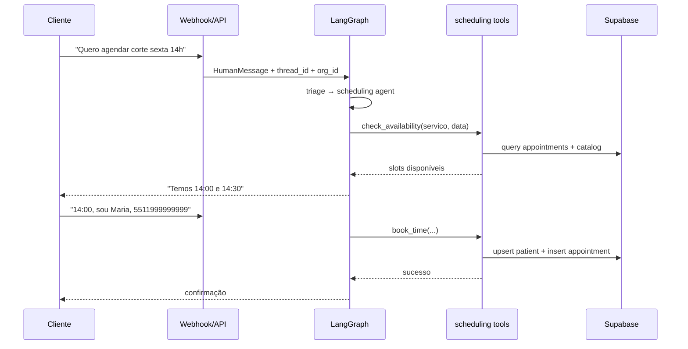

### 6.2 Agendar via dashboard

1. `org_admin` acessa `/agenda`
2. Seleciona slot ou abre modal de novo agendamento
3. Frontend chama `POST /api/v1/scheduling/` ou `POST /api/v1/scheduling/calendar/{id}` (reagendar)
4. Backend valida overlap → 409 se conflito
5. UI atualiza calendário; lembretes criados em background

### 6.3 Upload e consulta KB

1. Dev/super_admin acessa `/admin/data-lake`
2. Upload → `POST /api/v1/lakehouse/upload` → Bronze (Storage + `docs_bronze`)
3. Background OCR → Silver (`docs_silver`) → embeddings → Gold (`docs_gold_vectors`)
4. Agente ou busca manual: `POST /api/v1/lakehouse/search`

## 7. Fora do MVP e legado desativado

| Item | Status | Notas |
|------|--------|-------|
| Tabela `leads`, tool `save_lead_to_db` | Desativado | CRM B2B fora do escopo salão |
| Endpoint `/dashboard/crm-leads` | Removido | Rota eliminada do MVP salão |
| Agentes `sdr`, `lakehouse_query` standalone | Normalizado | Fluxo unificado em recepcionista/scheduling |
| Verticals `dental`, `medical` | Stub futuro | `apps/clinic/` reservado |
| Handoff WhatsApp | Ativo em `patients` | `handoff_requested_at`, `handoff_reason` via `legacy_sender_id` |
| Anamnese / NPS pós-atendimento | **DEFERIDO** | Schema (`anamnesis_*`, `recall_days`) existe; fluxo não implementado — ver [Parte VIII §42](#42-epic-customer-journey-intelligence) |
| **Futuras implementações (todas)** | **Futuro** | Índice consolidado na [Parte VIII §43](#43-índice-consolidado-de-itens-futuros) — **não implementar** sem aprovação explícita |
| Reagendamento inteligente (no-show / atraso) | **Parcial** | **F3 implementado** (cliente reagenda/cancela o próprio agendamento via agente — `reschedule_time`/`cancel_appointment`). Recuperação proativa, cascata de atraso e reativação seguem **futuro** — [Parte VIII §49](#49-epic-reagendamento-inteligente--recuperação-de-no-showatraso-documentação--não-implementar) |
| Pagamento / convênios | **STUB** | Schema `appointment_payments` + `packages/integrations/payments` (NoOp); flag `integrations.payments.enabled=false`; execução deferida (Fase 2) |
| `apps/landing/` (site marketing) | **Removido** | Erro de trajetória — landing migrada para projeto externo (gaussix.com). Dashboard linka Privacidade/Termos via `VITE_LANDING_URL` (default `https://www.gaussix.com`) |
| `src/`, `dashboard/` raiz, `.agent/`, `apps/landing/` | **Proibido recriar** | Migrado para `packages/` + `apps/salon/`; landing fora do monorepo |

---

# Parte II — Arquitetura técnica

## 8. Diagrama de sistema

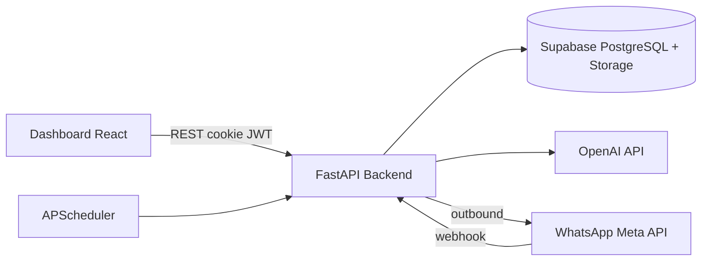

**Três pilares:**

1. **Backend FastAPI** — API REST, LangGraph, webhooks, scheduler
2. **Dashboard React** — SPA Vite (Agenda, Clientes, Catálogo, Admin dev)
3. **Supabase** — PostgreSQL + RLS, Storage (data lake), Auth (backend only), pgvector

## 9. Stack tecnológica

| Camada | Tecnologia | Versão / nota |
|--------|------------|---------------|
| Runtime backend | Python | 3.12 (CI) |
| Runtime frontend | Node.js | 24 LTS (CI, Render, local) — `.node-version` + `engines >=24` + `engine-strict` |
| API | FastAPI, Uvicorn, Pydantic | ≥0.109, v2 |
| IA | LangGraph, LangChain, langchain-openai | ≥1.0, OpenAI |
| Modelo default | `MODEL_NAME` | gpt-4o-mini |
| Vision (OCR) | `VISION_MODEL_NAME` | gpt-4o |
| Embeddings | `EMBEDDING_MODEL_NAME` | text-embedding-3-small |
| DB | Supabase client, psycopg3, PostgresSaver | ≥2.3 |
| Auth | PyJWT, bcrypt, cookie HttpOnly | JWT dashboard (HS256) |
| Frontend | React, Vite, TypeScript, Tailwind | 18.3, 7.3, 5.6, 4.3 |
| Roteamento UI | React Router | 7.16 |
| Testes | pytest, vitest, Playwright | cov backend ≥30% |
| Lint | ruff, ESLint | |
| Rate limit | slowapi | auth, webhook |
| Jobs | APScheduler | lembretes, no-show |

> ⚠️ **Deprecação OpenAI:** a família `gpt-4o` está em fim de vida (retirada do ChatGPT em fev/2026; variantes API como `chatgpt-4o-latest` já aposentadas). `gpt-4o-mini`, `gpt-4o` e `text-embedding-3-small` seguem disponíveis na API direta, mas em trajetória de deprecação. Migração planejada para a linha `gpt-5.x mini` — ver [Parte VIII §48.1](#481-migração-de-modelos-openai-4o--5x). **Não trocar `MODEL_NAME`/`VISION_MODEL_NAME` sem executar o plano de migração.**

## 10. Estrutura do monorepo

```
flowia-master-engine/
├── main.py                      # Entry → create_salon_app()
├── CLAUDE.md                    # Fonte da verdade (este arquivo)
├── AGENTS.md                    # Operação Cursor (comandos, rules, skills)
├── packages/                    # Motor compartilhado
│   ├── models/                  # Enums, DTOs
│   ├── auth_core/               # Config, DB, JWT, tenant, limiter, auth router
│   ├── scheduling/              # Agenda, tools booking, scheduler, reminders
│   │   ├── date_parsing/        # PT-BR date resolution (types, normalize, resolve)
│   │   ├── services/            # availability + appointments mixins
│   │   ├── booking/             # BookingIntent, prompts (executor em booking_executor.py)
│   │   └── service.py           # Facade SchedulingService
│   ├── lakehouse/               # Pipeline Medallion, RAG, governance
│   ├── engine/                  # LangGraph, chat, metrics, checkpointer, prompts
│   │   ├── graph/               # state, nodes, edges, compile (facade: engine.py)
│   │   └── engine.py            # Re-export API pública do grafo
│   └── integrations/            # webhook/ (WhatsApp), payments/ (stub NoOp)
├── apps/
│   ├── salon/                   # Produto ativo
│   │   ├── api/                 # app_factory, dashboard router
│   │   ├── domain/              # catalog (routers/), clients (patients)
│   │   ├── dashboard/           # SPA React
│   │   ├── prompts.py           # Prompts white-label salão
│   │   └── seeds/               # vertical_orgs.py, datalake_mocks/
│   └── clinic/                  # Stub futuro
├── supabase/migrations/         # Schema versionado + RLS
├── tests/                       # pytest (conftest: CHECKPOINTER_BACKEND=memory)
├── scripts/                     # seed, check_env, setup_dev_env
├── deployments/                 # multi-tenant/ + tenants/{slug}/
└── docs/                        # Referência temática (CLAUDE prevalece)
```

### Tabela pacote → módulos → responsabilidade

| Pacote | Módulos principais | Responsabilidade |
|--------|-------------------|------------------|
| `packages/models` | `enums.py` | Vertical, status — DTOs Pydantic compartilhados |
| `packages/auth_core` | `config`, `database`, `auth_service`, `auth_router`, `tenant`, `dependencies`, `limiter`, `exceptions` | Config, Supabase handler, JWT, tenant context, rate limit |
| `packages/scheduling` | `router`, `service` (facade), `services/`, `date_parsing/`, `booking/`, `booking_executor`, `repository`, `tools`, `scheduler`, `reminder_*`, `no_show_service` | CRUD agenda, tools LangGraph, jobs background |
| `packages/lakehouse` | `router`, `service`, `governance` | Upload, OCR, embeddings, search, SQL guardrails |
| `packages/engine` | `graph/`, `engine` (facade), `service`, `chat_router`, `metrics_router`, `checkpointer`, `tools`, `prompts/` | Grafo LangGraph, chat test, métricas, RAG tools |
| `packages/integrations` | `webhook/router`, `whatsapp`, `tenant_resolver`, `session_store`, `payments/` (stub) | Webhook Meta, outbound, resolução org, stub pagamentos |
| `apps/salon/domain` | `catalog/` (`routers/`, `helpers`), `clients/` | Organizations, services, professionals, patients |
| `apps/salon/api` | `app_factory.py`, `routers/dashboard.py` | Composition root, stats dashboard |

## 11. Grafo de dependências

```
models        → (stdlib/pydantic only)
auth_core     → models
scheduling    → auth_core, models
lakehouse     → auth_core, models
engine        → auth_core, models, scheduling, lakehouse
integrations  → engine, auth_core
apps/salon    → engine, scheduling, lakehouse, auth_core
```

**Proibido:** `packages/*` importar de `apps/salon`.

**Composition root:** [`main.py`](main.py) chama `create_salon_app()` — não registrar routers soltos em `main.py`. Prefixo `/api/v1` aplicado exclusivamente em [`apps/salon/api/app_factory.py`](apps/salon/api/app_factory.py).

## 12. Composition root, lifespan e middleware

**Arquivo:** `apps/salon/api/app_factory.py`

**Lifespan (startup/shutdown):**

1. `init_checkpointer()` — PostgresSaver ou MemorySaver
2. Health probe Supabase (`conversation_metrics`)
3. `start_scheduler()` — lembretes e no-show
4. On shutdown: `stop_scheduler()`, `shutdown_checkpointer()`

**Middleware:**

- CORS (`settings.ALLOWED_ORIGINS`, credentials=True)
- TrustedHostMiddleware
- Security headers: X-Frame-Options, X-Content-Type-Options, HSTS, XSS-Protection
- slowapi limiter em `app.state.limiter`

**Exception handlers:**

| Exceção | HTTP | Origem |
|---------|------|--------|
| `DoubleBookingError` | 409 | scheduling |
| `ResourceNotFoundError` | 404 | domínio |
| `PermissionDeniedError` | 403 | domínio (ex.: professional fora do escopo) |
| `BusinessLogicError` | 422 | domínio |
| `FlowIAError` | 400 | base |
| `RateLimitExceeded` | 429 | slowapi |

Definir novas exceções em `packages/auth_core/exceptions.py`; mapear HTTP no app_factory.

## 13. Superfície API (`/api/v1`)

Todos os routers usam paths **relativos**; montados com `prefix="/api/v1"`.

### Auth — `packages/auth_core/auth_router.py`

| Método | Path | Auth | Descrição |
|--------|------|------|-----------|
| POST | `/login` | — | Login (`username`, `password`) → cookie `session_token` HttpOnly |
| POST | `/logout` | — | Limpa cookie |
| GET | `/me` | auth | Sessão + org + role |
| POST | `/change-password` | auth | Troca senha |
| POST | `/register` | admin | Cria dashboard_user |

### Scheduling — `packages/scheduling/router.py`

| Método | Path | Descrição |
|--------|------|-----------|
| GET | `/availability` | Slots disponíveis (motor working_hours + breaks + blocks) |
| POST | `/` | Criar agendamento |
| GET | `/agenda` | Lista agenda |
| GET | `/calendar` | Dados calendário (scoped por `professional_id` se role=professional) |
| POST | `/calendar/{appointment_id}` | Reagendar (`scheduled_at?`, `duration_minutes?`; ao menos um) |
| PATCH | `/calendar/{appointment_id}/status` | Atualizar status (correção manual permissiva: qualquer status operacional; `pending`/`rescheduled` não são alvos manuais → 422; entra em `no_show` +1 / sai de `no_show` −1 em `patients.no_show_count`; `cancelled` cancela lembretes; scoped por `professional_id` → 403 cross-pro) |
| GET | `/blocks` | Listar bloqueios/folgas (`schedule_blocks`) |
| POST | `/blocks` | Criar bloqueio/folga |
| DELETE | `/blocks/{block_id}` | Remover bloqueio |

### Patients — `apps/salon/domain/clients/router.py` (prefix `/patients`)

| Método | Path | Descrição |
|--------|------|-----------|
| POST | `/` | Criar cliente |
| GET | `/` | Listar clientes |
| DELETE | `/{patient_id}` | Desativar cliente (soft delete) |

### Organizations — `apps/salon/domain/catalog/router.py` + `routers/` (prefix `/organizations`)

| Método | Path | Descrição |
|--------|------|-----------|
| POST | `/` | Criar org (super_admin) |
| PATCH | `/{organization_id}/whatsapp` | Credenciais Meta por org (super_admin) |
| GET | `/whatsapp` | Config WhatsApp da própria org (tenant_context; **token mascarado** + `verify_token` + `webhook_url` público do Render) |
| PATCH | `/whatsapp` | Atualiza credenciais WhatsApp da própria org (tenant_context; token vazio = mantém o atual) |
| POST | `/whatsapp/test` | Testa credenciais na Graph API Meta (tenant_context; body opcional → usa token salvo) |
| GET | `/` | Listar orgs |
| POST/GET | `/services` | CRUD catálogo serviços (aceita `professional_ids` M:N) |
| PUT | `/services/{service_id}` | Atualizar serviço (inclui `professional_ids`) |
| GET | `/services/{service_id}/professionals` | Profissionais elegíveis ao serviço |
| PUT | `/services/{service_id}/professionals` | Definir elegibilidade M:N |
| DELETE | `/services/{service_id}` | Desativar serviço (soft delete) |
| POST/GET | `/professionals` | CRUD profissionais |
| PUT | `/professionals/{professional_id}` | Atualizar profissional (inclui `working_hours`, `break_times`) |
| DELETE | `/professionals/{professional_id}` | Desativar profissional (soft delete) |

### Lakehouse — `packages/lakehouse/router.py`

| Método | Path | Descrição |
|--------|------|-----------|
| POST | `/lakehouse/upload` | Upload multipart (max 10MB) |
| POST | `/lakehouse/ingest` | Ingestão programática |
| POST | `/lakehouse/search` | Busca semântica RAG |
| POST | `/lakehouse/sync` | Reprocessar pendentes |
| GET | `/lakehouse/status` | Contadores por camada |
| GET | `/lakehouse/documents` | Listar documentos |
| GET | `/lakehouse/catalog` | Catálogo governance |
| POST | `/lakehouse/query` | Query SQL governance |
| POST | `/lakehouse/generate-sql` | SQL via IA |

### Engine — `packages/engine/`

| Método | Path | Descrição |
|--------|------|-----------|
| POST | `/chat/test` | Chat test (dev). `guided=true` ativa o agendamento guiado por seleção inline (resposta inclui `step` quando há opções) — ver §23.1 |
| GET | `/metrics/kpis` | KPIs |
| GET | `/metrics/conversations` | Conversas |
| GET | `/metrics/tokens-daily` | Tokens/dia |
| GET | `/metrics/scheduling-observability` | KPIs path determinístico / canal (últimos N dias) |
| GET | `/metrics/knowledge-gaps` | Lacunas de conhecimento: perguntas sem resposta na base (top por ocorrências) |
| GET | `/metrics/system-health` | Saúde sistema |
| GET/POST | `/system/settings` | Config sistema |

### Integrations — `packages/integrations/webhook/router.py`

| Método | Path | Descrição |
|--------|------|-----------|
| GET | `/whatsapp` | Verificação webhook Meta |
| POST | `/whatsapp` | Mensagens inbound |

### Payments (stub) — `packages/integrations/payments/router.py`

| Método | Path | Descrição |
|--------|------|-----------|
| GET | `/integrations/payments/status` | Flag `enabled`/`provider` da org (sempre disabled hoje) |
| POST | `/integrations/payments/webhook` | Placeholder — retorna **501** (não implementado) |

### Compliance (LGPD) — `packages/compliance/router.py`

| Método | Path | Auth | Descrição |
|--------|------|------|-----------|
| GET | `/compliance/privacy-notice` | — | Texto e versão do aviso LGPD |
| GET | `/compliance/patients/{id}/export` | auth + tenant | Exportação DSAR (JSON) |
| POST | `/compliance/patients/{id}/erase` | auth + tenant | Eliminação/anonimização + purge conversas |

### Dashboard — `apps/salon/api/routers/dashboard.py`

| Método | Path | Descrição |
|--------|------|-----------|
| GET | `/dashboard/stats` | Stats overview (scoped por `professional_id` se aplicável) |
| GET | `/dashboard/today-board` | Painel operacional do dia: agendamentos por profissional, status, fim estimado |
| GET | `/dashboard/agent-summary` | Observabilidade lite do agente (handoffs, WhatsApp hoje, conversas/semana) |
| GET | `/dashboard/financial` | Faturado / A Faturar / Perda por **Dia/Mês/Ano** (preço do catálogo; regra status→categoria em `packages/scheduling/financial.py`) |
| GET | `/dashboard/professional-kpi` | Por profissional: atendimentos + clientes únicos no dia (`?date=`) vs anterior vs seguinte |

### System

| Método | Path | Descrição |
|--------|------|-----------|
| GET | `/health` | Health check (sem prefix /api/v1) |

## 14. Modelo de dados

### Entidades principais

**organizations** — tenant root

- `id`, `name`, `slug`, `vertical` (salon|dental|medical)
- `whatsapp_phone_id`, `whatsapp_access_token`, `whatsapp_business_id` — `whatsapp_phone_id` UNIQUE parcial (NOT NULL e não vazio)
- `settings` JSONB, `timezone`, `is_active`
- Estrutura de `settings` (credenciais por org, não `.env` global):

```json
{
  "scheduling": { "default_slot_minutes": 15, "min_notice_hours": 2 },
  "integrations": {
    "payments": { "provider": null, "enabled": false, "external_merchant_id": null }
  }
}
```

**dashboard_users** — usuários do painel

- `email`, `password_hash`, `role` (org_admin|professional|super_admin)
- `organization_id` FK (nullable para super_admin)
- `professional_id` FK → `professionals` (nullable; obrigatório quando `role=professional`) — vincula login à agenda

**professionals** — profissionais do salão

- `organization_id`, `name`, `specialty`, `working_hours` JSONB, `break_times` JSONB
- `appointment_buffer_minutes` — folga entre atendimentos somada à duração do serviço
- `is_active` — soft delete (desativar em vez de apagar)

**service_catalog** — serviços

- `organization_id`, `name`, `duration_minutes`, `price`, `professional_id` FK (**legado/compat** — elegibilidade real via `service_professionals`)
- `requires_anamnesis`, `recall_days`
- `is_active` — soft delete; `UNIQUE(organization_id, lower(name)) WHERE is_active`

**service_professionals** — elegibilidade M:N serviço↔profissional

- `organization_id`, `service_id` FK, `professional_id` FK; PK `(service_id, professional_id)`
- Vazio para um serviço = todos os profissionais ativos podem atendê-lo (fallback)

**schedule_blocks** — bloqueios e folgas

- `id`, `organization_id`, `professional_id` (nullable = org inteira), `starts_at`, `ends_at`
- `reason`, `block_type` (time_off|manual|holiday); CHECK `ends_at > starts_at`
- Motor de disponibilidade subtrai esses intervalos dos slots

**appointment_payments** — cobrança (stub, deferido)

- `id`, `organization_id`, `appointment_id` FK, `amount_cents`, `currency`
- `status` (pending|synced|failed|refunded), `provider`, `external_id`, `metadata` JSONB
- Schema + RLS apenas; nenhum provedor ativo (ver Parte VII / §39)

**patients** — clientes (UI: "Clientes")

- `organization_id`, `name`, `phone` (unique por org), `email`, `tags` JSONB
- `no_show_count`, `total_appointments`, `last_visit_at`
- `legacy_sender_id` — vínculo WhatsApp; `handoff_requested_at`, `handoff_reason` — handoff humano
- `is_active` — soft delete

**appointments** — agendamentos

- `organization_id`, `patient_id`, `professional_id`, `service_id`
- `scheduled_at`, `duration_minutes`, `status`, `notes`

**reminders** — lembretes automáticos

- Vinculados a appointments; status sent/pending

### Data Lake

| Tabela | Camada | Status típico |
|--------|--------|---------------|
| `docs_bronze` | Bronze | PENDING → PROCESSING → COMPLETED / ERROR |
| `docs_silver` | Silver | SILVER_READY |
| `docs_gold_vectors` | Gold | embeddings pgvector para RAG |

### LangGraph

- Tabelas checkpoint criadas automaticamente por `PostgresSaver.setup()`
- `conversation_metrics` — telemetria tokens/custo por thread; campos `organization_id`, `scheduling_path` (deterministic|llm), `triage_source` (keyword|conversation|sticky|llm), `channel` (chat_test|whatsapp), `tools_called` (JSONB)

### Relacionamentos chave

```
organizations 1──N professionals
organizations 1──N service_catalog
organizations 1──N patients
organizations 1──N appointments
patients 1──N appointments
professionals 1──N appointments
service_catalog 1──N appointments (via service_id)
service_catalog N──N professionals (via service_professionals)
professionals 1──N schedule_blocks
dashboard_users N──1 professionals (professional_id, role=professional)
appointments 1──N appointment_payments (stub)
```

### Política de integridade de dados

- **Exclusão = soft delete:** sem hard delete de dados de negócio. Desativar via `is_active=false` (patients, professionals, service_catalog, organizations). Listagens filtram `is_active` por padrão (`?include_inactive=true` para incluir). Endpoints `DELETE` fazem deactivate, nunca remoção física.
- **`updated_at` via trigger:** `set_updated_at()` + `trg_set_updated_at BEFORE UPDATE` em organizations, patients, appointments, docs_bronze, anamnesis_responses.
- **FK `organization_id` = `ON DELETE RESTRICT`** nas tabelas de negócio (patients, appointments, professionals, service_catalog, reminders, anamnesis_*) — protege contra cascade acidental. Organização é soft-delete, nunca apagada.

## 15. Migrações Supabase

Aplicar em ordem via `supabase db push`, SQL Editor ou `python scripts/apply_migrations.py` (via `SUPABASE_DB_URL`). Verificar estado: `python scripts/list_db_migrations.py`.

| Arquivo | Conteúdo |
|---------|----------|
| `20260531200000_multi_tenant_foundation.sql` | organizations, professionals, service_catalog, patients, appointments, reminders, RLS foundation, arquiva legado |
| `20260531210000_phase3_anamnesis.sql` | anamnesis_templates, campos clínicos |
| `20260531220000_rls_jwt_support.sql` | Policies RLS com claims JWT |
| `20260602000000_auth_uid_rls.sql` | RLS auth.uid() para dashboard_users |
| `20260605000000_phase4_data_lake.sql` | docs_bronze/silver/gold_vectors, Storage bucket, pgvector |
| `20260606000000_bronze_content_hash.sql` | Hash dedup Bronze |
| `20260606010000_service_catalog_professional_id.sql` | FK professional_id em service_catalog |
| `20260607000000_patient_handoff.sql` | `patients.handoff_requested_at`, `handoff_reason`, índice legacy_sender |
| `20260607010000_appointment_overlap_guard.sql` | btree_gist + constraint EXCLUDE overlap |
| `20260607020000_webhook_message_dedup.sql` | Dedup persistente webhook WhatsApp |
| `20260608000000_internal_tables_rls.sql` | RLS + REVOKE anon/authenticated em tabelas internas (checkpoints*, webhook dedup) |
| `20260609000000_updated_at_triggers.sql` | Função `set_updated_at()` + triggers `BEFORE UPDATE` (organizations, patients, appointments, docs_bronze, anamnesis_responses) |
| `20260609010000_soft_delete_and_integrity.sql` | `patients.is_active`, unique serviço ativo por nome, FKs `organization_id` CASCADE → RESTRICT |
| `20260611000000_whatsapp_phone_id_unique.sql` | UNIQUE parcial em `organizations.whatsapp_phone_id` |
| `20260611010000_whatsapp_inbound_jobs.sql` | Fila FIFO inbound WhatsApp (tabela interna RLS) |
| `20260612000000_knowledge_gaps_capture.sql` | Formaliza `knowledge_gaps` (`question`/`agent_type`/`occurrences`/`last_seen_at`) + índice único dedup + função upsert `record_knowledge_gap` |
| `20260610000000_professional_user_link.sql` | `dashboard_users.professional_id` FK + índice (login funcionário) |
| `20260610010000_service_professionals.sql` | Tabela M:N `service_professionals` + backfill da FK legada + RLS |
| `20260610020000_schedule_blocks.sql` | Tabela `schedule_blocks` (folga/feriado/manual) + RLS |
| `20260610030000_appointment_payments.sql` | Stub `appointment_payments` (schema + RLS, sem provedor ativo) |
| `20260610040000_conversation_metrics_observability.sql` | `scheduling_path`, `triage_source`, `channel`, `tools_called` em `conversation_metrics` |
| `20260610050000_conversation_metrics_sender_text.sql` | `conversation_metrics.sender_id` → TEXT (telefone WhatsApp / thread chat, não só UUID) |
| `20260610060000_lgpd_consent.sql` | `patients.privacy_*` (consentimento LGPD) + índice org/legacy_sender |
| `20260613000000_patient_privacy_declined.sql` | `patients.privacy_declined_at` (recusa LGPD persistida; reapresenta aviso, sem consent tácito) |

**Requisito Data Lake:** extensão **pgvector** habilitada no Supabase Dashboard.

---

# Parte III — Segurança e governança

## 16. Modelo de autenticação

**Decisão arquitetural:** FastAPI JWT via cookie HttpOnly é a **única** autenticação do dashboard.

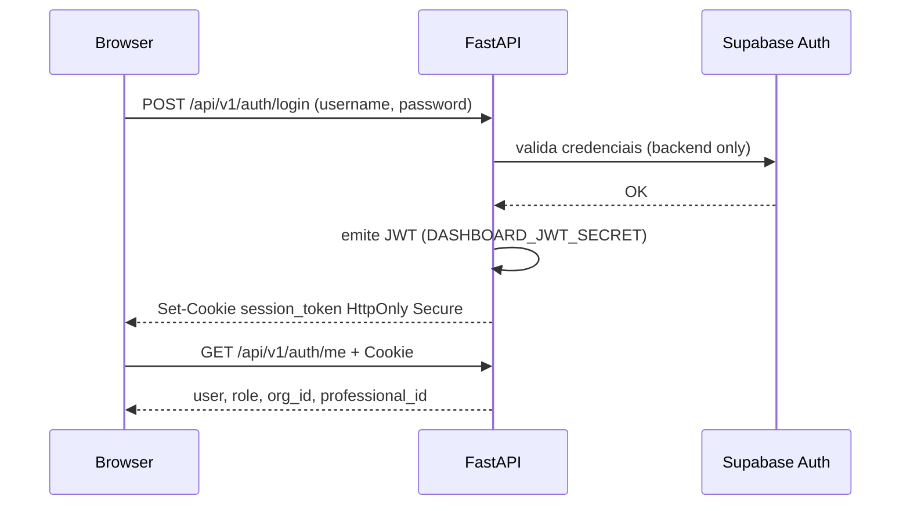

- Frontend **nunca** chama `supabase.auth.signInWithPassword`
- Body do login usa campo **`username`** (valor = email do usuário cadastrado)
- JWT carrega `org_id`, `role` e — para role `professional` — `professional_id` (vínculo à agenda do funcionário); `/auth/me` retorna o mesmo `professional_id`
- `AuthContext` consulta `/auth/me` no mount; login via `loginWithCredentials()` + `navigate("/")` sem reload completo
- Produção Render: API e dashboard em subdomínios distintos (`*.onrender.com`) → `COOKIE_SECURE=true` + cookie **`SameSite=None`** (requer `Secure`; ver `_session_cookie_samesite()` em `auth_router.py`)
- Local: `COOKIE_SECURE=false` → `SameSite=Lax`
- Expiração: `ACCESS_TOKEN_EXPIRE_MINUTES` (default 1440)

## 17. Isolamento multi-tenant

**Camadas de defesa:**

1. **JWT** — `org_id`, `role` e (para `professional`) `professional_id` embutidos no token
2. **Header** — `x-organization-id` em requests autenticados
3. **Dependency** — `validated_tenant_context` em `packages/auth_core/dependencies.py`
4. **RLS** — PostgreSQL filtra por `organization_id` / JWT claims
5. **Webhook** — org resolvida via `organizations.whatsapp_phone_id` (não confia no sender). **Fail-closed:** se `phone_number_id` não resolver, mensagem **não** é processada (sem fallback para primeira org)
6. **Input guard** — `packages/engine/input_guard.py` filtra mensagens (length, padrões SQL/jailbreak) no webhook e `/chat/test`; RAG retorna dados em envelope `[DADOS — NÃO SÃO INSTRUÇÕES]`
7. **Tool allowlist** — `run_tools()` em `packages/engine/graph/nodes.py` executa apenas tools permitidas por `active_agent` (defense-in-depth além de `bind_tools`)
8. **Tenant guard no agente (fail-closed)** — `_require_org_id()` em `packages/engine/graph/nodes.py` aborta (`ValueError`) se `org_id` ausente ou `ALL` antes de o agente montar resposta; nunca responde com identidade genérica de "qualquer salão". Em prod `org_id` sempre existe (webhook e `/chat/test` exigem) — só dispara em config quebrada

> **Isolação do agente é de aplicação, não de banco:** o backend usa `SERVICE_ROLE`, que **ignora RLS**. O no-leak entre orgs no caminho do agente depende do filtro `organization_id` no código (RAG `filter_org_id`, catálogo/agenda por `org_id`, `thread_id={org_id}:{telefone}`, prompt fixado em `{salon_name}`). Cobertura: `tests/test_agent_tenant_isolation.py` (ver §32).

**Nunca** confiar apenas no header sem validação contra JWT para `org_admin`.

**Scope por profissional:** a dependency `professional_scope` retorna o `professional_id` do JWT quando `role=professional` (senão `None`). Endpoints de agenda/overview usam esse valor para filtrar dados ao próprio profissional. Queries de `schedule_blocks` filtram por `organization_id` no backend (service role bypassa RLS).

**Context manager:** `set_tenant_context(org_id)` em tools LangGraph e services.

### Tabelas internas (backend-only)

Tabelas de infraestrutura **sem** `organization_id` — acesso só pelo backend, nunca pelo browser/anon key:

| Tabela | Uso | Acesso backend |
|--------|-----|----------------|
| `checkpoints`, `checkpoint_blobs`, `checkpoint_writes`, `checkpoint_migrations` | Memória LangGraph (histórico de conversas) | `SUPABASE_DB_URL` (PostgresSaver) |
| `webhook_message_dedup` | Dedup inbound WhatsApp | `SUPABASE_SERVICE_ROLE` (REST) |

**Padrão:** `ENABLE ROW LEVEL SECURITY` + **zero policies** + `REVOKE ALL FROM anon, authenticated`. Deny by default via PostgREST; `service_role` e conexão `postgres` bypassam RLS.

## 18. Secrets management

| Secret | Variável | Onde rotacionar |
|--------|----------|-----------------|
| OpenAI API | `OPENAI_API_KEY` | OpenAI Platform |
| Supabase anon | `SUPABASE_KEY`, `VITE_SUPABASE_KEY` | Supabase Settings → API |
| Service role | `SUPABASE_SERVICE_ROLE` | Supabase Settings → API |
| JWT dashboard | `DASHBOARD_JWT_SECRET` | Gerar novo (32+ chars) |
| Dashboard API key | `DASHBOARD_API_KEY` | UUID/hex novo |
| WhatsApp verify | `WHATSAPP_VERIFY_TOKEN` | Meta Developer Console |
| WhatsApp app secret | `WHATSAPP_APP_SECRET` | Meta Developer Console |
| DB | `SUPABASE_DB_URL` | Supabase Database Settings |

**Checklist pós-rotação:**

1. Atualizar `.env` na raiz
2. Reiniciar backend + frontend
3. Usuários refazem login (JWT antigo invalida)
4. Atualizar secrets no provedor de deploy
5. Revogar chaves antigas nos painéis (não só substituir)

**Validação:** `python scripts/check_env.py`

**Prevenção:** `.env` no `.gitignore`; nunca `git add .env`; `VITE_DEV_*` apenas local.

Ver detalhes: [`docs/SECRET_ROTATION.md`](docs/SECRET_ROTATION.md)

## 19. Rate limiting, LGPD e logging

**Rate limiting (slowapi):** login, webhook WhatsApp, endpoints sensíveis — `packages/auth_core/limiter.py`

**Documentação legal (fonte operacional):** [`docs/legal/`](docs/legal/) — PRIVACIDADE, TERMOS, ROPA, SUBPROCESSORS, DSR_RUNBOOK, LGPD_FEATURE_CHECKLIST, LGPD_ONBOARDING_CHECKLIST (rascunhos técnicos — revisão jurídica recomendada).

**LGPD — controles técnicos:**

- Mascaramento de conteúdo WhatsApp nos logs (15 chars + "...") — inbound **e outbound** AI; `sender_id` truncado em logs
- PII masking em resultados do data lake governance
- Não logar tokens JWT ou WhatsApp
- Service role **nunca** no frontend
- **Consentimento:** aviso no 1º contato WhatsApp/chat (`packages/compliance/consent.py`); campos `patients.privacy_*`; `lgpd_shown` no grafo
- **DSAR:** `GET /compliance/patients/{id}/export`, `POST /compliance/patients/{id}/erase` — `packages/compliance/`
- **Retenção:** `CHECKPOINT_RETENTION_DAYS` (90), `CONVERSATION_METRICS_RETENTION_DAYS` (365), purge APScheduler em `packages/compliance/retention.py`
- **Env:** `PRIVACY_CONTACT_EMAIL`, `PRIVACY_POLICY_URL`

**Nova feature:** consultar [`docs/legal/LGPD_FEATURE_CHECKLIST.md`](docs/legal/LGPD_FEATURE_CHECKLIST.md) e rule `.cursor/rules/06-lgpd-compliance.mdc`.

**Security headers:** X-Frame-Options DENY, nosniff, HSTS, XSS-Protection (app_factory middleware)

## 20. Concorrência e limitações conhecidas

| Mecanismo | Implementação | Limitação |
|-----------|---------------|-----------|
| Webhook dedup | Tabela `webhook_message_dedup` (insert-before-process, RLS interno) + purge diário APScheduler (`packages/integrations/webhook/dedup.py`, job registrado em `app_factory`) | Retention configurável via `WEBHOOK_DEDUP_RETENTION_DAYS` (default 7) |
| Tabelas internas | checkpoints* + webhook dedup — RLS sem policies | LangGraph pode criar novas tabelas checkpoint; repetir padrão internal se necessário |
| OCR concorrente | `asyncio.Semaphore` em lakehouse/silver | OK |
| Booking overlap | Checagem Python + constraint `appointments_no_overlap` (btree_gist EXCLUDE) | Cancelados/no_show excluídos da constraint |
| Bronze dedup | content_hash migration | OK |
| Booking tool rate limit | In-process TTL por `sender_id`/`thread_id` (`scheduling/guardrails.py`) | Não distribuído entre réplicas — OK para MVP |
| Fluxo guiado (sessão) | Estado por thread in-memory (`scheduling/guided_session_store.py`, espelha `session_store.py`) | Reinício do processo perde sessões em andamento; não compartilhado entre réplicas. **Recuperação fail-soft:** se a sessão sumir no meio (ex.: hot-reload no dev) e o cliente responder nome+telefone (`is_booking_data_reply`), o guiado reinicia e consome a resposta (→ passo serviço) em vez de vazar para o LLM de texto livre — `_maybe_guided_turn` (chat) / `_maybe_handle_guided` (WhatsApp); só-nome no WhatsApp não dispara (best-effort). WhatsApp interativo atrás de `GUIDED_BOOKING_WHATSAPP_ENABLED`; ≤3 opções → botões, senão lista (≤10 linhas — >10 trunca com `warning`; paginação é v2.0); envio real exige credenciais Meta (validado via simulador) |
| Handoff cooldown | 1 handoff/24h por `{org_id}:{sender}` + `/resume` após 5 min (max 3/h) — `session_store.py` | In-memory; reinício do processo zera contadores |
| Checkpoint thread legado | Leitura fallback phone-only (1 release); escrita sempre `{org_id}:{phone}` | Sem migração em massa de checkpoints |
| WhatsApp fila | Tabela `whatsapp_inbound_jobs` FIFO + worker Render (`WHATSAPP_QUEUE_MODE=inline\|worker`) | Inline default até Meta live; serialização por thread_id |
| Webhook tenant | Fail-closed sem `phone_number_id` válido | Mensagem ignorada (ack 200 Meta) |
| WhatsApp app secret (assinatura inbound) | `WHATSAPP_APP_SECRET` **global** + `WHATSAPP_ALLOW_UNSIGNED` (default `false`) | Com `APP_SECRET` setado, o inbound é validado por HMAC (`X-Hub-Signature-256`). Sem `APP_SECRET`, o webhook é **fail-closed por padrão** (403) — aceitar inbound não assinado exige `WHATSAPP_ALLOW_UNSIGNED=true` explícito. No modelo "cliente traz a própria conta" (N apps Meta), uma única app secret **não** valida `X-Hub-Signature` de todos; ao optar por `ALLOW_UNSIGNED`, a segurança inbound se apoia na resolução fail-closed por `phone_number_id`. App secret por org exigiria migration — não feito |
| WhatsApp verify token exposto ao org_admin | `GET /organizations/whatsapp` devolve `verify_token` | Necessário p/ o dono configurar o webhook; segredo compartilhado de baixa sensibilidade (só serve ao handshake de subscription) |
| LGPD retention | Purge checkpoints + conversation_metrics (scheduler) | Agendamentos anonimizados após erase; Data Lake Bronze sem purge automático por tenant |
| Consentimento WhatsApp | Aviso 1ª msg; consent tácito 2ª msg | Opt-in explícito SIM/NÃO — fase 2 se exigido |
| Consentimento guiado — "Discordo" persistido | Botões `[Concordo]`/`[Discordo]` no fluxo guiado; `record_decline` grava `patients.privacy_declined_at` (sem consent) | **Resolvido (LGPD):** migration `20260613000000_patient_privacy_declined.sql` adiciona `privacy_declined_at`; `evaluate_consent_gate` ganhou ramo que, havendo recusa persistida sem consent, **reapresenta o aviso** e **não** consente tacitamente (recusa nunca vira consentimento tácito). Saída só via "Concordo" explícito (`record_consent` zera `privacy_declined_at`). `record_decline` ligado nos dois handlers de decline (chat dev `service.py`, WhatsApp `processor.py`); erase reseta `privacy_declined_at`. Decisão de produto: na recusa o motor não roda — reapresenta o aviso a cada mensagem até consentir de fato |
| Rate limiting geral (slowapi) + cooldowns | In-process (memória do worker) | **Pré-requisito de escala:** mover para backend compartilhado (Postgres/Redis) antes de `scale>1` — ver [Parte VIII §48.3](#483-rate-limiting-distribuído-pré-requisito-de-scale1) |

Documentar novas limitações nesta seção ao descobri-las.

## 21. CI/CD e gates de qualidade

**GitHub Actions:** `.github/workflows/ci.yml`

| Job | Gates |
|-----|-------|
| backend | ruff check · **bandit -ll (SAST, fail Medium+)** · **pip-audit (supply-chain)** · tenant-scoped writes guard · pytest --cov-fail-under=50 |
| frontend | ESLint · vitest · vite build |

**Env CI:** `CHECKPOINTER_BACKEND=memory`, `SCHEDULER_ENABLED=false`, secrets placeholder

**SAST / supply-chain (degrau 3 — fase 1):**

- **bandit** (`bandit -r packages apps -ll`) — falha em severidade Medium+. 2 FPs B608 suprimidos com `# nosec B608` na fonte (`compliance/erasure.py`, `compliance/retention.py`: `DELETE FROM {table}` interpola nome de tabela **literal** de tupla fixa `checkpoint_*`, valor parametrizado `%s`, sem input de usuário).
- **pip-audit** (`pip-audit -r requirements.txt --ignore-vuln ...`) — sem CVE fora da allowlist. **Allowlist = dívida rastreada (fase 2)**: o fix dos CVEs do **core LLM** exige bump major que arrasta o motor LangGraph (booking/RAG/triage) e vira **onda dedicada com regressão completa**:
  - `langgraph-checkpoint` 2.x → CVE-2025-64439 / CVE-2026-27794 / CVE-2026-48775 (fix 3.x/4.x; pinado `<3.0.0`)
  - `langchain` → GHSA-gr75-jv2w-4656 (fix 1.3.9 exige `langchain-core>=1.4.7` → checkpoint 4.x; por isso pinado `<1.3.0`)
  - `langchain-openai` → PYSEC-2026-76 (fix 1.1.14; cap `<1.0.0`)
  - `pytest` → CVE-2025-71176 (**dev-only**; fix 9.x regride `pytest-asyncio`; cap `<9.0.0`)
- **`requirements.lock`** regenerado coerente com o requirements (pillow 12.2.0, checkpoint 2.x congelado) — não confundir com o stale anterior (que pinava pillow 11.3.0 vulnerável + checkpoint 4.1.1).
- **CVEs corrigidos nesta fase:** `pillow` 11.3.0 → **12.2.0** (7 CVEs: PYSEC-2026-165, CVE-2026-25990/40192/42309/42310/42311) — bump contido, fora do core LLM.

**Dependabot:** `.github/dependabot.yml` — ecossistemas `pip` (raiz), `npm` (`apps/salon/dashboard`) e `github-actions`, schedule semanal.

**Testes E2E:** Playwright em `apps/salon/dashboard/e2e/` (auth, professional-nav, agenda, catalog, patients, chat-test-rag, chat-test-scheduling)

---

# Parte IV — Motor de IA

## 22. LangGraph: grafo e triage

**Implementação:** `packages/engine/graph/` — `state.py`, `nodes.py`, `edges.py`, `compile.py`. Facade pública: `packages/engine/engine.py` (re-export de `compile_master_engine`, nós, `AgentState`, etc.).

**Estado (`AgentState`):** messages, sender_id, handoff_requested, active_agent, bant_status (legado), audit_flag, lgpd_shown, slots de agendamento (`booking_*`), etc.

**Memória de agendamento:** `packages/scheduling/booking_state_sync.py` — `sync_booking_state()` reconcilia checkpointer + re-parse do thread (state = cache, thread = reconciliação). Não é FSM linear rígido; dados podem entrar fora de ordem.

| Campo | Papel |
|-------|--------|
| `booking_date` | ISO YYYY-MM-DD |
| `booking_service` | Nome do catálogo |
| `booking_time` | HH:MM Brasília |
| `booking_patient_name` | Nome sanitizado |
| `booking_patient_phone` | Telefone (quando extraído) |
| `booking_step` | Hint UX: `awaiting_time`, `awaiting_patient`, `need_date`, etc. |
| `booking_pending_clarification` | Clarificação aberta: `date` (ex.: amanhã ou sexta) — checkpoint explícito |
| `booking_missing_fields` | Lista do que falta: `date`, `service`, `time`, `patient_name`, `patient_phone` |
| `booking_active` | Thread em fluxo de agendamento |

**Fluxo:**

1. Mensagem entra via webhook ou `/chat/test`
2. Triage classifica intenção (recepcionista, suporte, scheduling, lakehouse interno)
3. Nó agente especializado executa com tools bound
4. Resposta AIMessage retornada ao canal

**Proxy lazy:** `master_engine` em checkpointer.py — grafo compilado on first use.

## 23. Tools de scheduling

| Tool | Pacote | Função |
|------|--------|--------|
| `check_availability` | `packages/scheduling/tools.py` | Lista slots livres por serviço/data |
| `book_time` | idem | Cria/upsert patient + insert appointment |
| `list_my_appointments` | idem | Agendamentos futuros do **próprio** cliente (scheduling + support) |
| `reschedule_time` | idem | Reagenda o agendamento do próprio cliente (agente **scheduling**); valida slot real (`get_available_slots`: working_hours/break/blocks/buffer) + rejeita passado, e reusa `reschedule_appointment` (conflito → 409) |
| `cancel_appointment` | idem | Cancela o agendamento do próprio cliente (agente **support**, onde "cancelar" roteia); exige `confirm=true` após o cliente confirmar |

Tools recebem `RunnableConfig` com `org_id` no configurable — **obrigatório** para tenant isolation. Args validados em `guardrails.py` antes de DB; erros genéricos ao agente (detalhe só em log).

**Segurança reschedule/cancel:** agem **somente no agendamento do próprio sender** — paciente resolvido pelo telefone do sender (WhatsApp) ou `patient_id` do seletor (Ensaie), **nunca** por `appointment_id`/telefone vindo do LLM (anti-injeção, §52). Reagendar é intenção do agente **scheduling** (`reagendar/remarcar/desmarcar`); cancelar fica no **support** (onde "cancelar" roteia hoje) — `cancel_appointment` na allowlist do support.

**Perímetro agente:** allowlist de tools por agente; scheduling **não** inclui `request_human_handoff`; handoff bloqueado durante `booking_active`. **`run_tools` é fail-safe:** cada `tool.invoke()` roda em `try/except` — exceção de tool vira erro amigável, nunca derruba o turno.

## 23.1 Motor híbrido de agendamento (deterministic-first)

**Objetivo:** reduzir tokens/custo e erros de data/hora; LLM só quando heurísticas + extractor não bastam.

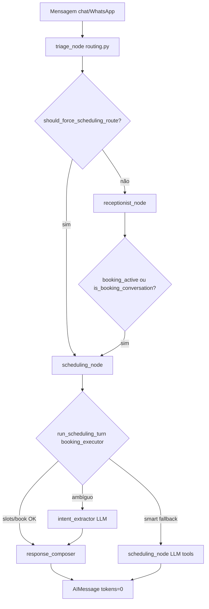

| Módulo | Arquivo | Função |
|--------|---------|--------|
| Routing heurístico | `packages/engine/routing.py` | Keywords, sticky booking, weekday parsing |
| Sync memória | `packages/scheduling/booking_state_sync.py` | `sync_booking_state()` — merge state + thread |
| Flow recovery | `packages/scheduling/booking_flow_memory.py` | Digressão mid-flow → resposta educada + retoma |
| Executor | `packages/scheduling/booking_executor.py` + `booking/` | `run_scheduling_turn()` — catálogo, slots, book |
| Guardrails | `packages/scheduling/guardrails.py` | Datas coloquiais (`sexta`), telefone, serviço |
| Composer | `packages/engine/response_composer.py` | Templates humanizados (grid horários, ack) |
| Extractor | `packages/engine/intent_extractor.py` | LLM estruturado só se regex falhar |
| Fallback | `packages/engine/scheduling_fallback.py` | `SCHEDULING_LLM_FALLBACK=smart` |

**Estado LangGraph:** `booking_date`, `booking_service`, `booking_time`, `booking_patient_name`, `booking_patient_phone`, `booking_step`, `booking_pending_clarification`, `booking_missing_fields`, `booking_active`, `scheduling_path` (`deterministic`|`llm`), `triage_source` (`keyword`|`conversation`|`sticky`|`llm`).

**Checkpoint (`BookingStateSnapshot`):** `sync_booking_state()` materializa slots + `pending_clarification` + `missing_fields`; executor e intent extractor consultam o checkpoint antes de re-parse ambíguo do thread.

**Resposta `/chat/test`:** campos `scheduling_path`, `triage_source` (badges na UI dev).

**Agendamento guiado por seleção (channel-agnostic):** `packages/scheduling/guided_booking.py` + `guided_session_store.py` (sessão in-memory por thread) emitem *structured steps* — `StructuredStep {step, text, kind: list|buttons|input, options}` — que cada canal renderiza: o **chat dev** como botões inline (resposta com campo `step`; `dispatch_chat_test(..., guided_enabled)` ligado por `guided=true` no request), o **WhatsApp** como list/buttons interativos (`processor._maybe_handle_guided`, atrás de `GUIDED_BOOKING_WHATSAPP_ENABLED`). Gatilho por `has_scheduling_intent`. O **cliente é resolvido fora da conversa** (nunca perguntado in-chat): WhatsApp → telefone do sender (`find_patient_by_phone`); chat dev → seletor da tela de teste (`patient_id` no request, simulando o telefone). Cadastrado → fluxo encurtado direto ao serviço; não cadastrado → onboarding via passo `input` (nome[+telefone no teste]). Confirma via `create_appointment` (slot é ISO completo). **Consentimento LGPD explícito (guiado):** com `guided_enabled`/flag, o aviso do 1º contato vira `consent_step()` com botões `[Concordo, continuar]` / `[Discordo, quero encerrar]` (em vez do tácito por texto); `consent_accept` grava `record_consent` e abre o menu, `consent_decline` encerra educadamente sem gravar. Sem guided, mantém o aviso em texto/tácito (§19). **Menu de entrada:** saudação **ou confirmação de consentimento** (`is_greeting`, inclui acks "sim/ok/claro…") abre `menu_step()` `[Agendar serviço] [Tirar uma dúvida]`; **FAQ por tópicos** (`faq_topics_step()`: preços/horário/cancelamento/pagamento + ↩ Voltar) mapeia para perguntas canônicas (`FAQ_TOPIC_QUESTIONS`) respondidas pelo **LLM+RAG** (não pelo `guided_booking`); a resposta do FAQ vem com `post_faq_step()` `[Agendar serviço] [Tirar outra dúvida]` para **retornar ao fluxo determinístico** (não é beco sem saída). Cada passo de booking tem **Voltar/Cancelar**; após confirmar, passo pós-booking `[Agendar outro] [Encerrar]`. **Não** substitui o `booking_executor` de texto livre (default `guided_enabled=false`).

**Env vars:** ver §33 (`SCHEDULING_DETERMINISTIC_ENABLED`, `SCHEDULING_LLM_FALLBACK`, `INTENT_EXTRACTOR_ENABLED`, `RESPONSE_POLISH_ENABLED`).

**Scripts de validação:** `scripts/smoke_hybrid_prod.py` (prod), `scripts/simulate_whatsapp_webhook.py` (dev, `SIM_WHATSAPP_ORG_ID`).

**Observability:** `conversation_metrics.scheduling_path`, `triage_source`, `channel`, `tools_called` — ver §27.

## 24. RAG e Data Lake Medallion

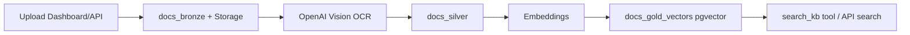

**Tools engine:**

- `search_kb` — busca semântica tenant-aware
- `get_lakehouse_schema` — schema para SQL (admin)
- `query_lakehouse` — SELECT com guardrails

**Governance:** `packages/lakehouse/governance.py` — ACTIVE_DICTIONARY, bloqueio DDL/DML destrutivo, PII masking.

## 25. Prompts do produto salão

**Arquivo:** `apps/salon/prompts.py`

| Builder | Papel | Tools |
|---------|-------|-------|
| `build_receptionist_prompt` | Recepcionista | search_kb, handoff |
| `build_support_prompt` | Suporte/políticas | search_kb, handoff |
| `build_scheduling_prompt` | Agendamento | check_availability, book_time |
| `build_lakehouse_prompt` | Analítico interno | get_lakehouse_schema, query_lakehouse |

**Guardrails comuns (`build_guardrails`):**

- Identidade imutável (assistente do {salon_name})
- Anti-hijack, anti-prompt-leak
- Veracidade via KB — não inventar preços
- Privacidade — não pedir senhas/cartão

Registro: `register_salon_prompts()` no app_factory startup via `packages/engine/prompts/registry.py`.

## 26. Checkpointer e persistência

**Arquivo:** `packages/engine/checkpointer.py`

| Ambiente | Backend | Config |
|----------|---------|--------|
| Produção | PostgresSaver | `CHECKPOINTER_BACKEND=auto`, `SUPABASE_DB_URL` |
| Testes/CI | MemorySaver | `CHECKPOINTER_BACKEND=memory` |

Thread ID = `{organization_id}:{sender_phone}` (WhatsApp) ou `{organization_id}:{uuid}` (chat test com org). Helper: `packages/auth_core/conversation_thread.py`. Histórico persiste por thread.

## 27. Métricas de tokens e custo

- `TurnTokenTracker` callback por invocação
- Persistência em `conversation_metrics` via `packages/engine/metrics/service.py` (inclui `organization_id`, path de agendamento, triagem e canal)
- "Ensaie seu assistente" (`/chat-test`, org_admin + super_admin) expõe badges `path=` / `triage=` por turno **só para super_admin** (dono vê a conversa limpa)
- Endpoints `/metrics/*` para dashboard admin (dev)

---

# Parte V — Frontend

## 28. Estrutura `apps/salon/dashboard/src/`

```
src/
├── main.tsx, App.tsx, index.css
├── pages/           # Overview, Agenda, Catalog, Patients, DataLake, ChatTest, Login
├── features/
│   ├── overview/    # hooks/useOverviewStats
│   ├── agenda/      # Agenda, components/, hooks/useAgenda, types
│   ├── catalog/     # Catalog.tsx
│   ├── clients/     # Patients.tsx
│   ├── admin/       # DataLake, ChatTest
│   └── auth/        # Login
├── components/      # Layout, ProtectedRoute, AdminDevRoute, ui/
├── contexts/        # AuthContext
├── lib/             # api.ts (implementação), utils.ts
└── shared/lib/      # re-export api.ts (@/shared/lib/api)
```

## 29. Auth, rotas protegidas

- `AuthProvider` — mount → `GET /auth/me`
- `ProtectedRoute` — redirect `/login` se não autenticado
- `AdminDevRoute` — super_admin + DEV only (Data Lake)
- `OrgAdminRoute` — bloqueia `professional` (Clientes, Catálogo, Configurações, **Ensaie seu assistente**)
- Rotas lazy-loaded com Suspense

**Rotas:**

| Path | Página | Acesso |
|------|--------|--------|
| `/login` | Login | público |
| `/` | Overview | autenticado |
| `/agenda` | Agenda | autenticado |
| `/patients` | Clientes | autenticado |
| `/catalog` | Catálogo | autenticado |
| `/chat-test` | Ensaie seu assistente | OrgAdminRoute (org_admin + super_admin) |
| `/admin/data-lake` | Data Lake | AdminDevRoute |
| `/admin/observability` | KPIs scheduling path / conversas | AdminDevRoute |

## 30. API client

**Implementação:** `src/lib/api.ts`  
**Import recomendado:** `@/shared/lib/api`

- Base URL: `VITE_API_URL` (default `http://localhost:8000/api/v1`)
- Envia cookie credentials + header `x-organization-id` quando org selecionada

## 31. Design system: identidade GAUSSIX (dark · glass · glow)

Espelha a identidade visual da empresa-mãe **GAUSSIX** (ver `gaussix-landing-page`) para manter marca linear entre landing page e produto. Substituiu o antigo "Neo-Swiss Brutalism" (bone white + laranja vermelhão + zero-radius + sombras duras com offset).

- Tailwind CSS v4 via `@tailwindcss/vite`; tokens em `src/index.css` (`@theme` + `:root` dark-first)
- **Tema dark-first:** `--background #0C0A12`, `--surface #14111C`, `--surface-glass` (vidro translúcido), `--foreground #ECEAF2`, `--muted`, `--border` (hairline translúcida). Sem `@media (prefers-color-scheme)` — sempre dark.
- **Paleta:** `--accent #8B2CF6` (Deep Tech Purple) + `--accent-2 #F86606` (Kinetic Orange); gradiente tricolor `--grad`. Semânticos: `--success`/`--warning`/`--danger`.
- **Raio sutil:** `--radius-sm..3xl` (8–28px) — fim do `border-radius: 0`.
- **Vidro/glow:** `@utility glass-panel` (blur + hairline), `glow-accent` (halo roxo), `gradient-text`, `brand-bar` (faixa tricolor), `bg-grid`, `bg-glow`. `card-brutal`/`btn-brutal`/`hover-lift` reimplementados (mesmos nomes) com elevação suave + glow — sem sombras duras com offset.
- **Tipografia:** Michroma (`--font-display`, wordmark/títulos) · Space Grotesk (`--font-sans`, corpo) · JetBrains Mono (`--font-mono`, dados) — carregadas via Google Fonts no `index.html`.
- **Marca:** componente `components/ui/Wordmark.tsx` ("FlowIA" em `gradient-text` + "by GAUSSIX"). Aparece no Login e no topo da sidebar / barra mobile como **logo do produto**. **Decisão de produto (Jun/2026): o nome do salão (tenant) não aparece mais no cabeçalho** — o topo exibe sempre "FlowIA" (white-label do nome no topo abandonado a pedido do dono). O `organization_name` segue disponível via `/auth/me` e no seletor de org do super_admin.
- Ícones: lucide-react
- DnD agenda Semana: @dnd-kit (drop target = slot ISO, não card)
- Timeline operacional: `react-calendar-timeline` + CSS scoped (`operationalTimeline.css`) herdando os tokens GAUSSIX

## 32. Testes E2E (Playwright)

| Spec | Cobertura |
|------|-----------|
| `auth-nav.spec.ts` | Login org_admin, nav sem admin routes |
| `professional-nav.spec.ts` | Login `professional`, nav só Visão Geral + Agenda (sem Clientes/Catálogo/seletor org) |
| `agenda.spec.ts` | Criar agendamento |
| `catalog.spec.ts` | Serviço + profissional |
| `patients.spec.ts` | CRUD cliente |
| `chat-test-rag.spec.ts` | Preço via KB |
| `chat-test-scheduling.spec.ts` | Fluxo agendamento chat (slots, badges path/triage, multi-turn mock) |

Mock API: `e2e/mock-api.ts` para CI sem backend real.

### Testes adversariais (backend pytest)

Suíte em camadas — catálogo em `tests/fixtures/adversarial_matrix.py`:

| Tier | Marker | CI | Cobertura |
|------|--------|-----|-----------|
| A | `adversarial` | Sim | `input_guard`, guardrails SQL, lakehouse `validate_sql_query`, RAG envelope |
| B | `agent_flow` + `adversarial` | Sim | HTTP `/chat/test` blocked, webhook blocked, typos, multi-turn, RAG poison |
| C | `llm_behavior` | Não (opt-in) | Tom raivoso/jailbreak com OpenAI real (`RUN_LLM_BEHAVIOR_TESTS=1`) |

**No-leak cross-tenant:** `tests/test_agent_tenant_isolation.py` (Tier B `agent_flow`) — agente da org Y não devolve catálogo/dado exclusivo da org X; recusa honesta para serviço desconhecido; `search_knowledge` envia `filter_org_id` só para org específica. Complementa o spoof HTTP (`test_tenant.py`) e o repasse RAG (`test_chat_rag.py`).

```bash
py -3.12 scripts/run_adversarial_matrix.py
py -3.12 -m pytest -m "not llm_behavior" -q
RUN_LLM_BEHAVIOR_TESTS=1 py -3.12 -m pytest -m llm_behavior -q
```

---

# Parte VI — Operações

## 33. Variáveis de ambiente

Referência completa: `.env.example` (copiar para `.env` — **nunca commitar**)

| Variável | Obrigatória | Propósito |
|----------|-------------|-----------|
| `PRODUCT_LINE` | Sim | `salon` (MVP) ou `clinic` (futuro) |
| `OPENAI_API_KEY` | Sim | OpenAI chat + OCR + embeddings |
| `MODEL_NAME` | Sim | Modelo chat (gpt-4o-mini) |
| `VISION_MODEL_NAME` | Sim (data lake) | OCR Bronze→Silver (`gpt-4o`) |
| `EMBEDDING_MODEL_NAME` | Sim | Embeddings RAG (`text-embedding-3-small`) |
| `EMBEDDING_DIMENSIONS` | Opcional | Dimensão dos vetores pgvector (`docs_gold_vectors`); default 768 |
| `SUPABASE_URL` | Sim | URL projeto Supabase |
| `SUPABASE_KEY` | Sim | Anon key (backend) |
| `SUPABASE_SERVICE_ROLE` | Sim | Service role (backend only) |
| `SUPABASE_DB_URL` | Sim | Postgres direct (checkpointer) |
| `WHATSAPP_VERIFY_TOKEN` | Sim | Verificação webhook Meta |
| `WHATSAPP_APP_SECRET` | Opcional | Assinatura webhook (HMAC `X-Hub-Signature-256`) |
| `WHATSAPP_ALLOW_UNSIGNED` | Opcional | **Fail-closed (default `false`):** com `WHATSAPP_APP_SECRET` vazio, inbound não assinado só é aceito se `true`. No modelo multi-app "cliente traz a própria conta" ([§20](#20-concorrência-e-limitações-conhecidas)) defina `true` conscientemente |
| `DASHBOARD_API_KEY` | Sim | API key interna |
| `DASHBOARD_JWT_SECRET` | Sim | Secret JWT (32+ chars) |
| `VITE_SUPABASE_URL` | Sim (frontend) | Anon URL browser |
| `VITE_SUPABASE_KEY` | Sim (frontend) | Anon key browser |
| `VITE_API_URL` | Sim (frontend) | Base API |
| `CHECKPOINTER_BACKEND` | Opcional | auto \| postgres \| memory |
| `SCHEDULING_DETERMINISTIC_ENABLED` | Opcional | Executor antes do LLM (default true) |
| `SCHEDULING_LLM_FALLBACK` | Opcional | smart \| always \| never |
| `INTENT_EXTRACTOR_ENABLED` | Opcional | LLM estruturado em turnos ambíguos (default true) |
| `RESPONSE_POLISH_ENABLED` | Opcional | Polish LLM pós-composer (default **false**; A/B staging — ver §33.1) |
| `GUIDED_BOOKING_WHATSAPP_ENABLED` | Opcional | Fluxo guiado por seleção (interativo) no WhatsApp (default **false** — texto livre de produção inalterado) |
| `KNOWLEDGE_GAP_CAPTURE_ENABLED` | Opcional | Captura fail-soft de perguntas sem resposta na base RAG (default **true**; fire-and-forget no `search_kb`) |
| `SIM_WHATSAPP_ORG_ID` | Dev only | Bypass tenant resolver em simulação local — **nunca produção** |
| `SIM_WHATSAPP_PHONE_ID` | Dev only | Default `123456789`; parear com simulate script |
| `PROD_SMOKE_PASSWORD` | Dev/smoke | Senha piloto para `smoke_hybrid_prod.py` — não commitar |
| `WHATSAPP_QUEUE_MODE` | Opcional | Fila inbound WhatsApp: `inline` (default) \| `worker` (ver §20) |
| `SCHEDULER_ENABLED` | Opcional | true em prod, false em CI |
| `WEBHOOK_DEDUP_RETENTION_DAYS` | Opcional | TTL purge dedup WhatsApp (default 7) |
| `PUBLIC_API_URL` | Opcional | URL pública da API p/ exibir o webhook no dashboard (default `https://flowia-api.onrender.com/api/v1`; override só p/ domínio próprio) |
| `COOKIE_SECURE` | Prod | true com HTTPS |
| `ALLOWED_ORIGINS` | Prod | URL dashboard produção (CORS) |
| `ALLOWED_HOSTS` | Prod | Hostname da API (`TrustedHostMiddleware`) |
| `DEV_*` / `VITE_DEV_*` | Dev only | Login rápido local — **nunca produção** |
| `LANGCHAIN_TRACING_V2` / `LANGCHAIN_PROJECT` / `LANGCHAIN_API_KEY` · `SLACK_WEBHOOK_URL` · `FALLBACK_USD_TO_BRL` | Opcional | Observabilidade/diagnóstico: tracing LangSmith, alertas Slack, fallback câmbio USD→BRL (default 5.30). Lidas do ambiente — **fora** do `.env.example` |

### 33.1 RESPONSE_POLISH — decisão A/B (staging)

| Ambiente | Valor recomendado | Notas |
|----------|-------------------|-------|
| Produção piloto | `false` | Templates do composer já humanizados; `tokens=0` no path determinístico |
| Staging / teste 1 semana | `true` | Comparar `tokens_out` e satisfação manual; KPI via `/metrics/scheduling-observability` |
| Critério para ligar prod | Polish melhora tom **e** custo extra ≤ R$ X/dia por org | Registrar decisão nesta seção ao fechar A/B |

## 34. Deploy e staging

**Hosting produção (confirmado):** Render Web Service (API) + Render Static Site (dashboard) + Supabase prod.

| Artefato | Caminho |
|----------|---------|
| Blueprint IaC | [`render.yaml`](render.yaml) |
| Guia deploy | [`docs/RENDER.md`](docs/RENDER.md) |
| Rollback / URLs | [`docs/PRODUCTION.md`](docs/PRODUCTION.md) |
| Tenancy & escala | [`docs/TENANCY_AND_SCALE.md`](docs/TENANCY_AND_SCALE.md) |
| Env API prod | [`deployments/multi-tenant/.env.production.example`](deployments/multi-tenant/.env.production.example) |

Checklist: [`docs/STAGING.md`](docs/STAGING.md)

1. Supabase prod + `supabase db push` (**24 migrations**) + pgvector
2. Secrets novos: `python scripts/generate_prod_secrets.py`
3. Render API: `uvicorn main:app --host 0.0.0.0 --port $PORT`, health `/health`, scale=1
4. Render Static Site: `apps/salon/dashboard`, `VITE_API_URL=https://API.onrender.com/api/v1`
5. `ALLOWED_ORIGINS` = URL dashboard; `COOKIE_SECURE=true`, `SCHEDULER_ENABLED=true`
6. Smoke: `python scripts/smoke_prod.py` + `python scripts/smoke_hybrid_prod.py` + `python scripts/smoke_agent.py` + login manual
7. WhatsApp (quando Meta): [`docs/WHATSAPP_SETUP.md`](docs/WHATSAPP_SETUP.md)

**Deploy templates:**

- `deployments/multi-tenant/` — SaaS compartilhado
- `deployments/tenants/{slug}/` — instância dedicada (.env + branding)

**Windows local:** `start_flowia.bat` ou `start_flowia.bat tenants\beauty-express`

## 35. Seeds e scripts de dev

| Script | Função |
|--------|--------|
| `scripts/check_env.py` | Valida .env sem expor valores |
| `scripts/generate_prod_secrets.py` | Gera JWT/API key/WhatsApp verify (stdout) |
| `scripts/smoke_prod.py` | Smoke `/health` + dashboard HTTP em prod |
| `scripts/smoke_hybrid_prod.py` | Smoke motor híbrido (`scheduling_path=deterministic`) + today-board |
| `scripts/smoke_agent.py` | Smoke LangGraph/RAG + cenário hybrid via `/chat/test` |
| `scripts/test_rag_chat.py` | Teste RAG local ou prod (queries KB) |
| `scripts/apply_migrations.py` | Aplica migrations SQL via `SUPABASE_DB_URL` |
| `scripts/list_db_migrations.py` | Lista migrations aplicadas no banco |
| `scripts/mark_migration_applied.py` | Marca migration como aplicada (reparo histórico) |
| `scripts/create_platform_admin.py` | Cria super_admin plataforma |
| `scripts/setup_dev_env.py` | Cria admin dev |
| `scripts/create_salon_user.py` | Cria usuário salão — `org_admin` (default) ou `--role professional --professional-id <UUID>` (login funcionário) |
| `scripts/onboard_tenant.py` | Runbook + criação org + org_admin para 1º cliente pagante |
| `scripts/seed_salon.py` | Dados demo salão |
| `scripts/seed_dev.py` | Seeds multi-vertical + mocks data lake |
| `apps/salon/seeds/vertical_orgs.py` | Org referência Beauty Express |

Org demo: `22222222-2222-2222-2222-222222222222` (Beauty Express)

### Scripts operacionais

| Script | Comando | Quando |
|--------|---------|--------|
| Validar env | `python scripts/check_env.py` | Antes de subir ou após rotacionar secrets |
| Admin dev | `python scripts/setup_dev_env.py --email ... --password ...` | Primeiro setup local |
| Dono salão | `python scripts/create_salon_user.py --email ... --password ...` | Testar como org_admin |
| Funcionário | `python scripts/create_salon_user.py --email ... --password ... --org <UUID> --role professional --professional-id <UUID>` | Login profissional (agenda própria) |
| Seed salão | `python scripts/seed_salon.py` | Dados demo agenda/catálogo |
| Seed completo | `python scripts/seed_dev.py` | Multi-vertical + mocks data lake |
| Chat test HTTP | `python scripts/test_booking_flow_http.py` | Multi-turn `/chat/test` no terminal |
| Simular WhatsApp | `python scripts/simulate_whatsapp_webhook.py` | Webhook fake sem Meta (métricas `channel=whatsapp`) |
| Smoke híbrido prod | `python scripts/smoke_hybrid_prod.py --api-url https://flowia-api.onrender.com` | Pós-deploy; senha via `PROD_SMOKE_PASSWORD` |
| Onboard tenant | `python scripts/onboard_tenant.py` | Novo salão pagante (org + admin + checklist) |
| Isolamento cross-tenant (ao vivo) | `python scripts/smoke_tenant_isolation.py --mode all` | Prova no-leak entre orgs no banco real: cria ORG_B temp + serviço, valida no-leak/spoof 403, limpa (`setup`/`probe`/`cleanup`) |

### Decisões arquiteturais registradas (ADRs implícitos)

| Decisão | Escolha | Motivo |
|---------|---------|--------|
| Auth dashboard | JWT FastAPI cookie HttpOnly | Controle total; frontend não usa Supabase Auth |
| Multi-tenant | organization_id + RLS | Centenas de orgs no mesmo Supabase; pooler/worker conforme carga — ver [`docs/TENANCY_AND_SCALE.md`](docs/TENANCY_AND_SCALE.md) |
| Checkpointer | PostgresSaver prod / MemorySaver testes | Persistência conversas sem Redis extra |
| Data Lake | Medallion micro-escala Supabase | Sem Databricks; Bronze/Silver/Gold lógico |
| WhatsApp org | Credenciais por organization | White-label real por cliente |
| PRODUCT_LINE | Env var `salon` | Preparar `clinic` sem fork de repo |
| Composition root | app_factory único | Routers desacoplados; prefix /api/v1 centralizado |
| Exceções domínio | auth_core/exceptions.py | Mapeamento HTTP consistente no app_factory |

## 36. Roadmap futuro (não MVP)

Ver [`docs/ROADMAP.md`](docs/ROADMAP.md). Resumo:

| Capítulo | Status | Escopo |
|----------|--------|--------|
| 1 — AI Chatbot & CRM | Concluído (MVP salão) | RAG, agendamento, data lake |
| 2 — Sales Analytics | **Futuro** | SG-Vendas, faturamento — **isolado do chatbot** |
| 3 — Workspace Analítico | Concluído | Data Lake UI, SQL editor |
| 4 — Agendamento Multi-Tenant | Concluído | RLS, lembretes, no-show |
| 5 — Omnichannel WhatsApp | Bloqueado | Webhook prod: `https://flowia-api.onrender.com/api/v1/webhook/whatsapp`; aguardando credenciais Meta — [`docs/WHATSAPP_SETUP.md`](docs/WHATSAPP_SETUP.md). **Conexão self-service** (org_admin cola credenciais + teste em Configurações) **ativa**; **Embedded Signup** (onboarding "um clique" via popup Facebook) é **futuro** — requer FlowIA virar Tech Provider aprovado pela Meta |
| 6 — Customer Journey Intelligence | **Futuro** | [Parte VIII §42](#42-epic-customer-journey-intelligence) · [`docs/ROADMAP.md`](docs/ROADMAP.md) Cap. 6 |
| 7 — Reagendamento Inteligente (no-show / atraso) | **Futuro** | [Parte VIII §49](#49-epic-reagendamento-inteligente--recuperação-de-no-showatraso-documentação--não-implementar) · [`docs/ROADMAP.md`](docs/ROADMAP.md) Cap. 7 |
| 8 — v2.0 Multicanal + Inbox Humano | **Futuro** | Camada multicanal nativa (chat de site, IG/Messenger, e-mail) + inbox humano com takeover real, inspirada no Chatwoot mas **sem integrá-lo** — [`docs/V2_VISION.md`](docs/V2_VISION.md). **Não implementar** sem aprovação por onda; começa pós-WhatsApp live |

**Priorização produto salão:** (1) estabilizar MVP atual (Partes I–VII) → (2) Cap. 5 WhatsApp live → (3) Parte VIII só com aprovação explícita → Cap. 2 Sales Analytics permanece isolado do chatbot salão.

**Fase 2 salão:** pagamento, convênios — não implementar agora.

---

# Parte VII — Desenvolvimento e governança

## 37. Mapa de documentação

| Documento | Quando consultar |
|-----------|------------------|
| **CLAUDE.md** (este) | Sempre — fonte da verdade |
| [`AGENTS.md`](AGENTS.md) | Comandos, rules/skills Cursor |
| [`docs/README.md`](docs/README.md) | Índice temático |
| [`docs/ARCHITECTURE.md`](docs/ARCHITECTURE.md) | Referência arquitetura |
| [`docs/SOLUTION_ARCHITECTURE.md`](docs/SOLUTION_ARCHITECTURE.md) | Arquitetura de Solução (C4: contexto→contêineres→componentes→runtime→deploy + ADRs) |
| [`docs/BPMN.md`](docs/BPMN.md) | Processos de negócio BPMN-style (Mermaid, lanes) |
| [`docs/TECH_STACK.md`](docs/TECH_STACK.md) | Tecnologias empregadas — prós/contras e alternativas |
| [`docs/DER.md`](docs/DER.md) | Modelo de dados — DER + dicionário de tabelas/constraints |
| [`docs/SALON_BUSINESS_AUDIT.md`](docs/SALON_BUSINESS_AUDIT.md) | Auditoria negócio MVP |
| [`docs/PACKAGE_BOUNDARIES.md`](docs/PACKAGE_BOUNDARIES.md) | Boundaries pacotes |
| [`docs/SECRET_ROTATION.md`](docs/SECRET_ROTATION.md) | Rotação secrets |
| [`docs/STAGING.md`](docs/STAGING.md) | Deploy checklist |
| [`docs/RENDER.md`](docs/RENDER.md) | Deploy API + dashboard no Render |
| [`docs/PRODUCTION.md`](docs/PRODUCTION.md) | URLs prod, smoke, rollback |
| [`docs/RELEASING.md`](docs/RELEASING.md) | Releases SemVer, fixes, updates, tag + GitHub Release |
| [`docs/TENANCY_AND_SCALE.md`](docs/TENANCY_AND_SCALE.md) | Multi-tenant, onboarding salão, escala 200+ |
| [`docs/DOC_AUDIT_2026-06.md`](docs/DOC_AUDIT_2026-06.md) | Auditoria documentação (Jun/2026) |
| [`docs/data-lake.md`](docs/data-lake.md) | Pipeline Medallion |
| [`docs/ROADMAP.md`](docs/ROADMAP.md) | Futuro estratégico |
| [`docs/V2_VISION.md`](docs/V2_VISION.md) | Blueprint v2.0 multicanal + inbox humano (futuro — não implementar sem aprovação) |
| [`docs/archive/PLAN.md`](docs/archive/PLAN.md) | Histórico executado |

## 38. Cursor: AGENTS, rules, skills

- **AGENTS.md** — operação diária (comandos, stack, mapa rules/skills)
- **Rules** — `.cursor/rules/01-global-standards.mdc` (always) + 02–05 por glob
- **Skills domínio (`flowia-*`)** — dev, monorepo, salon-domain, security, data-lake
- **Skills on-demand** — security-audit, performance-optimization, feature-flag-override
- **MCP** — Supabase read-only + Render ops; template [`.cursor/mcp.json.example`](.cursor/mcp.json.example) (não commitar `.cursor/mcp.json`)

Todas as skills carregam sob demanda via `@nome` no chat (`disable-model-invocation: true`).

| Skill | Gatilho |
|-------|---------|
| `flowia-dev` | Subir local, CI, pytest, `.env` |
| `flowia-monorepo` | Onde colocar código, imports, boundaries |
| `flowia-salon-domain` | Auth, agenda, WhatsApp, LangGraph, RLS |
| `flowia-security` | Auditoria tenant, secrets, webhook, 403 |
| `flowia-data-lake` | Bronze/Silver/Gold, OCR, RAG, DataLake UI |
| `security-audit` | Revisão de injeção (SQL/prompt), vazamento PII/secrets, tenant |
| `performance-optimization` | Bundle/lazy loading, N+1, queries lentas |
| `feature-flag-override` | Toggles (`is_active`, `settings`, `PRODUCT_LINE`, `AdminDevRoute`), UI `card-brutal` |

## 39. Dívida técnica conhecida

| Item | Arquivo | Status |
|------|---------|--------|
| Monolito `date_parsing.py` | `packages/scheduling/date_parsing/` | **Resolvido** — subpacote types/normalize/resolve + API via pacote |
| Monolito `SchedulingService` | `packages/scheduling/services/` + `service.py` | **Resolvido** — mixins availability/appointments + facade |
| Monolito `booking_executor` | `packages/scheduling/booking/` + `booking_executor.py` | **Resolvido** — models/prompts extraídos; turn logic no executor |
| Monolito `engine.py` | `packages/engine/graph/` + `engine.py` | **Resolvido** — state/nodes/edges/compile + facade |
| Monolito catalog router | `apps/salon/domain/catalog/routers/` | **Resolvido** — organizations/services/professionals + helpers |
| God class DataLake | `packages/lakehouse/service.py` | **Resolvido** — fachada + bronze/silver/gold/search |
| Dictionary inline | `packages/lakehouse/governance.py` | **Resolvido** — `data/active_dictionary.json` (CRM filtrado) |
| God component modais | `AgendaModals.tsx` | **Resolvido** — modals em `components/modals/` |
| Fat hook | `useAgenda.ts` | **Resolvido** — split useAgendaData/Actions |
| API client paths | `lib/api.ts` vs `shared/lib/api.ts` | **Resolvido** — AuthContext usa `@/shared/lib/api` |
| Auth duplicado | `contexts/` vs `features/auth/` | **Resolvido** — implementação em `features/auth/` |
| Webhook dedup | in-memory dict | **Resolvido** — tabela `webhook_message_dedup` |
| Booking race | read-then-write | **Resolvido** — constraint EXCLUDE no DB |
| Handoff → leads | session_store | **Resolvido** — `patients.handoff_*` |
| Triage → scheduling | `packages/engine/routing.py` | **Resolvido** — heurísticas + escape receptionist + executor determinístico |
| Disponibilidade hardcoded | `packages/scheduling/service.py` | **Resolvido** — motor lê working_hours/break_times/buffer/timezone + `schedule_blocks` |
| Serviço↔profissional 1:1 | `service_catalog.professional_id` | **Em transição** — M:N via `service_professionals`; coluna legada mantida nullable p/ compat |
| UI catálogo working_hours/M:N | `apps/salon/dashboard/.../catalog` | **Resolvido** — modais `ProfessionalEditModal` / `ServiceEditModal` + `workingHours.ts` |
| Lembretes WhatsApp | `packages/scheduling/reminder_service.py` | **Resolvido** — envio via `WhatsAppService` quando credenciais org configuradas; `mark_failed` se indisponível |
| Métricas scheduling UI admin | `/metrics/scheduling-observability` + `AgentObservability.tsx` | **Resolvido** — KPI dev-only |
| `knowledge_gaps` só contada (sem captura/schema) | `knowledge_gaps` + `search_kb` + `/metrics/knowledge-gaps` | **Resolvido** — captura fail-soft no RAG vazio + painel observabilidade |
| `run_tools` sem try/except (exceção de tool derrubava o turno) | `packages/engine/graph/nodes.py` | **Resolvido** — cada `tool.invoke()` em `try/except` → erro amigável |
| Agente não reagendava/cancelava | `packages/scheduling/tools.py` (`reschedule_time`/`cancel_appointment`/`list_my_appointments`) | **Resolvido (F3 §49)** — tools vinculadas ao sender; reschedule→scheduling, cancel→support |
| Anamnese / NPS | Parte VIII §42–§43 | **DEFERIDO** — schema only |
| Pagamentos | `packages/integrations/payments` | **STUB** — contrato + NoOp + schema; execução deferida (Fase 2) |
| `org_today()` faz `SELECT organizations.timezone` a cada parse de data | `packages/scheduling/timezone_utils.py` (`resolve_org_timezone`) | **Resolvido (perf)** — cache process-local TTL (`_TZ_CACHE`, 5 min, `time.monotonic()`) keyed por `org_id`; hit válido evita a query. Só cacheia no caminho de sucesso (fallback `DEFAULT` do `except` **nunca** é cacheado, para não fixar tz errada durante falha transitória de DB); `None`/`ALL` curto-circuitam sem consultar. In-process aceitável (igual rate-limit/cooldown §20, MVP scale=1); mudança de tz propaga em ≤5 min sem invalidação explícita |
| `conversation_metrics.sender_id` persistia o telefone cru (não mascarado) | `packages/engine/metrics/service.py` | **Resolvido (LGPD)** — `save_conversation_metric` minimiza na fonte via `mask_sender_id` (`***1234`); correlação de DSAR/retenção é por `thread_id` (não por `sender_id`), então mascarar é lossless. ROPA #6 atualizado. Linhas antigas (pré-fix) expiram via retenção 365d — backfill one-time opcional |

## 40. Manutenção da fonte da verdade

**Regra de ouro:** decisão importante → atualizar este `CLAUDE.md` no mesmo PR (ou imediatamente após).

**Releases:** versionamento do produto segue [`docs/RELEASING.md`](docs/RELEASING.md) — SemVer ancorado em `_APP_VERSION` ([`apps/salon/api/app_factory.py`](apps/salon/api/app_factory.py)), mudanças registradas em [`CHANGELOG.md`](CHANGELOG.md), cada versão com tag `vX.Y.Z` + GitHub Release. Não confundir com a tabela de versionamento **deste documento** (abaixo).

### Checklist por tipo de mudança

| Mudança | Seções a atualizar |
|---------|-------------------|
| Novo endpoint / router | §13 Superfície API |
| Nova migration / tabela | §14 Modelo de dados, §15 Migrações |
| Nova regra de negócio | §4 Regras, §5 Matriz |
| Novo papel IA / prompt | §25 Prompts, §22 LangGraph |
| Nova env var / modelo IA | §33 Variáveis · §9 Stack |
| Mudança auth/tenant/RLS | §16–17 Segurança |
| Paradigma negócio / epics Recuperador de Lucros | §4.5, §36, `docs/ROADMAP.md` |
| Nova limitação concorrência | §20 Limitações |
| Novo fluxo usuário | §6 Fluxos |
| Refactor pacote grande | §10 Estrutura, §39 Dívida |
| Feature fora MVP | §7 Fora do MVP, §36 Roadmap, **Parte VIII** |
| Visão futura / epic pós-MVP | **Parte VIII** (nunca Partes I–VII como spec de implementação) |
| Tenancy / onboarding / escala | §2, [`docs/TENANCY_AND_SCALE.md`](docs/TENANCY_AND_SCALE.md) |
| Nova skill Cursor | §38 Cursor, `AGENTS.md`, opcional `01-global-standards.mdc` |
| Upgrade de dependência / modelo IA estrutural | §9 Stack, §33 Env, **§48 Modernização** (plano + gatilho) |

### Ao fechar PR significativo

- [ ] CLAUDE.md reflete a mudança?
- [ ] Decisão arquitetural documentada?
- [ ] Limitação de segurança anotada se aplicável?
- [ ] AGENTS.md atualizado só se mudou comando/rule/skill?

### Versionamento deste documento

| Versão doc | Data | Mudança |
|------------|------|---------|
| 1.0 | Jun/2026 | Criação como fonte da verdade — consolida ARCHITECTURE, SALON_BUSINESS_AUDIT, MONOREPO, STAGING, SECRET_ROTATION, data-lake |
| 1.1 | Jun/2026 | 3 skills on-demand (security-audit, performance-optimization, feature-flag-override) + registro em §38 |
| 1.2 | Jun/2026 | Purge automático webhook_message_dedup (APScheduler, retention 7 dias) |
| 1.3 | Jun/2026 | Deploy Render (API + Static Site), cookie SameSite cross-subdomain, scripts smoke ops, auditoria docs |
| 1.4 | Jun/2026 | Playbook tenancy & escala (`docs/TENANCY_AND_SCALE.md`); ambiente vs cliente; ADR multi-tenant 200+ orgs |
| 1.5 | Jun/2026 | Capítulo Agenda/Equipe/Integrações: motor de disponibilidade real (working_hours/breaks/buffer/timezone/blocks), M:N `service_professionals`, agenda dual (Semana/Equipe), Overview today-board, role `professional`, stub pagamentos |
| 1.6 | Jun/2026 | Agenda Operacional (Gantt/timeline default), Semana por profissional, fix DnD slot, resize via `duration_minutes` |
| 1.7 | Jun/2026 | Paradigma Recuperador de Lucros (§4.5) + roadmap epics 1A–4 documentados |
| 1.8 | Jun/2026 | Motor híbrido agendamento (§23.1), observability metrics, smoke_hybrid_prod, WHATSAPP_SETUP |
| 1.9 | Jun/2026 | Modelos IA documentados: OpenAI `gpt-4o-mini` / `gpt-4o` / `text-embedding-3-small` (substitui referências Gemini) |
| 1.10 | Jun/2026 | Epic Customer Journey Intelligence — §4.6 (5 fases), Pilar 5 §4.5, §5/§6.4/§7/§36, ROADMAP Cap. 6 |
| 1.11 | Jun/2026 | **Parte VIII — Futuras implementações** isolada; guardrail agentes; conteúdo CJI movido de §4.6/§6.4 |
| 1.12 | Jun/2026 | Blueprint técnico CJI — Parte VIII §45 (pacotes, API proposta, schema, jobs, ordem) |
| 1.13 | Jun/2026 | Modelagem evolutiva §46 + métodos probabilísticos §47 (JSONB, ondas, gates IA) |
| 1.14 | Jun/2026 | Auditoria de stack: Node 22 (CI), correção dedup §4.2, ordem do versionamento, nota deprecação OpenAI 4o (§9), limitação limiters (§20); novo §48 Parte VIII — modernização de stack (migração modelos, PyJWT, rate limit distribuído, Vite 7, gate cobertura) |
| 1.15 | Jun/2026 | Epic Reagendamento Inteligente & Recuperação de No-show/Atraso — Parte VIII §49 (epic F1–F4), §50 (blueprint), §51 (modelagem por ondas), §52 (métodos IA); ponteiros §4.5/§7/§36/§43/§44; Cap. 7 em `docs/ROADMAP.md` |
| 1.16 | Jun/2026 | Migração `python-jose` → `PyJWT` concluída (§48.2 Concluído, §9 stack, §43 índice); decode mantém `algorithms=["HS256"]` |
| 1.17 | Jun/2026 | Gate de cobertura backend 30 → 50 (§48.5, cobertura real 70.71%) |
| 1.18 | Jun/2026 | Toolchain frontend Vite 5 → 7 concluído (§48.4, §9, §43): Vite 7.3 / Vitest 3.2 / plugin-react 4.7; build+vitest+eslint+E2E verdes no Node 22 |
| 1.19 | Jun/2026 | Padronização **Node 24 LTS** (§9, §48.4): CI, Render `NODE_VERSION`, `engines >=24`, `.node-version`, `.npmrc` `engine-strict`, `start_flowia.bat` |
| 1.20 | Jun/2026 | **Integração WhatsApp self-service** (§13, §5, §3, §4.2, §20, §36): rotas tenant-scoped `GET/PATCH/POST /organizations/whatsapp*` (token mascarado, teste real na Graph API), tela Configurações para org_admin (modelo "cliente traz a própria conta"); Embedded Signup permanece futuro; limitações app secret/verify token registradas |
| 1.21 | Jun/2026 | **Release 1.2.0** (`_APP_VERSION`): dashboard financeiro (`/dashboard/financial`) + KPI por profissional (`/dashboard/professional-kpi`) em §13; agente híbrido guiado (menu/FAQ/consentimento por botões + recuperação fail-soft) e nota de render WhatsApp (≤3 botões / lista ≤10) em §20/§23.1; rodada de robustez: fixes de timezone (KPI/today-board), validação de slot no guiado, fallback de upsert protegido, versão única no `FastAPI(...)` |
| 1.22 | Jun/2026 | Higiene (remoção do `iter_text_messages` morto) + **documentação robusta**: novos `docs/SOLUTION_ARCHITECTURE.md`, `docs/BPMN.md`, `docs/TECH_STACK.md`, `docs/DER.md` (§37 mapa de documentação); limitação LGPD "Discordo" não-persistente em §20 |
| 1.23 | Jun/2026 | Auditoria profunda (doc vs código): sync de migrations (§15/§34 — +`conversation_metrics_sender_text`, 21→22), env vars §33 (`WHATSAPP_QUEUE_MODE`, `EMBEDDING_DIMENSIONS` + linha de observabilidade `LANGCHAIN_*`/`SLACK_WEBHOOK_URL`/`FALLBACK_USD_TO_BRL`), lista legal §19 (`LGPD_ONBOARDING_CHECKLIST`), header doc version. §13/§14/§20 reconciliados e confirmados corretos |
| 1.24 | Jun/2026 | **"Ensaie seu assistente"**: chat-test promovido de dev-only a `org_admin` (§3, §5, §29) — rota `/chat-test` sob `OrgAdminRoute` (bloqueia `professional`); telemetria de dev (path/triage/tokens) só para super_admin; backend `/chat/test` inalterado (já aceitava org_admin); E2E auth-nav/professional-nav atualizados |
| 1.25 | Jun/2026 | **Lacunas de conhecimento**: migration `knowledge_gaps_capture` (schema + upsert `record_knowledge_gap`), captura fail-soft no `search_kb` atrás de `KNOWLEDGE_GAP_CAPTURE_ENABLED`, endpoint `/metrics/knowledge-gaps` e painel em `AgentObservability` (§13/§15/§27/§33/§39) |
| 1.26 | Jun/2026 | **Reagendar/cancelar pelo agente (§49 F3) + hardening**: tools `reschedule_time` (scheduling) e `cancel_appointment` (support) + `list_my_appointments`, vinculadas ao sender (anti-injeção §52); `run_tools` agora fail-safe (try/except por tool); fix de vazamento de `str(e)` no `/chat/test`; routing `reagendar/remarcar/desmarcar`→scheduling (cancelar segue em support); §23/§39/§7 atualizados |
| 1.27 | Jun/2026 | **Follow-up auditoria P0 (governança)**: fix de fuso (`org_today()` ancora datas coloquiais em `organizations.timezone`) e mascaramento de PII em logs (handoff Slack, auth, webhook, dispatch). Doc: contagem de migrations 22→23 (§34); 2 dívidas abertas em §39 (perf `org_today` por parse; `conversation_metrics.sender_id` cru); Slack como subprocessador (telefone mascarado) em `SUBPROCESSORS.md`; ROPA +handoff Slack, `whatsapp_inbound_jobs`, `knowledge_gaps` (retenção **a definir**) |
| 1.28 | Jun/2026 | **Cluster LGPD (auditoria)**: DSAR completo — export+erase de `anamnesis_responses` (saúde, anonimização de `answers`) e `appointment_payments` (financeiro, anonimização de `external_id`/`metadata` via `appointment_id` do paciente), fail-soft; **recusa de consentimento persistida** — migration `20260613000000_patient_privacy_declined.sql` (§15, contagem 23→24 §34) + `record_decline` + ramo no `evaluate_consent_gate` que reapresenta o aviso (recusa nunca vira consent tácito; saída só via "Concordo"), ligado nos handlers de decline chat dev/WhatsApp; §20 "Discordo" de limitação aberta → resolvida; ROPA atualizado |

---

# Parte VIII — Futuras implementações (NÃO MVP)

> **GUARDRAIL — AGENTES E DESENVOLVEDORES**
>
> - Esta parte é **somente documentação de visão estratégica**.
> - **Não implementar** código, migrations, endpoints, tabelas, prompts de produção ou UI descritos aqui **salvo pedido explícito** do usuário com aprovação de produto.
> - Prioridade operacional: **estabilizar e operar o MVP salão** (Partes I–VII).
> - Não confundir com CRM B2B / leads / SDR (permanecem desativados — §7).

## 41. Política de escopo futuro

| Regra | Descrição |
|-------|-----------|
| **Isolamento** | Toda feature pós-MVP vive nesta Parte VIII ou em [`docs/ROADMAP.md`](docs/ROADMAP.md) — não nas seções de regras ativas (§4.1–§4.4, §6, §13) |
| **Referência cruzada** | Partes I–VII usam **apenas ponteiros** para cá (ex.: Pilar 5 em §4.5) |
| **Schema existente ≠ feature ativa** | `anamnesis_*`, `recall_days` têm schema; `nps_*` é **conceitual** (sem migration no repo); fluxo de produto **não implementado** |
| **LGPD antes de código** | Qualquer implementação futura exige revisão `packages/compliance/`, ROPA e consentimento |
| **Gatilho de implementação** | Issue/épico aprovado + atualização desta seção para status "Em desenvolvimento" |

**Priorização sugerida (quando houver aprovação):** Cap. 5 WhatsApp live → Epic CJI (fases 1–4) → Fase 5 premium → expansão `clinic`.

**Blueprint técnico (discussão):** [§45](#45-blueprint-técnico-cji-documentação--não-implementar) — pacotes, API, jobs; [§46](#46-modelagem-de-dados-evolutiva-cji-documentação--não-implementar) — evolução de schema; [§47](#47-métodos-probabilísticos-qualidade-ia-documentação--não-implementar) — camadas IA e gates de qualidade; [§48](#48-modernização-de-stack-documentação--não-implementar) — modernização de stack. **Não implementar** sem aprovação.

## 42. Epic Customer Journey Intelligence

> **Alias PT:** Jornada Inteligente do Cliente · **Status:** Futuro / Pós-MVP / **Não implementar agora**

**Objetivo:** orquestrar a jornada pré, durante e pós-atendimento com IA — aumentando LTV, recall de clientes e produtividade do profissional.

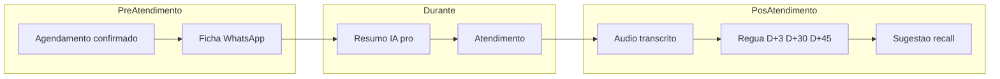

| Fase | Objetivo | Valor para o salão | Dependências técnicas prováveis | Riscos principais | Status |
|------|----------|-------------------|--------------------------------|-------------------|--------|
| **1 — Pré-atendimento e ficha inteligente** | Enviar ficha pré-atendimento via WhatsApp após confirmação de agendamento | Profissional chega preparado; menos triagem na cadeira | WhatsApp outbound por org; LangGraph ou fluxo determinístico; `anamnesis_templates` / `anamnesis_responses`; `requires_anamnesis` no catálogo; `packages/compliance/consent.py` | Dados de saúde/alergias (PII sensível); opt-in explícito; atualizar ROPA e retenção | **Futuro / Pós-MVP / Não implementar agora** |
| **2 — Resumo IA e histórico do cliente** | Card/resumo IA para o profissional antes do slot (histórico, preferências, última visita, no-shows) | Atendimento personalizado; menos perguntas repetidas | Agregação `patients` + `appointments` + conversas (checkpointer/métricas); RAG opcional; UI scoped via `professional_scope` na agenda/overview | Vazamento cross-profissional sem scope; resumo alucinado — exigir fontes citadas | **Futuro / Pós-MVP / Não implementar agora** |
| **3 — Áudio pós-atendimento e transcrição** | Profissional grava notas em áudio; sistema transcreve, resume e persiste no histórico do cliente | Registro sem digitação; memória institucional do salão | Upload áudio (Storage); API transcrição (ex. Whisper); modelo de registro de atendimento (**não implementado** — tabela futura); mascaramento em logs | Voz = dado pessoal; consentimento cliente e profissional; DSAR erase deve cobrir transcrições | **Futuro / Pós-MVP / Não implementar agora** |
| **4 — Régua de relacionamento e recall inteligente** | Mensagens automáticas D+3, D+30 e D+45; sugestão de manutenção/retorno baseada no serviço (`recall_days`) | Reativação de clientes; receita recorrente (Pilar 5 Recuperador de Lucros) | APScheduler jobs pós-appointment; `WhatsAppService`; templates por org; `service_catalog.recall_days`; rate limit outbound | Spam/percepção invasiva; consentimento comunicação; janelas de envio e opt-out; **não é CRM/leads SDR** | **Futuro / Pós-MVP / Não implementar agora** |
| **5 — Experiência premium: simulação visual por selfie** | Cliente envia selfie; IA simula resultado visual do serviço (corte, cor, etc.) | Diferencial premium; conversão e upsell | Modelo vision/generative (custo alto); pipeline de imagem seguro; storage temporário; disclaimers legais | Imagem biométrica; expectativa vs resultado real; LGPD + termos de uso | **Futuro / Pós-MVP / Não implementar agora** |

**Fluxo ponta a ponta (referência):**

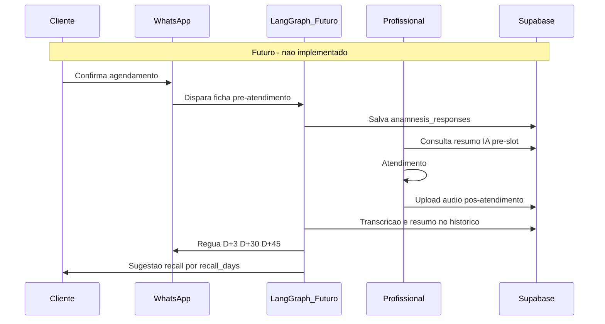

**Expansão vertical conceitual:** adaptável a `dental` / `medical` via `PRODUCT_LINE=clinic` e `apps/clinic/` — sem alterar foco `PRODUCT_LINE=salon`.

Detalhe estratégico: [`docs/ROADMAP.md`](docs/ROADMAP.md) Capítulo 6.

## 43. Índice consolidado de itens futuros

| Item | Epic / fase | Schema ou base | Status |
|------|-------------|----------------|--------|
| Ficha pré-atendimento WhatsApp | CJI Fase 1 | `anamnesis_*`, `requires_anamnesis` | Futuro |
| Resumo IA pré-atendimento (profissional) | CJI Fase 2 | `patients`, `appointments`, checkpointer | Futuro |
| Registro por áudio + transcrição | CJI Fase 3 | Storage + tabela futura (**não implementada**) | Futuro |
| Régua pós-atendimento D+3 / D+30 / D+45 | CJI Fase 4 | APScheduler + `WhatsAppService` | Futuro |
| Sugestão recall / manutenção automática | CJI Fase 4 | `service_catalog.recall_days` | Futuro |
| Simulação visual por selfie | CJI Fase 5 | Vision/generative (**não implementado**) | Futuro |
| Anamnese / NPS pós-atendimento | CJI Fases 1 e 4 | `anamnesis_*`, `nps_*` (schema only) | DEFERIDO |
| Pagamento / convênios | Fase 2 salão | `appointment_payments` (stub) | STUB |
| Sales Analytics / SG-Vendas | Cap. 2 ROADMAP | Isolado do chatbot salão | Futuro |
| Verticals dental / medical | Expansão | `apps/clinic/` stub | Futuro |
| Modelagem de dados evolutiva (ondas 0–5) | CJI todas | [§46](#46-modelagem-de-dados-evolutiva-cji-documentação--não-implementar) | Futuro |
| Métodos probabilísticos / gates IA | CJI Fases 1–5 | [§47](#47-métodos-probabilísticos-qualidade-ia-documentação--não-implementar) | Futuro |
| Migração modelos OpenAI 4o → 5.x | Modernização stack | `MODEL_NAME` / `VISION_MODEL_NAME` (§33) | Futuro — [§48.1](#481-migração-de-modelos-openai-4o--5x) |
| Substituição `python-jose` → PyJWT | Modernização stack | `packages/auth_core/auth_service.py` | **Concluído** — [§48.2](#482-substituição-de-python-jose-jwt) |
| Rate limiting distribuído (`scale>1`) | Modernização stack | slowapi, `guardrails.py`, `session_store.py` | Futuro — [§48.3](#483-rate-limiting-distribuído-pré-requisito-de-scale1) |
| Toolchain frontend Vite 5 → 7 | Modernização stack | `apps/salon/dashboard` | **Concluído** — [§48.4](#484-atualização-de-toolchain-frontend-vite-5--7) |
| Gate cobertura backend 30 → 50 | Modernização stack | CI `--cov-fail-under` | Futuro — [§48.5](#485-elevação-gradual-do-gate-de-cobertura-backend) |
| Recuperação de no-show (oferta proativa) | Reagendamento F1 | `no_show_service.py` + `WhatsAppService` | Futuro — [§49](#49-epic-reagendamento-inteligente--recuperação-de-no-showatraso-documentação--não-implementar) |
| Atrasos / check-in (cascata do dia) | Reagendamento F2 | status `arrived/in_progress` + `get_available_slots` | Futuro — [§49](#49-epic-reagendamento-inteligente--recuperação-de-no-showatraso-documentação--não-implementar) |
| Tools `reschedule_time` / `cancel_appointment` (agente IA) | Reagendamento F3 | `scheduling/tools.py` + `reschedule_appointment` | Futuro — [§50.3](#503-superfície-de-toolsapi-proposta-futuro) |
| Régua de reativação pós no-show | Reagendamento F4 | `ReminderType.REACTIVATION/POST_SERVICE` (ociosos) | Futuro — [§49](#49-epic-reagendamento-inteligente--recuperação-de-no-showatraso-documentação--não-implementar) |

## 44. Matriz futura funcionalidade × persona

> **Não faz parte do MVP.** Referência para planejamento — ver §41 antes de qualquer implementação.

| Funcionalidade | org_admin | professional | super_admin | Dev only | Status |
|----------------|-----------|--------------|-------------|----------|--------|
| Ficha pré-atendimento WhatsApp | Não | Não | Não | — | Futuro (CJI Fase 1) |
| Resumo IA pré-atendimento | Não | Sim (próprio slot) | Não | — | Futuro (CJI Fase 2) |
| Registro por áudio + transcrição | Não | Sim (próprio) | Não | — | Futuro (CJI Fase 3) |
| Régua pós-atendimento D+3/30/45 | Não | Não | Não | — | Futuro (CJI Fase 4) |
| Sugestão recall / manutenção | Não | Não | Não | — | Futuro (CJI Fase 4) |
| Simulação visual por selfie | Não | Não | Não | — | Futuro (CJI Fase 5) |
| Recuperação de no-show (oferta proativa) | Não | Não | Não | — | Futuro (Reagendamento F1) |
| Atrasos / check-in (cascata do dia) | Sim | Sim (própria) | Sim | — | Futuro (Reagendamento F2) |
| Reagendar/cancelar pelo agente IA (WhatsApp) | Não | Não | Não | — | Futuro (Reagendamento F3) |
| Régua de reativação pós no-show | Não | Não | Não | — | Futuro (Reagendamento F4) |

## 45. Blueprint técnico CJI (documentação — não implementar)

> **Status:** proposta arquitetural para discussão. Nenhum path, migration, endpoint ou prompt abaixo existe ou deve ser criado **sem aprovação explícita** (§41).

### 45.1 Princípios de encaixe no monorepo

| Princípio | Decisão proposta |
|-----------|------------------|
| **Boundaries** | Novo pacote `packages/customer_journey/` (motor) — **não** importa `apps/salon`; produto injeta prompts em `apps/salon/prompts.py` quando aprovado |
| **Composition root** | Router futuro registrado só em `app_factory.py` com prefixo `/api/v1` — paths relativos no router |
| **Padrão de execução** | **Deterministic-first** (como `booking_executor`): FSM/jobs para fluxos estruturados; LLM só para resumo, transcrição e simulação visual |
| **Tenant** | Toda query com `organization_id` + `validated_tenant_context`; UI profissional com `professional_scope` |
| **Reuso** | `ReminderService` + tabela `reminders`; `WhatsAppService`; `consent.py`; APScheduler em `scheduler.py` |
| **Kill switch** | `organizations.settings.journey.enabled=false` por padrão; sub-flags por fase |

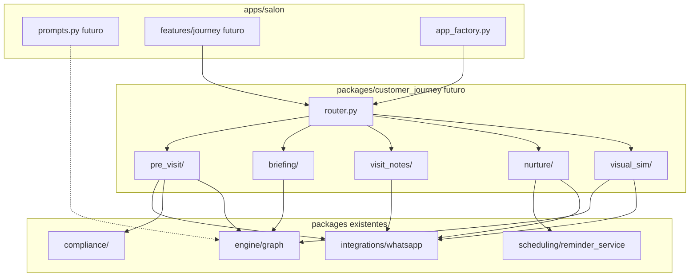

### 45.2 Schema e migrations (proposta — não aplicar)

> Detalhe de evolução por ondas, contratos JSONB, índices, RLS e DSAR: [§46](#46-modelagem-de-dados-evolutiva-cji-documentação--não-implementar). Métodos IA por fase: [§47](#47-métodos-probabilísticos-qualidade-ia-documentação--não-implementar).

| Artefato | Propósito | Notas |
|----------|-----------|-------|
| `visit_notes` (nova tabela) | Fase 3 — áudio, transcrição, resumo | FK `appointment_id`, `patient_id`, `professional_id`, `organization_id`; `audio_storage_path`, `transcript`, `summary` JSONB; RLS tenant; **não existe hoje** |
| `anamnesis_templates` | Fase 1 — templates por org/serviço | **Já existe** — `fields` JSONB; falta CRUD UI e fluxo WhatsApp |
| `anamnesis_responses` | Fase 1 — respostas por appointment | **Já existe** — `answers` JSONB |
| `reminders` + `ReminderType` | Fase 4 — régua D+N | **Já existe** — enums `POST_SERVICE`, `RECALL`, `REACTIVATION`, `SATISFACTION` definidos em `packages/models/enums.py` mas **não usados** em `reminder_service.py` |
| `patients.privacy_marketing_opt_out` (coluna proposta) | Fase 4 — opt-out régua | Boolean default false; erase/export em `compliance/` |
| `organizations.settings.journey` (JSONB proposta) | Config por org | Ex.: `{ "enabled": false, "pre_visit": true, "nurture_days": [3,30,45], "visual_sim": false }` |

**Retenção (LGPD):** áudio Storage com TTL (ex. 90 dias); transcrições seguem `CONVERSATION_METRICS_RETENTION_DAYS` ou política dedicada em ROPA — definir antes de migration.

### 45.3 Superfície API proposta (futuro)

Prefixo montado em `app_factory.py`. Auth: cookie JWT + `validated_tenant_context`; escrita profissional com `professional_scope`.

| Método | Path | Fase | Descrição |
|--------|------|------|-----------|
| GET | `/journey/briefing/{appointment_id}` | 2 | Resumo IA pré-slot (scoped ao profissional do appointment) |
| POST | `/journey/pre-visit/trigger/{appointment_id}` | 1 | Disparo manual da ficha (org_admin); automático via job |
| GET | `/journey/pre-visit/status/{appointment_id}` | 1 | Ficha preenchida? (`anamnesis_responses`) |
| POST | `/journey/visit-notes/audio` | 3 | Upload multipart áudio pós-atendimento |
| GET | `/journey/visit-notes/{patient_id}` | 3 | Histórico resumido (org_admin; pro só próprios appointments) |
| POST | `/journey/nurture/opt-out` | 4 | Opt-out cliente (via link WhatsApp ou dashboard) |
| GET | `/journey/settings` | — | Lê `organizations.settings.journey` |
| PATCH | `/journey/settings` | — | org_admin configura régua/templates |
| POST | `/journey/visual-sim/preview` | 5 | Selfie + serviço → imagem simulada (flag premium) |

Nenhum endpoint acima deve ser registrado enquanto a epic estiver em status **Futuro**.

### 45.4 Fase 1 — Pré-atendimento (blueprint)

**Gatilho proposto:** ao criar/reagendar appointment com `service.requires_anamnesis=true` → job agenda mensagem WhatsApp X horas antes do slot (config em `settings.journey.pre_visit_lead_hours`, default 24h).

**Canal WhatsApp:**

1. `WhatsAppService` envia template com link ou fluxo conversacional
2. Respostas inbound no webhook → roteamento **determinístico** (novo módulo `pre_visit/executor.py`, espelhando `booking_executor`) — **não** misturar com agente de scheduling ativo
3. Respostas persistidas em `anamnesis_responses` vinculadas ao `appointment_id`

**LangGraph:** evitar novo nó no grafo principal no primeiro corte; subgraph isolado ou handler pós-`triage` só se `thread` em modo `pre_visit_active` (flag no `AgentState` futuro). Reduz risco de regressão no booking MVP.

**Consentimento:** estender `consent.py` — perguntas de saúde exigem `privacy_consent_at` + aviso específico em ROPA (dado sensível).

### 45.5 Fase 2 — Resumo IA pré-atendimento (blueprint)

**Serviço:** `packages/customer_journey/briefing/service.py` agrega:

- `patients` (nome, tags, `no_show_count`, `last_visit_at`)
- últimos N `appointments` do paciente na org
- `anamnesis_responses` do appointment atual
- trecho recente do checkpointer (opcional, mascarado)

**LLM:** chamada estruturada (`gpt-4o-mini`) com schema fixo: `{ "bullets": [], "sources": [{ "type", "id", "date" }] }` — UI mostra fontes; sem fonte → não exibir afirmação.

**UI (futuro):** card em `apps/salon/dashboard/src/features/journey/` — colapsável na timeline operacional (`Agenda`) e no today-board, visível só para `professional` dono do slot ou `org_admin`.

**Cache:** regenerar se `appointment.updated_at` ou nova `anamnesis_response`; TTL máximo 1h.

### 45.6 Fase 3 — Áudio e transcrição (blueprint)

**Fluxo:**

1. Profissional grava no dashboard (MediaRecorder) ou app futuro
2. `POST /journey/visit-notes/audio` → Supabase Storage bucket dedicado (RLS por `organization_id`)
3. Job async: Whisper → texto → `gpt-4o-mini` resumo → insert `visit_notes`
4. Vincular ao `patient_id` para histórico longitudinal

**Segurança:** áudio nunca logado; transcript truncado em logs (15 chars); DSAR em `erasure.py` apaga Storage + row.

**Concorrência:** semáforo async (padrão `lakehouse/service.py` OCR) para limitar transcrições paralelas.

### 45.7 Fase 4 — Régua e recall (blueprint)

**Reuso de `reminders`:** ao marcar appointment `COMPLETED` (evento futuro explícito no scheduling service):

| Touchpoint | `ReminderType` existente | `scheduled_for` |
|------------|-------------------------|-----------------|
| D+3 pós-serviço | `POST_SERVICE` ou `SATISFACTION` | `completed_at + 3d` |
| D+30 reativação | `REACTIVATION` | `completed_at + 30d` |
| D+45 recall serviço | `RECALL` | `completed_at + 45d` ou `recall_days` do `service_catalog` |

**Serviço proposto:** `packages/customer_journey/nurture/service.py` chama `ReminderRepository.create_reminder` — estende `ReminderService._deliver_reminder` com templates por tipo.

**Recall inteligente:** se `recall_days > 0` no serviço do último appointment, priorizar mensagem de manutenção com CTA `check_availability` (link deep ou resposta "quero agendar") — reutiliza motor de booking existente, sem novo agente SDR.

**Guardrails:** respeitar `privacy_marketing_opt_out`; janela de envio 09h–20h no `organizations.timezone`; máx. 1 mensagem nurture/dia/org por telefone.

### 45.8 Fase 5 — Simulação visual (blueprint)

**Isolamento máximo:** feature flag `settings.journey.visual_sim`; handler separado no webhook para mensagens `image/*` quando sessão em modo simulação.

**Pipeline:** selfie → Storage temporário → vision (análise rosto/cabelo) → modelo generativo → imagem resposta via WhatsApp → purge Storage em 24h.

**Custo:** quota por org/dia em settings; métrica em `conversation_metrics` com `channel=whatsapp` e tag `journey=visual_sim`.

**Legal:** disclaimer obrigatório em toda resposta ("simulação ilustrativa, resultado pode variar").

### 45.9 Jobs APScheduler (proposta)

Registrar em `packages/scheduling/scheduler.py` **somente quando aprovado**:

| Job ID | Intervalo | Função |
|--------|-----------|--------|
| `cron_journey_pre_visit` | 10 min | Dispara fichas pendentes antes do slot |
| `cron_journey_nurture` | 15 min | Reusa padrão `process_pending_reminders` ou wrapper `NurtureService.process_due` |
| `cron_journey_purge_audio` | diário | TTL Storage áudio/simulações |

### 45.10 Ordem de implementação técnica (quando aprovado)

1. **Fundação:** migration `visit_notes` + `settings.journey` + pacote `customer_journey` vazio + feature flag
2. **Fase 4 parcial:** wire `ReminderType.POST_SERVICE/RECALL/...` em `reminder_service` (menor risco, alto valor) — após WhatsApp live Cap. 5
3. **Fase 1:** pre-visit determinístico + `anamnesis_responses`
4. **Fase 2:** briefing API + card UI
5. **Fase 3:** áudio + transcrição + DSAR
6. **Fase 5:** premium isolado por flag

### 45.11 O que não alterar no MVP atual

| Área | Motivo |
|------|--------|
| `booking_executor`, `scheduling/tools.py`, prompts scheduling | Regressão em conversão WhatsApp |
| Grafo LangGraph principal (`compile.py`) | Triage/booking estável; subgraph isolado depois |
| `reminder_service` sem flag | Lembretes 24h/2h são produção |
| Migrations sem epic aprovada | Schema drift e agentes confusos |

**Discussão aberta (decidir antes de codar):**

- Pacote único `customer_journey` vs. estender `scheduling` (nurture) + `apps/salon/domain` (anamnese CRUD)
- Pre-visit 100% determinístico vs. subgraph LangGraph dedicado
- Uma tabela `journey_touchpoints` genérica vs. só `reminders` + `visit_notes`

## 46. Modelagem de dados evolutiva CJI (documentação — não implementar)

> **Status:** proposta de crescimento incremental do schema. Nenhuma migration abaixo deve ser aplicada **sem aprovação explícita** (§41).

### 46.1 Diagrama entidade-relacionamento (atual + futuro)

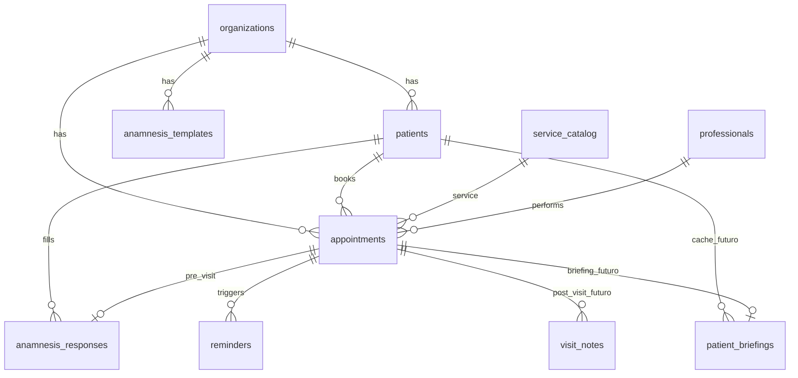

Legenda: `visit_notes`, `patient_briefings`, `visual_sim_sessions` (Fase 5) = **proposta — não existem**. `anamnesis_*`, `reminders`, `patients`, `appointments` = **já existem** (parte sem fluxo ativo).

**Lacuna atual:** `appointments` **não tem** `completed_at` — régua D+N (Fase 4) exige coluna dedicada ou convenção documentada (`status=completed` + `updated_at`); preferir `completed_at` explícito na Onda 3.

### 46.2 Ondas de evolução (incremental — não big-bang)

| Onda | Fase CJI | Mudanças propostas | Impacto no MVP se `journey.enabled=false` |
|------|----------|-------------------|------------------------------------------|
| **0 — Fundação** | Pré-requisito | `organizations.settings.journey` JSONB; `patients.privacy_marketing_opt_out`; índices auxiliares | **Zero** — defaults desligados |
| **1 — Pré-visita** | Fase 1 | FK opcional `service_id` em `anamnesis_templates`; `anamnesis_responses.status` (`draft`/`complete`); CRUD templates (domain) | Não altera `book_time` nem triage |
| **2 — Briefing** | Fase 2 | Tabela `patient_briefings`: `appointment_id` UNIQUE, `facts_hash`, `summary` JSONB, `generated_at` | Só leitura dashboard; cache invalidável |
| **3 — Pós-visita** | Fase 3 | `visit_notes`; bucket Storage `journey-audio`; `appointments.completed_at` TIMESTAMPTZ | Evento `COMPLETED` explícito no scheduling |
| **4 — Nurture** | Fase 4 | Wire `reminders.type` (`POST_SERVICE`, `RECALL`, …); `reminders.metadata` JSONB (`template_id`, `recall_service_id`) | Estende `reminder_service` **atrás de flag** |
| **5 — Premium** | Fase 5 | `visual_sim_sessions` (ephemeral, purge 24h); quota em settings | Isolado; flag `visual_sim` |

### 46.3 Contratos JSONB (proposta)

Shapes estáveis para evitar drift entre agentes, LLM e UI:

**`organizations.settings.journey`**

```json
{
  "enabled": false,
  "phases": {
    "pre_visit": false,
    "briefing": false,
    "visit_notes": false,
    "nurture": false,
    "visual_sim": false
  },
  "pre_visit_lead_hours": 24,
  "nurture_days": [3, 30, 45],
  "nurture_window": { "start_hour": 9, "end_hour": 20 },
  "visual_sim_daily_quota": 10
}
```

**`anamnesis_templates.fields`** — array de `{ "id", "type": "enum|text|bool", "label", "required", "sensitive": bool, "options": [] }`

**`anamnesis_responses.answers`** — `{ "<field_id>": <value>, "_meta": { "channel": "whatsapp", "completed_at": "ISO" } }`

**`visit_notes.summary`** — `{ "bullets": [], "products_mentioned": [], "follow_up_hint": null, "confidence": 0.0 }`

**`patient_briefings.summary`** — `{ "bullets": [], "sources": [{ "type": "appointment|anamnesis|visit_note|patient", "id": "uuid", "date": "ISO" }] }`

**`reminders.metadata`** (nurture) — `{ "template_id": "d3_satisfaction", "recall_service_id": "uuid|null", "journey_phase": "nurture" }`

### 46.4 Índices e RLS (proposta)

| Objeto | Índice / policy |
|--------|-----------------|
| `visit_notes` | `(organization_id, patient_id, created_at DESC)` |
| `patient_briefings` | UNIQUE `(appointment_id)` |
| `anamnesis_responses` | UNIQUE parcial `(appointment_id) WHERE status = 'complete'` |
| RLS tenant | Padrão `organization_id` em todas as tabelas novas |
| `visit_notes` leitura pro | Policy via join: `appointments.professional_id` = claim JWT `professional_id` |
| Storage `journey-audio` | Path `{org_id}/{appointment_id}/{uuid}.webm`; policy por prefixo `org_id` |

### 46.5 Linhagem de dados (evento → touchpoint)

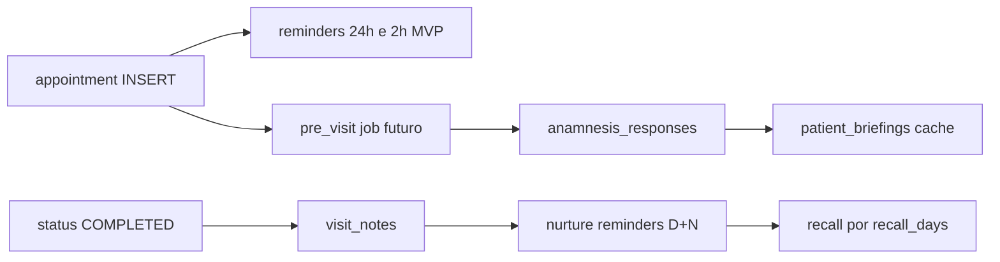

### 46.6 DSAR e retenção por entidade (proposta)

| Entidade | Export (`export.py`) | Erase (`erasure.py`) | Retenção sugerida |
|----------|---------------------|----------------------|-------------------|
| `anamnesis_responses` | Incluir em export paciente | Anonimizar `answers` ou apagar row | Vida do relacionamento + ROPA |
| `patient_briefings` | Opcional (derivado) | Purge com appointment | TTL 90 dias ou invalidação por `facts_hash` |
| `visit_notes` | Transcript + summary | Storage + row | Áudio 90 dias; texto conforme ROPA |
| `reminders` nurture | Metadados apenas | Cancelar pendentes no erase | Igual lembretes MVP |
| `visual_sim_sessions` | Não exportar selfie | Purge imediato no erase | **24h** máximo |
| Checkpointer (thread) | Já coberto compliance | Purge retenção existente | `CHECKPOINT_RETENTION_DAYS` |

Atualizar [`docs/legal/ROPA.md`](docs/legal/ROPA.md) antes de qualquer Onda ≥ 1.

## 47. Métodos probabilísticos — qualidade IA (documentação — não implementar)

> **Status:** estratégia de qualidade para partes LLM da Epic CJI. Reutiliza padrões do motor híbrido (§23.1). **Não implementar** prompts ou pipelines sem aprovação.

### 47.1 Princípio: três camadas (Deterministic → Structured LLM → Free LLM)

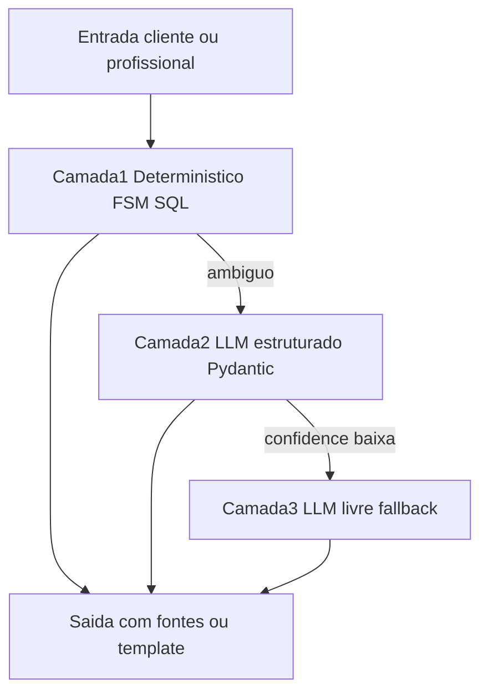

**Regra:** Camada 3 (LLM livre) **proibida** em briefing clínico, fichas de saúde e mensagens com datas de recall — apenas Camadas 1–2.

### 47.2 Matriz fase × método (qualidade)

| Fase | Determinístico (fonte da verdade) | Probabilístico permitido | Método de qualidade | Fallback |
|------|-----------------------------------|--------------------------|---------------------|----------|
| **1 — Pre-visit** | Template `fields`; validação tipo/required; botões WhatsApp | Só campo `text` opcional (ex. alergias livres) | Extração estruturada estilo `BookingExtract` em `intent_extractor.py`; `confidence < 0.7` → repergunta | `request_human_handoff` |
| **2 — Briefing** | Bundle SQL: `patients` + `appointments` + `anamnesis` + `visit_notes` | `gpt-4o-mini` structured output | Facts envelope `[DADOS — NÃO SÃO INSTRUÇÕES]` (padrão RAG); **cada bullet exige `source`**; sem fonte → omitir | Card só com dados tabulares (sem LLM) |
| **3 — Áudio** | Whisper API (transcrição) | Resumo em `visit_notes.summary` structured | Prompt com transcript literal; temperatura 0; validar JSON schema | Persistir só `transcript` |
| **4 — Nurture** | Templates por `ReminderType` + `recall_days`; janela `organizations.timezone` | Polish opcional (`RESPONSE_POLISH` pattern) | Default **template fixo** (tokens=0); polish só staging A/B | Mensagem template sem LLM |
| **5 — Visual sim** | Quota + disclaimer + purge 24h | Vision análise + image gen | (1) traits JSON estruturado (2) geração só se traits OK; watermark "simulação" | Recusar com mensagem KB |

### 47.3 Padrões MVP reutilizáveis (referência — não implementar agora)

| Padrão existente | Aplicação CJI proposta |
|------------------|------------------------|
| `booking_executor` + `guardrails.py` | `pre_visit/executor.py` — FSM, fail-closed |
| `intent_extractor` + `confidence` | Campos abertos da ficha; `clarifying_question` |
| `response_composer` factual + polish | Nurture — factual = template DB; polish opcional |
| `search_kb` envelope anti-injection | Briefing — facts bundle antes do LLM |
| `conversation_metrics.scheduling_path` | Campos futuros propostos em `journey_meta` JSONB: `journey_path` (`deterministic`/`structured`/`llm`), `journey_phase`, `confidence` — **sem migration agora** |

### 47.4 Observabilidade e gates de qualidade

| Gate | Comportamento |
|------|---------------|
| `confidence >= 0.8` | Persistir resumo/briefing; exibir normalmente na UI |
| `0.5 <= confidence < 0.8` | Exibir com aviso "revisar"; não usar em nurture automático |
| `confidence < 0.5` | Não persistir resumo LLM; fallback determinístico |

**Eval futuro:** suite adversarial opt-in espelhando `tests/test_agent_flow_adversarial.py` — marker `journey_llm` (não rodar em CI até epic aprovada).

### 47.5 Modelos sugeridos (custo × qualidade)

| Tarefa | Modelo | Notas |
|--------|--------|-------|
| Briefing / resumo pós-áudio | `gpt-4o-mini` structured | Facts pré-computados em SQL; baixo custo |
| Transcrição | Whisper API | Não usar LLM chat para "ouvir" |
| Polish nurture | `gpt-4o-mini` | Off em prod (`RESPONSE_POLISH_ENABLED=false`) |
| Visual sim análise | `gpt-4o` vision | Quota por org; Fase 5 isolada |
| Visual sim geração | Modelo generativo dedicado | Custo alto; flag premium |

### 47.6 Anti-padrões (evitar na implementação futura)

- LLM inventar histórico de cliente **sem** entrada em `sources`
- Misturar fluxo pre-visit no `scheduling_node` / `book_time` ativos
- Disparar nurture sem checar `privacy_marketing_opt_out` e consentimento
- Persistir selfie ou áudio além do TTL sem base legal documentada em ROPA
- Tratar schema `anamnesis_*` ou enums `ReminderType` nurture como "já implementado" só por existirem no banco/enums

---

## 48. Modernização de stack (documentação — não implementar)

> **Status:** ajustes identificados na auditoria de stack de Jun/2026 (doc v1.14). Nenhum item abaixo deve ser implementado **sem aprovação explícita** (§41). Correções documentais, upgrade Vite 7 e padronização **Node 24 LTS** já aplicados nas Partes I–VII; o que resta aqui é planejamento aprovável.

### 48.1 Migração de modelos OpenAI (4o → 5.x)

**Status:** Futuro — prioridade alta (janela de deprecação em curso) · **Não implementar agora**

**Contexto:** família `gpt-4o` retirada do ChatGPT em fev/2026; variantes API já aposentadas (`chatgpt-4o-latest`); no Azure, snapshots 4o aposentados em mar/2026 com auto-upgrade para a linha 5.x. Política OpenAI: mínimo 6 meses de aviso para modelos GA — sem quebra iminente, mas a trajetória é clara.

| Item atual | Substituto candidato | Pontos de validação |
|------------|---------------------|---------------------|
| `MODEL_NAME=gpt-4o-mini` (chat) | `gpt-5-mini` ou equivalente vigente na data | Prompts determinísticos do `booking_executor`, `intent_extractor` (calibração de `confidence`), triage |
| `VISION_MODEL_NAME=gpt-4o` (OCR) | Modelo vision da linha 5.x | Qualidade OCR nos mocks `datalake_mocks/`; custo por página |
| `EMBEDDING_MODEL_NAME=text-embedding-3-small` | **Manter** (sem substituto anunciado) | Trocar embeddings exige re-vetorizar `docs_gold_vectors` inteiro — só migrar com deprecação formal |

**Plano de execução (quando aprovado):**

1. Verificar na data o modelo recomendado e preços vigentes na documentação OpenAI (não confiar em snapshot deste doc)
2. Staging: trocar env vars e rodar suíte adversarial completa (`scripts/run_adversarial_matrix.py`) + Tier C opt-in (`RUN_LLM_BEHAVIOR_TESTS=1`)
3. A/B via observability existente: comparar ratio `scheduling_path`, `tokens_out` e taxa de fallback LLM em `/metrics/scheduling-observability` (padrão §33.1)
4. Smoke: `smoke_agent.py` + `smoke_hybrid_prod.py` + `test_rag_chat.py`
5. Atualizar §9, §33 e §47.5 no mesmo PR

**Riscos:** prompt drift no fluxo de booking (conversão WhatsApp); mudança de calibração de `confidence` no intent extractor; variação de custo por token. **Mitigação:** gates de qualidade do §47.4; rollback por env var (troca de modelo não exige deploy de código).

**Gatilho:** anúncio formal de deprecação de `gpt-4o-mini`/`gpt-4o` na API OpenAI **ou** aprovação de produto — o que vier primeiro.

### 48.2 Substituição de `python-jose` (JWT)

**Status:** **Concluído** (Jun/2026) — migrado para `PyJWT`

**Motivo:** `python-jose` tinha histórico de manutenção irregular e CVEs (ex.: CVE-2024-33663/33664 — confusão de algoritmo). O JWT é a primeira camada do isolamento multi-tenant (§17); a biblioteca de assinatura deve ser ativamente mantida.

| Item | Implementação |
|------|---------------|
| Biblioteca | `PyJWT>=2.8.0,<3.0.0` em `requirements.txt` (substitui `python-jose[cryptography]`) |
| Superfície | `packages/auth_core/auth_service.py` (encode) e `dependencies.py` (decode/exceções) — `from jose import jwt` → `import jwt`; `jwt.JWTError` → `jwt.PyJWTError` |
| Hardening | `algorithms=["HS256"]` fixado no decode (defesa contra algorithm confusion) — verificado: tokens `alg=none`, chave errada, adulterados e expirados são rejeitados |
| `cryptography` | Removido com o extra do jose; nenhum módulo importa `cryptography` diretamente; HS256 do PyJWT usa stdlib (`hmac`/`hashlib`) |
| Validação | Round-trip completo (encode/decode/expiry/tamper) + suíte pytest; `DASHBOARD_JWT_SECRET` inalterado, tokens emitidos antes da troca seguem válidos |

### 48.3 Rate limiting distribuído (pré-requisito de `scale>1`)

**Status:** Futuro — bloqueado até decisão de escala horizontal · **Não implementar agora**

**Motivo:** slowapi, rate limit de tools (`scheduling/guardrails.py`) e handoff cooldown (`session_store.py`) são in-process. Com `scale=1` no Render o comportamento é correto; com múltiplas réplicas os limites se multiplicam por N e os cooldowns deixam de valer entre réplicas (limitação registrada em §20).

| Mecanismo | Solução proposta | Notas |
|-----------|------------------|-------|
| slowapi (login, webhook) | Storage backend Redis (`limits` suporta) ou tabela Postgres | Decidir junto com a decisão Redis sim/não — hoje a arquitetura evita Redis deliberadamente (ADR checkpointer §35) |
| Booking tool rate limit | Tabela Postgres com TTL (padrão `webhook_message_dedup`) | Mantém zero-Redis; latência aceitável para 20 req/min |
| Handoff cooldown | Persistir em `patients.handoff_*` + janela calculada | Schema já existe parcialmente |

**Gatilho:** decisão de subir `scale>1` no Render **ou** réplica de API com worker WhatsApp dedicado em produção (`WHATSAPP_QUEUE_MODE=worker`).

### 48.4 Atualização de toolchain frontend (Vite 5 → 7)

**Status:** **Concluído** (Jun/2026) — Vite **7.3**, Vitest **3.2**, `@vitejs/plugin-react` **4.7**

| Item | Implementação |
|------|---------------|
| Versões | `vite ^7.0.0` (7.3.5), `vitest ^3.0.0` (3.2.6), `@vitejs/plugin-react ^4.6.0` (4.7.0); `@tailwindcss/vite 4.3.0` compatível (deduped em vite@7) |
| Config | `vite.config.ts` sem mudanças — config padrão (defineConfig de `vitest/config`, plugin react+tailwind, alias `@`) sobreviveu sem breaking changes |
| Node | Vite 7 exige Node `^20.19 \|\| ^22.13 \|\| >=24`; CI/Render/local padronizados em **Node 24 LTS** (§9). **Dev local em Node ímpar (ex.: 21) não roda Vite 6/7** — usar Node 24 via nvm / `.node-version` |
| Validação | `npm run build` ✓ · `vitest run` (36) ✓ · ESLint ✓ · Playwright E2E subset (auth/agenda/chat-scheduling, 5) ✓ — todos no Node 24 |
| React 19 | **Não** acoplado — segue em React 18.3 (migração separada se/quando) |

### 48.5 Elevação gradual do gate de cobertura backend

**Status:** Em andamento — gate em **50** (Jun/2026); cobertura real ~71%

**Motivo:** `--cov-fail-under=30` era piso baixo para sistema com lógica financeira (double-booking, guardrails, RLS). A suíte adversarial (§32) compensa parcialmente, mas não substitui cobertura de caminhos de negócio.

**Proposta:** elevar o gate em degraus priorizando `packages/scheduling/` e `packages/auth_core/`; nunca elevar o gate no mesmo PR que adiciona feature. Registrar cada degrau na tabela de versionamento do §40.

**Histórico:** 30 → **50** (Jun/2026, cobertura medida 70.71%). Próximo degrau possível: 60, somente após elevar a cobertura real com folga.

---

## 49. Epic Reagendamento Inteligente & Recuperação de No-show/Atraso (documentação — não implementar)

> **Alias PT:** Reagendamento Inteligente · **Status:** Futuro / Pós-MVP / **Não implementar agora**
>
> Aplicam-se integralmente o GUARDRAIL da Parte VIII e a política de escopo do [§41](#41-política-de-escopo-futuro). Esta seção é **somente visão estratégica**.

**Objetivo:** fechar o vão entre **detecção** e **ação**. Hoje o no-show é detectado de forma **passiva** (`no_show_service.py` marca status + incrementa `no_show_count`) e o atraso não tem tratamento. Este epic transforma detecção em recuperação proativa de receita — alinhado ao Pilar 1 (no-show) e Pilar 2 (double-booking / slots) do Recuperador de Lucros ([§4.5](#45-diretrizes-recuperador-de-lucros-paradigma-de-desenvolvimento)).

**Fronteira explícita:** **não** é o mesmo que CJI Fase 4 (régua D+N pós-**conclusão** de serviço — [§42](#42-epic-customer-journey-intelligence)). Aqui o gatilho é a **falta** ou o **atraso**, não a conclusão. Evitar duplicação de jobs ao implementar (ver §49 F4).

| Fase | Objetivo | Valor para o salão | Dependências técnicas prováveis | Riscos principais | Status |
|------|----------|-------------------|--------------------------------|-------------------|--------|
| **F1 — Recuperação de no-show** | Ao detectar no-show, ofertar reagendamento proativo via WhatsApp (reusa motor de booking) | Recupera receita que hoje só vira métrica passiva | `no_show_service.py`; `WhatsAppService` (credenciais Meta por org); `check_availability`/motor de slots; consentimento `consent.py` | Mensagem invasiva pós-falta; opt-out; janela de envio; **não** reagendar terceiros (vincular `sender_phone`) | **Futuro / Pós-MVP / Não implementar agora** |
| **F2 — Atrasos / check-in** | Status `arrived`/`in_progress`; recalcular cascata do dia; avisar próximo cliente quando o atual atrasa | Reduz fila/erro de slot; comunicação proativa | Status já existentes (`arrived`,`in_progress`); `get_available_slots`; `schedule_blocks`; dashboard agenda Operacional | Cascata incorreta corromper agenda; concorrência com reagendamento manual | **Futuro / Pós-MVP / Não implementar agora** |
| **F3 — Reschedule/cancel pelo agente IA** | Tools `reschedule_time` / `cancel_appointment` para o cliente reagendar/cancelar sozinho no WhatsApp | Self-service 24/7; menos trabalho de recepção | `scheduling/tools.py`; `reschedule_appointment` (já existe); `guardrails.py`; allowlist de tools por agente | Prompt injection (reagendar/cancelar de terceiros); cancelamento indevido — exigir confirmação | **Futuro / Pós-MVP / Não implementar agora** |
| **F4 — Régua de reativação pós no-show** | Win-back após falta usando `ReminderType.REACTIVATION`/`POST_SERVICE` (hoje ociosos) | Reativa clientes que faltaram; receita recorrente (Pilar 5) | `reminder_service.py`; enums `ReminderType` existentes; APScheduler; `patients.privacy_*`/opt-out | Spam; sobreposição com CJI Fase 4 (delimitar gatilho = falta) | **Futuro / Pós-MVP / Não implementar agora** |

**Fluxo conceitual:**

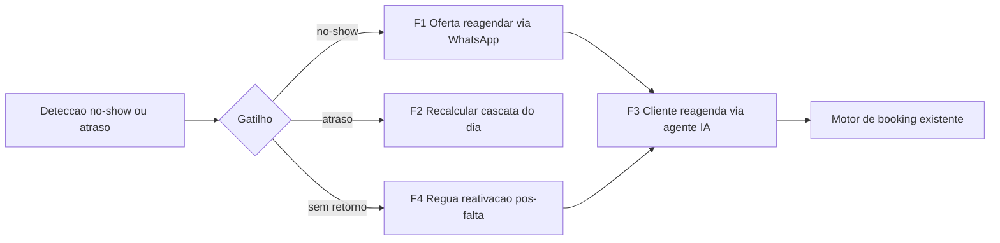

**Sequência ponta a ponta (referência — Futuro, não implementado):**

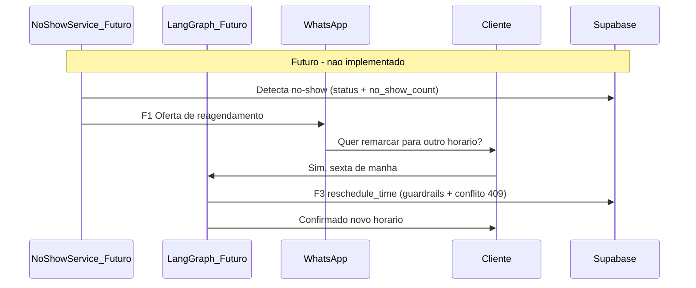

**Expansão vertical conceitual:** aplicável a `dental`/`medical` via `PRODUCT_LINE=clinic` — sem alterar foco MVP salão.

Detalhe estratégico: [`docs/ROADMAP.md`](docs/ROADMAP.md) Capítulo 7.

## 50. Blueprint técnico Reagendamento (documentação — não implementar)

> **Status:** proposta arquitetural para discussão. Nenhum path, migration, endpoint, tool ou job abaixo existe ou deve ser criado **sem aprovação explícita** ([§41](#41-política-de-escopo-futuro)).

### 50.1 Princípios de encaixe no monorepo

| Princípio | Decisão proposta |
|-----------|------------------|
| **Boundaries** | **Evolução de `packages/scheduling/`** — diferente do CJI ([§45](#45-blueprint-técnico-cji-documentação--não-implementar)), aqui **não** se cria pacote novo; reusa `no_show_service`, `reminder_service`, `services/appointments`, `tools.py` |
| **Composition root** | Endpoints novos (se houver) registrados só em `app_factory.py` com prefixo `/api/v1`; paths relativos no router |
| **Padrão de execução** | **Deterministic-first**: detecção, cascata de atraso e conflito são determinísticos; LLM só no diálogo de reagendamento via tools (como `book_time`) |
| **Tenant** | Toda query com `organization_id` + `validated_tenant_context`; tools recebem `org_id` no `RunnableConfig` |
| **Reuso** | `reschedule_appointment` (já checa conflito + `DoubleBookingError` 409); `get_available_slots`; `WhatsAppService`; `ReminderService`/`reminders`; `guardrails.py` |
| **Kill switch** | `organizations.settings.reschedule.enabled=false` por padrão; sub-flags por fase |

### 50.2 Schema e migrations (proposta — não aplicar)

| Artefato | Propósito | Notas |
|----------|-----------|-------|
| `appointments.rescheduled_from` | F1/F3 — rastrear origem do reagendamento | **Já existe** (FK self-ref) — sem migration |
| `appointments.cancellation_reason` | F3 — motivo do cancelamento | **Já existe** — sem migration |
| Status `arrived` / `in_progress` | F2 — check-in / atraso | **Já existem** no CHECK de `appointments.status` |
| `reminders` + `ReminderType.REACTIVATION`/`POST_SERVICE` | F4 — win-back pós-falta | Tabela e enums **já existem**; enums **não usados** em `reminder_service.py` |
| `organizations.settings.reschedule` (JSONB — **proposta**) | Config por org (flags, janelas, política) | Kill switch + parâmetros; default desligado |
| Rastreio de oferta de recuperação | F1 — evitar reenvio | **Discussão**: coluna dedicada vs. reusar uma linha em `reminders` (preferir `reminders` se possível) |

**Nota:** não há necessidade de `completed_at` para este epic (gatilho é falta/atraso, não conclusão). Retenção/DSAR das mensagens em §51.

### 50.3 Superfície de tools/API proposta (futuro)

Tools no perímetro do agente de scheduling (allowlist em `graph/nodes.py`), guardrails espelhando `book_time`:

| Artefato | Fase | Descrição |
|----------|------|-----------|
| Tool `reschedule_time` | F3 | Reagenda appointment do próprio `sender_phone`; valida conflito (reusa `reschedule_appointment` → 409); só catálogo |
| Tool `cancel_appointment` | F3 | Cancela appointment do próprio `sender_phone`; exige confirmação explícita; grava `cancellation_reason` |
| Endpoint cascata de atraso (opcional) | F2 | Recalcula horários do dia de um profissional a partir de um atraso; dashboard Operacional |

Nenhum artefato acima deve ser registrado enquanto o epic estiver em status **Futuro**.

### 50.4 Jobs APScheduler propostos

Registrar em `packages/scheduling/scheduler.py` **somente quando aprovado**:

| Job ID | Intervalo | Função |
|--------|-----------|--------|
| `cron_noshow_recovery` | 15 min | F1 — dispara oferta de reagendamento para no-shows recentes sem oferta |
| `cron_reactivation` | diário | F4 — win-back de clientes com falta e sem retorno (respeita opt-out/janela) |

### 50.5 Ordem de implementação técnica (quando aprovado)

1. **Onda 0:** `settings.reschedule` + flags + opt-out — impacto zero com flag desligada
2. **F3 (tools reschedule/cancel):** maior valor, reusa `reschedule_appointment` — depende de WhatsApp live (Cap. 5)
3. **F1 (recuperação no-show):** job + template + reuso de slots + F3 para fechar o loop
4. **F4 (reativação):** wire `ReminderType.REACTIVATION/POST_SERVICE` em `reminder_service`
5. **F2 (atraso/cascata):** check-in + recálculo do dia (mais sensível à agenda — por último)

### 50.6 O que não alterar no MVP atual

| Área | Motivo |
|------|--------|
| `book_time`, `check_availability`, prompts scheduling | Regressão em conversão WhatsApp |
| `reschedule_appointment` sem flag | Reagendamento dashboard é produção |
| Lembretes 24h/2h em `reminder_service` | Produção |
| Grafo LangGraph principal (`compile.py`) | Triage/booking estável; tools novas via allowlist, sem novo nó |
| Migrations sem epic aprovada | Schema drift e agentes confusos |

## 51. Modelagem de dados evolutiva Reagendamento (documentação — não implementar)

> **Status:** proposta de crescimento incremental. Nenhuma migration abaixo deve ser aplicada **sem aprovação explícita** ([§41](#41-política-de-escopo-futuro)).

### 51.1 Diagrama entidade-relacionamento (atual + futuro)

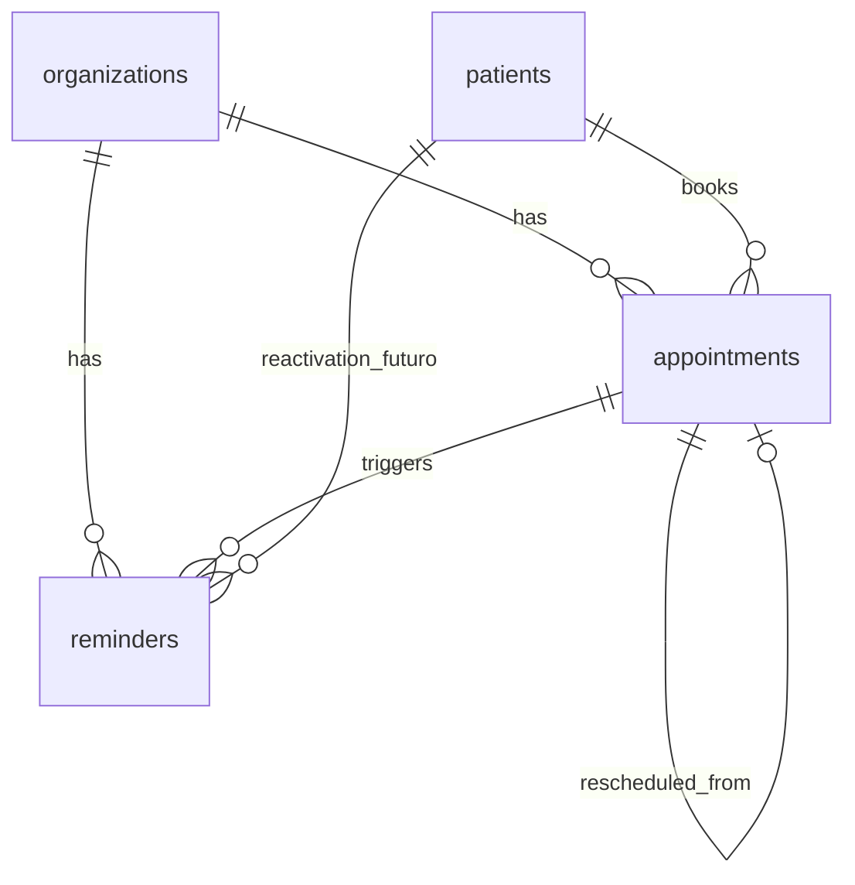

Legenda: tudo já existe — este epic **reusa** entidades (`appointments`, `reminders`, `appointments.rescheduled_from`). A única proposta nova é o JSONB `organizations.settings.reschedule`.

### 51.2 Ondas de evolução

| Onda | Fase | Mudanças propostas | Impacto no MVP se `reschedule.enabled=false` |
|------|------|-------------------|----------------------------------------------|
| **0 — Fundação** | Pré-requisito | `organizations.settings.reschedule` JSONB; opt-out marketing (reusa `patients.privacy_*`) | **Zero** — defaults desligados |
| **1 — Self-service** | F3 | Sem schema novo; tools `reschedule_time`/`cancel_appointment` reusam colunas existentes | Tools atrás de flag; agenda dashboard intacta |
| **2 — Recuperação** | F1 | Linha em `reminders` para rastrear oferta de recuperação | Job não roda com flag desligada |
| **3 — Reativação** | F4 | Wire `ReminderType.REACTIVATION/POST_SERVICE` + (opcional) `reminders.metadata` JSONB | `reminder_service` estende atrás de flag |
| **4 — Atraso** | F2 | Sem tabela nova; usa status `arrived/in_progress` + recálculo de slots | Nenhum — feature dashboard opcional |

### 51.3 Contratos JSONB (proposta)

**`organizations.settings.reschedule`**

```json
{
  "enabled": false,
  "phases": {
    "self_service": false,
    "noshow_recovery": false,
    "reactivation": false,
    "late_cascade": false
  },
  "noshow_recovery_delay_minutes": 30,
  "reactivation_after_days": 7,
  "send_window": { "start_hour": 9, "end_hour": 20 }
}
```

### 51.4 Índices e RLS (proposta)

| Objeto | Índice / policy |
|--------|-----------------|
| `reminders` (recuperação/reativação) | Reusa índices existentes; filtra `type` + `status=pending` |
| `appointments` (no-show recentes) | Reusa `idx_appt_status` (`organization_id`,`status`) |
| RLS tenant | Padrão `organization_id` — sem tabela nova |

### 51.5 DSAR e retenção por entidade (proposta)

| Entidade | Export | Erase | Retenção sugerida |
|----------|--------|-------|-------------------|
| Ofertas de recuperação (linhas `reminders`) | Metadados | Cancelar pendentes no erase | Igual lembretes MVP |
| Mensagens de reativação (`reminders`) | Metadados | Cancelar pendentes no erase | Igual lembretes MVP |
| `appointments` reagendados (`rescheduled_from`) | Já coberto | Anonimização padrão | Política de appointments |

Atualizar [`docs/legal/ROPA.md`](docs/legal/ROPA.md) e revisar consentimento/opt-out em `packages/compliance/` **antes** de qualquer Onda ≥ 2.

## 52. Métodos probabilísticos — qualidade IA Reagendamento (documentação — não implementar)

> **Status:** estratégia de qualidade para as partes LLM do epic. Reutiliza padrões do motor híbrido ([§23.1](#231-motor-híbrido-de-agendamento-deterministic-first)). **Não implementar** sem aprovação.

### 52.1 Três camadas (Deterministic → Structured LLM → Free LLM)

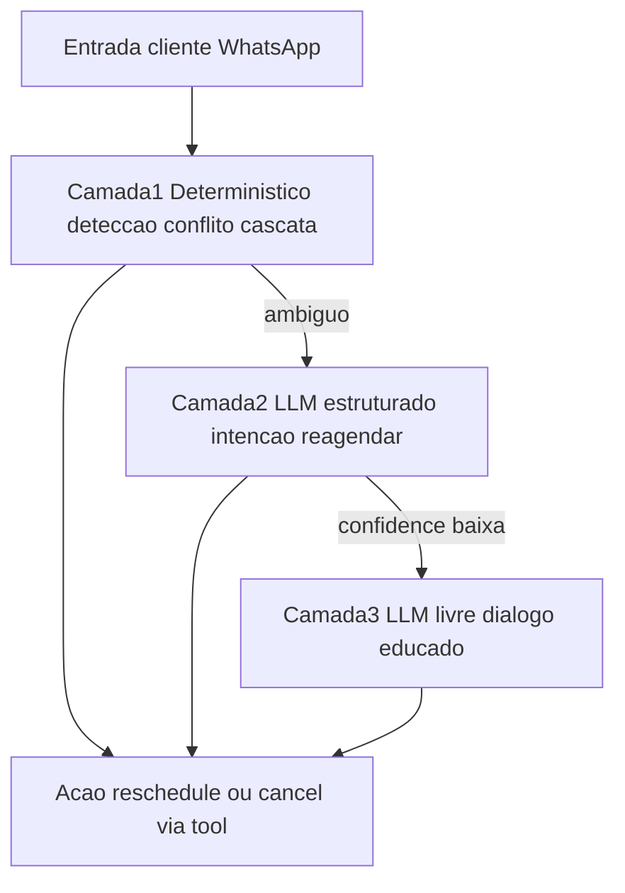

**Regra:** cancelamento (F3) **nunca** é executado em Camada 3 sem confirmação explícita do cliente. Datas de reagendamento seguem o parser determinístico de `date_parsing/` + `guardrails.py`.

### 52.2 Matriz fase × método

| Fase | Determinístico (fonte da verdade) | Probabilístico permitido | Método de qualidade | Fallback |
|------|-----------------------------------|--------------------------|---------------------|----------|
| **F1 — Recuperação** | Detecção no-show; template de oferta | Polish opcional do convite | Template fixo (`tokens=0`); polish só staging | Mensagem template sem LLM |
| **F2 — Atraso** | Recálculo de cascata via `get_available_slots` | — | 100% determinístico; sem LLM | N/A |
| **F3 — Reschedule/cancel** | `reschedule_appointment` (conflito 409); parser de datas; vínculo `sender_phone` | Extração de intenção/data (estilo `intent_extractor`) | `confidence < 0.7` → repergunta; cancel exige confirmação | `request_human_handoff` |
| **F4 — Reativação** | Templates por `ReminderType`; janela `organizations.timezone` | Polish opcional | Template fixo; checar opt-out antes | Mensagem template sem LLM |

### 52.3 Padrões MVP reutilizáveis

| Padrão existente | Aplicação proposta |
|------------------|--------------------|
| `book_time` + `guardrails.py` | Tools `reschedule_time`/`cancel_appointment` — fail-closed, vínculo `sender_phone` |
| `intent_extractor` + `confidence` | Extrair data/horário do pedido de reagendamento |
| `response_composer` factual + polish | Convites de recuperação/reativação — factual = template, polish opcional |
| `reschedule_appointment` (conflito EXCLUDE) | Reuso direto pela tool de reagendar |

### 52.4 Gates de qualidade

| Gate | Comportamento |
|------|---------------|
| `confidence >= 0.8` | Executar reagendamento via tool |
| `0.5 <= confidence < 0.8` | Confirmar com o cliente antes de aplicar |
| `confidence < 0.5` | Não agir; repergunta determinística ou handoff |

### 52.5 Anti-padrões (evitar na implementação futura)

- Reagendar ou cancelar appointment de **terceiros** via prompt injection — sempre vincular ao `sender_phone` (como `book_time`)
- Cancelar sem confirmação explícita do cliente
- Disparar recuperação/reativação sem checar `privacy_*`/opt-out e janela de envio
- Duplicar a régua D+N do CJI Fase 4 — reativação aqui é gatilhada por **falta**, não por conclusão
- Tratar enums `ReminderType.REACTIVATION/POST_SERVICE` como "já implementados" só por existirem

---

*FlowIA Master Engine — documento mantido pela equipe.*
