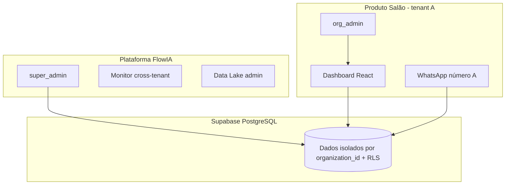
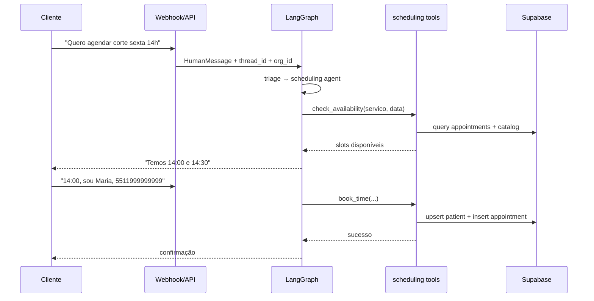
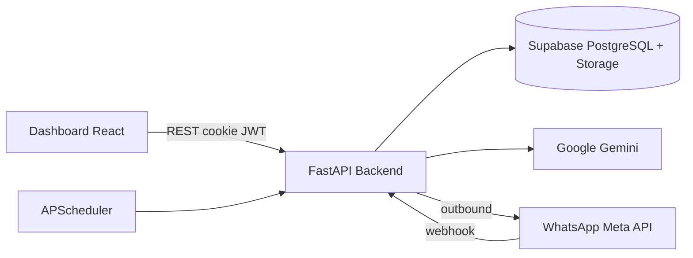
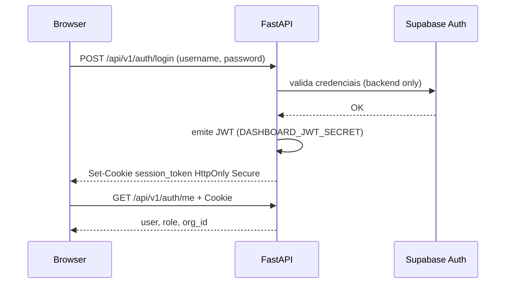
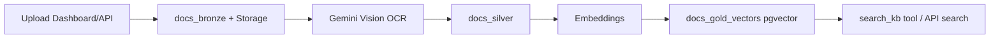

# FlowIA Master Engine — Fonte da Verdade

> **Este documento é a fonte canônica do projeto.** Em caso de divergência com outros arquivos em `docs/`, prevalece o `CLAUDE.md`.
>
> **Produto ativo:** MVP salão (`PRODUCT_LINE=salon`) · **Versão API:** 1.1.0 · **Última revisão doc:** Jun/2026

---

## Índice

- [Parte I — Visão e negócio](#parte-i--visão-e-negócio)
- [Parte II — Arquitetura técnica](#parte-ii--arquitetura-técnica)
- [Parte III — Segurança e governança](#parte-iii--segurança-e-governança)
- [Parte IV — Motor de IA](#parte-iv--motor-de-ia)
- [Parte V — Frontend](#parte-v--frontend)
- [Parte VI — Operações](#parte-vi--operações)
- [Parte VII — Desenvolvimento e governança](#parte-vii--desenvolvimento-e-governança)

---

# Parte I — Visão e negócio

## 1. Identidade do produto

**FlowIA Master Engine** é uma plataforma SaaS multi-tenant B2B para gestão inteligente de salões de beleza. Combina:

- **Dashboard administrativo** — agenda, clientes, catálogo de serviços
- **Assistente conversacional** — WhatsApp e chat de teste, powered by LangGraph + Google Gemini
- **Base de conhecimento (RAG)** — pipeline Medallion Bronze → Silver → Gold com busca semântica

**Proposta de valor:** automatizar recepção, agendamento e suporte via IA, com isolamento rigoroso por salão (tenant), operação white-label por organização e credenciais WhatsApp próprias por cliente.

**Modelo comercial:** cada cliente é uma `organization` no banco. Um codebase, um Supabase, N tenants isolados por `organization_id` + Row Level Security (RLS).

## 2. Modelo multi-tenant: plataforma vs produto



| Camada | Quem usa | Escopo de dados |
|--------|----------|-----------------|
| **Produto** | Dono/funcionário do salão + clientes via WhatsApp | Apenas dados da própria organização |
| **Plataforma** | Equipe FlowIA (`super_admin`) | Cross-tenant para operação, BI e dev |

**Princípios:**

- 1 codebase, 1 banco Supabase, N clientes
- Isolamento por `organization_id` em toda query de negócio
- `super_admin` pode operar cross-tenant; `org_admin` não pode trocar tenant
- Credenciais WhatsApp por org: `organizations.whatsapp_phone_id`, `whatsapp_access_token`

## 3. Personas e RBAC

| Persona | Role JWT | O que vê |
|---------|----------|----------|
| Dono / funcionário do salão | `org_admin` | Overview, Agenda, Clientes, Catálogo — **sem** Data Lake, Chat Test, seletor de org |
| Operador plataforma | `super_admin` | Mesmo dashboard + seletor de org (filtro `vertical=salon`) |
| Dev local | `super_admin` + `import.meta.env.DEV` | Rotas extras `/admin/data-lake`, `/admin/chat-test` |

**Regras de acesso:**

- `org_admin`: header `x-organization-id` deve coincidir com `org_id` do JWT → **403** se divergir
- `super_admin`: pode usar `ALL` ou qualquer org válida
- Rotas admin dev protegidas por `AdminDevRoute` (super_admin + ambiente DEV)

## 4. Regras de negócio detalhadas

### 4.1 Agendamento

- Serviço tem nome, duração (`duration_minutes`), preço e profissional vinculado (`service_catalog.professional_id`)
- Cliente identificado por **nome + telefone** (tabela `patients`; UI exibe "Clientes")
- Horário comercial padrão: **09:00–18:00**; slots de **30 minutos**
- Conflito de horário (double booking) → HTTP **409** (`DoubleBookingError`)
- Criação via dashboard (drag-and-drop na Agenda) ou agente IA (`check_availability` → `book_time`)
- Reagendamento passa por checagem de conflito antes de persistir
- Lembretes automáticos via APScheduler (`packages/scheduling/reminder_service.py`)
- Detecção de no-show via `no_show_service.py`

### 4.2 Atendimento WhatsApp / chat

| Papel IA | Responsabilidade | Regra crítica |
|----------|------------------|---------------|
| **Recepcionista** | Preços, serviços, horários | Sempre `search_kb` antes de inventar |
| **Suporte** | Políticas (cancelamento, atraso, pagamento) | KB como fonte oficial |
| **Agendamento** | Fluxo completo de booking | Ferramentas obrigatórias; nunca confirmar sem `book_time` |
| **Handoff** | Transferência humana | `request_human_handoff` |

- Sem CRM B2B / leads BANT no MVP salão (`PRODUCT_LINE=salon`)
- Mensagens mascaradas nos logs (LGPD): primeiros 15 caracteres apenas
- Dedup inbound por `message_id` (in-memory; ver limitações na Parte III)

### 4.3 Catálogo e clientes

- **Catálogo:** serviços e profissionais por org; CRUD via `/organizations/services` e `/organizations/professionals`
- **Clientes:** CRUD via `/patients`; telefone único por org (`UNIQUE(organization_id, phone)`)
- Agente pode criar paciente automaticamente no `book_time` se telefone não existir

### 4.4 Base de conhecimento (RAG)

- Upload de documentos alimenta pipeline Data Lake
- Agente consulta via tool `search_kb` (vetores em `docs_gold_vectors`)
- Dono do salão **não** gerencia pipeline — operador/dev em `/admin/data-lake`
- OCR via Gemini Vision; concorrência limitada por semáforo async

## 5. Matriz funcionalidade × persona

| Funcionalidade | org_admin | super_admin | Dev only | Status MVP |
|----------------|-----------|-------------|----------|------------|
| Visão Geral (agenda hoje, clientes, próximos) | Sim | Sim | — | Ativo |
| Agenda (CRUD + drag reagendar) | Sim | Sim | — | Ativo |
| Clientes (`/patients`) | Sim | Sim | — | Ativo |
| Catálogo (serviços + profissionais) | Sim | Sim | — | Ativo |
| Data Lake (upload, sync, RAG) | Não | Não | Sim | Ativo (dev) |
| Chat Test | Não | Não | Sim | Ativo (dev) |
| KPIs tokens/custo IA na Overview | Não | Não | — | Removido |
| CRM leads / SDR | Não | Não | — | Desativado |
| Prontuário clínico | Não | Não | — | Removido da UI |
| Seletor "Salão ativo" | Não | Sim | — | Ativo |

## 6. Fluxos de usuário

### 6.1 Agendar via chat (WhatsApp ou Chat Test)



### 6.2 Agendar via dashboard

1. `org_admin` acessa `/agenda`
2. Seleciona slot ou abre modal de novo agendamento
3. Frontend chama `POST /api/v1/scheduling/` ou `POST /api/v1/scheduling/calendar/{id}` (reagendar)
4. Backend valida overlap → 409 se conflito
5. UI atualiza calendário; lembretes criados em background

### 6.3 Upload e consulta KB

1. Dev/super_admin acessa `/admin/data-lake`
2. Upload → `POST /api/v1/lakehouse/upload` → Bronze (Storage + `docs_bronze`)
3. Background OCR → Silver (`docs_silver`) → embeddings → Gold (`docs_gold_vectors`)
4. Agente ou busca manual: `POST /api/v1/lakehouse/search`

## 7. Fora do MVP e legado desativado

| Item | Status | Notas |
|------|--------|-------|
| Tabela `leads`, tool `save_lead_to_db` | Desativado | CRM B2B fora do escopo salão |
| Endpoint `/dashboard/crm-leads` | Removido | Rota eliminada do MVP salão |
| Agentes `sdr`, `lakehouse_query` standalone | Normalizado | Fluxo unificado em recepcionista/scheduling |
| Verticals `dental`, `medical` | Stub futuro | `apps/clinic/` reservado |
| Handoff WhatsApp | Ativo em `patients` | `handoff_requested_at`, `handoff_reason` via `legacy_sender_id` |
| Anamnese / NPS pós-atendimento | **DEFERIDO** | Schema existe; fluxo não implementado (Cap 4 pilar 3) |
| Pagamento / convênios | Fase 2 | Não implementar agora |
| `src/`, `dashboard/` raiz, `.agent/` | **Proibido recriar** | Migrado para `packages/` + `apps/salon/` |

---

# Parte II — Arquitetura técnica

## 8. Diagrama de sistema



**Três pilares:**

1. **Backend FastAPI** — API REST, LangGraph, webhooks, scheduler
2. **Dashboard React** — SPA Vite (Agenda, Clientes, Catálogo, Admin dev)
3. **Supabase** — PostgreSQL + RLS, Storage (data lake), Auth (backend only), pgvector

## 9. Stack tecnológica

| Camada | Tecnologia | Versão / nota |
|--------|------------|---------------|
| Runtime backend | Python | 3.12 (CI) |
| Runtime frontend | Node.js | 20 (CI) |
| API | FastAPI, Uvicorn, Pydantic | ≥0.109, v2 |
| IA | LangGraph, LangChain, langchain-google-genai | ≥1.0, Gemini |
| Modelo default | `MODEL_NAME` | gemini-2.5-flash |
| Embeddings | `EMBEDDING_MODEL_NAME` | gemini-embedding-2 |
| DB | Supabase client, psycopg3, PostgresSaver | ≥2.3 |
| Auth | python-jose, bcrypt, cookie HttpOnly | JWT dashboard |
| Frontend | React, Vite, TypeScript, Tailwind | 18.3, 5.4, 5.6, 4.3 |
| Roteamento UI | React Router | 7.16 |
| Testes | pytest, vitest, Playwright | cov backend ≥30% |
| Lint | ruff, ESLint | |
| Rate limit | slowapi | auth, webhook |
| Jobs | APScheduler | lembretes, no-show |

## 10. Estrutura do monorepo

```
flowia-master-engine/
├── main.py                      # Entry → create_salon_app()
├── CLAUDE.md                    # Fonte da verdade (este arquivo)
├── AGENTS.md                    # Operação Cursor (comandos, rules, skills)
├── packages/                    # Motor compartilhado
│   ├── models/                  # Enums, DTOs
│   ├── auth_core/               # Config, DB, JWT, tenant, limiter, auth router
│   ├── scheduling/              # Agenda, tools booking, scheduler, reminders
│   ├── lakehouse/               # Pipeline Medallion, RAG, governance
│   ├── engine/                  # LangGraph, chat, metrics, checkpointer, prompts
│   └── integrations/webhook/    # WhatsApp inbound/outbound
├── apps/
│   ├── salon/                   # Produto ativo
│   │   ├── api/                 # app_factory, dashboard router
│   │   ├── domain/              # catalog (organizations), clients (patients)
│   │   ├── dashboard/           # SPA React
│   │   ├── prompts.py           # Prompts white-label salão
│   │   └── seeds/               # vertical_orgs.py
│   └── clinic/                  # Stub futuro
├── supabase/migrations/         # Schema versionado + RLS
├── tests/                       # pytest (conftest: CHECKPOINTER_BACKEND=memory)
├── scripts/                     # seed, check_env, setup_dev_env
├── deployments/                 # multi-tenant/ + tenants/{slug}/
└── docs/                        # Referência temática (CLAUDE prevalece)
```

### Tabela pacote → módulos → responsabilidade

| Pacote | Módulos principais | Responsabilidade |
|--------|-------------------|------------------|
| `packages/models` | `enums.py` | Vertical, status — DTOs Pydantic compartilhados |
| `packages/auth_core` | `config`, `database`, `auth_service`, `auth_router`, `tenant`, `dependencies`, `limiter`, `exceptions` | Config, Supabase handler, JWT, tenant context, rate limit |
| `packages/scheduling` | `router`, `service`, `repository`, `tools`, `scheduler`, `reminder_*`, `no_show_service` | CRUD agenda, tools LangGraph, jobs background |
| `packages/lakehouse` | `router`, `service`, `governance` | Upload, OCR, embeddings, search, SQL guardrails |
| `packages/engine` | `engine`, `service`, `chat_router`, `metrics_router`, `checkpointer`, `tools`, `prompts/` | Grafo LangGraph, chat test, métricas, RAG tools |
| `packages/integrations` | `webhook/router`, `whatsapp`, `tenant_resolver`, `session_store` | Webhook Meta, outbound, resolução org |
| `apps/salon/domain` | `catalog/`, `clients/` | Organizations, services, professionals, patients |
| `apps/salon/api` | `app_factory.py`, `routers/dashboard.py` | Composition root, stats dashboard |

## 11. Grafo de dependências

```
models        → (stdlib/pydantic only)
auth_core     → models
scheduling    → auth_core, models
lakehouse     → auth_core, models
engine        → auth_core, models, scheduling, lakehouse
integrations  → engine, auth_core
apps/salon    → engine, scheduling, lakehouse, auth_core
```

**Proibido:** `packages/*` importar de `apps/salon`.

**Composition root:** [`main.py`](main.py) chama `create_salon_app()` — não registrar routers soltos em `main.py`. Prefixo `/api/v1` aplicado exclusivamente em [`apps/salon/api/app_factory.py`](apps/salon/api/app_factory.py).

## 12. Composition root, lifespan e middleware

**Arquivo:** `apps/salon/api/app_factory.py`

**Lifespan (startup/shutdown):**

1. `init_checkpointer()` — PostgresSaver ou MemorySaver
2. Health probe Supabase (`conversation_metrics`)
3. `start_scheduler()` — lembretes e no-show
4. On shutdown: `stop_scheduler()`, `shutdown_checkpointer()`

**Middleware:**

- CORS (`settings.ALLOWED_ORIGINS`, credentials=True)
- TrustedHostMiddleware
- Security headers: X-Frame-Options, X-Content-Type-Options, HSTS, XSS-Protection
- slowapi limiter em `app.state.limiter`

**Exception handlers:**

| Exceção | HTTP | Origem |
|---------|------|--------|
| `DoubleBookingError` | 409 | scheduling |
| `ResourceNotFoundError` | 404 | domínio |
| `BusinessLogicError` | 422 | domínio |
| `FlowIAError` | 400 | base |
| `RateLimitExceeded` | 429 | slowapi |

Definir novas exceções em `packages/auth_core/exceptions.py`; mapear HTTP no app_factory.

## 13. Superfície API (`/api/v1`)

Todos os routers usam paths **relativos**; montados com `prefix="/api/v1"`.

### Auth — `packages/auth_core/auth_router.py`

| Método | Path | Auth | Descrição |
|--------|------|------|-----------|
| POST | `/login` | — | Login (`username`, `password`) → cookie `session_token` HttpOnly |
| POST | `/logout` | — | Limpa cookie |
| GET | `/me` | auth | Sessão + org + role |
| POST | `/change-password` | auth | Troca senha |
| POST | `/register` | admin | Cria dashboard_user |

### Scheduling — `packages/scheduling/router.py`

| Método | Path | Descrição |
|--------|------|-----------|
| GET | `/availability` | Slots disponíveis |
| POST | `/` | Criar agendamento |
| GET | `/agenda` | Lista agenda |
| GET | `/calendar` | Dados calendário |
| POST | `/calendar/{appointment_id}` | Reagendar |

### Patients — `apps/salon/domain/clients/router.py` (prefix `/patients`)

| Método | Path | Descrição |
|--------|------|-----------|
| POST | `/` | Criar cliente |
| GET | `/` | Listar clientes |
| DELETE | `/{patient_id}` | Desativar cliente (soft delete) |

### Organizations — `apps/salon/domain/catalog/router.py` (prefix `/organizations`)

| Método | Path | Descrição |
|--------|------|-----------|
| POST | `/` | Criar org (super_admin) |
| GET | `/` | Listar orgs |
| POST/GET | `/services` | CRUD catálogo serviços |
| DELETE | `/services/{service_id}` | Desativar serviço (soft delete) |
| POST/GET | `/professionals` | CRUD profissionais |
| DELETE | `/professionals/{professional_id}` | Desativar profissional (soft delete) |

### Lakehouse — `packages/lakehouse/router.py`

| Método | Path | Descrição |
|--------|------|-----------|
| POST | `/lakehouse/upload` | Upload multipart (max 10MB) |
| POST | `/lakehouse/ingest` | Ingestão programática |
| POST | `/lakehouse/search` | Busca semântica RAG |
| POST | `/lakehouse/sync` | Reprocessar pendentes |
| GET | `/lakehouse/status` | Contadores por camada |
| GET | `/lakehouse/documents` | Listar documentos |
| GET | `/lakehouse/catalog` | Catálogo governance |
| POST | `/lakehouse/query` | Query SQL governance |
| POST | `/lakehouse/generate-sql` | SQL via IA |

### Engine — `packages/engine/`

| Método | Path | Descrição |
|--------|------|-----------|
| POST | `/chat/test` | Chat test (dev) |
| GET | `/metrics/kpis` | KPIs |
| GET | `/metrics/conversations` | Conversas |
| GET | `/metrics/tokens-daily` | Tokens/dia |
| GET | `/metrics/system-health` | Saúde sistema |
| GET/POST | `/system/settings` | Config sistema |

### Integrations — `packages/integrations/webhook/router.py`

| Método | Path | Descrição |
|--------|------|-----------|
| GET | `/whatsapp` | Verificação webhook Meta |
| POST | `/whatsapp` | Mensagens inbound |

### Dashboard — `apps/salon/api/routers/dashboard.py`

| Método | Path | Descrição |
|--------|------|-----------|
| GET | `/dashboard/stats` | Stats overview |

### System

| Método | Path | Descrição |
|--------|------|-----------|
| GET | `/health` | Health check (sem prefix /api/v1) |

## 14. Modelo de dados

### Entidades principais

**organizations** — tenant root

- `id`, `name`, `slug`, `vertical` (salon|dental|medical)
- `whatsapp_phone_id`, `whatsapp_access_token`, `whatsapp_business_id`
- `settings` JSONB, `timezone`, `is_active`

**dashboard_users** — usuários do painel

- `email`, `password_hash`, `role` (org_admin|super_admin)
- `organization_id` FK (nullable para super_admin)

**professionals** — profissionais do salão

- `organization_id`, `name`, `specialty`, `working_hours` JSONB, `break_times` JSONB
- `is_active` — soft delete (desativar em vez de apagar)

**service_catalog** — serviços

- `organization_id`, `name`, `duration_minutes`, `price`, `professional_id` FK
- `requires_anamnesis`, `recall_days`
- `is_active` — soft delete; `UNIQUE(organization_id, lower(name)) WHERE is_active`

**patients** — clientes (UI: "Clientes")

- `organization_id`, `name`, `phone` (unique por org), `email`, `tags` JSONB
- `no_show_count`, `total_appointments`, `last_visit_at`
- `legacy_sender_id` — vínculo WhatsApp; `handoff_requested_at`, `handoff_reason` — handoff humano
- `is_active` — soft delete

**appointments** — agendamentos

- `organization_id`, `patient_id`, `professional_id`, `service_id`
- `scheduled_at`, `duration_minutes`, `status`, `notes`

**reminders** — lembretes automáticos

- Vinculados a appointments; status sent/pending

### Data Lake

| Tabela | Camada | Status típico |
|--------|--------|---------------|
| `docs_bronze` | Bronze | PENDING → PROCESSING → COMPLETED / ERROR |
| `docs_silver` | Silver | SILVER_READY |
| `docs_gold_vectors` | Gold | embeddings pgvector para RAG |

### LangGraph

- Tabelas checkpoint criadas automaticamente por `PostgresSaver.setup()`
- `conversation_metrics` — telemetria tokens/custo por thread

### Relacionamentos chave

```
organizations 1──N professionals
organizations 1──N service_catalog
organizations 1──N patients
organizations 1──N appointments
patients 1──N appointments
professionals 1──N appointments
service_catalog 1──N appointments (via service_id)
```

### Política de integridade de dados

- **Exclusão = soft delete:** sem hard delete de dados de negócio. Desativar via `is_active=false` (patients, professionals, service_catalog, organizations). Listagens filtram `is_active` por padrão (`?include_inactive=true` para incluir). Endpoints `DELETE` fazem deactivate, nunca remoção física.
- **`updated_at` via trigger:** `set_updated_at()` + `trg_set_updated_at BEFORE UPDATE` em organizations, patients, appointments, docs_bronze, anamnesis_responses.
- **FK `organization_id` = `ON DELETE RESTRICT`** nas tabelas de negócio (patients, appointments, professionals, service_catalog, reminders, anamnesis_*) — protege contra cascade acidental. Organização é soft-delete, nunca apagada.

## 15. Migrações Supabase

Aplicar em ordem via `supabase db push`, SQL Editor ou `python scripts/apply_migrations.py` (via `SUPABASE_DB_URL`). Verificar estado: `python scripts/list_db_migrations.py`.

| Arquivo | Conteúdo |
|---------|----------|
| `20260531200000_multi_tenant_foundation.sql` | organizations, professionals, service_catalog, patients, appointments, reminders, RLS foundation, arquiva legado |
| `20260531210000_phase3_anamnesis.sql` | anamnesis_templates, campos clínicos |
| `20260531220000_rls_jwt_support.sql` | Policies RLS com claims JWT |
| `20260602000000_auth_uid_rls.sql` | RLS auth.uid() para dashboard_users |
| `20260605000000_phase4_data_lake.sql` | docs_bronze/silver/gold_vectors, Storage bucket, pgvector |
| `20260606000000_bronze_content_hash.sql` | Hash dedup Bronze |
| `20260606010000_service_catalog_professional_id.sql` | FK professional_id em service_catalog |
| `20260607000000_patient_handoff.sql` | `patients.handoff_requested_at`, `handoff_reason`, índice legacy_sender |
| `20260607010000_appointment_overlap_guard.sql` | btree_gist + constraint EXCLUDE overlap |
| `20260607020000_webhook_message_dedup.sql` | Dedup persistente webhook WhatsApp |
| `20260608000000_internal_tables_rls.sql` | RLS + REVOKE anon/authenticated em tabelas internas (checkpoints*, webhook dedup) |
| `20260609000000_updated_at_triggers.sql` | Função `set_updated_at()` + triggers `BEFORE UPDATE` (organizations, patients, appointments, docs_bronze, anamnesis_responses) |
| `20260609010000_soft_delete_and_integrity.sql` | `patients.is_active`, unique serviço ativo por nome, FKs `organization_id` CASCADE → RESTRICT |

**Requisito Data Lake:** extensão **pgvector** habilitada no Supabase Dashboard.

---

# Parte III — Segurança e governança

## 16. Modelo de autenticação

**Decisão arquitetural:** FastAPI JWT via cookie HttpOnly é a **única** autenticação do dashboard.



- Frontend **nunca** chama `supabase.auth.signInWithPassword`
- Body do login usa campo **`username`** (valor = email do usuário cadastrado)
- `AuthContext` consulta `/auth/me` no mount; login via `loginWithCredentials()` + `navigate("/")` sem reload completo
- Produção Render: API e dashboard em subdomínios distintos (`*.onrender.com`) → `COOKIE_SECURE=true` + cookie **`SameSite=None`** (requer `Secure`; ver `_session_cookie_samesite()` em `auth_router.py`)
- Local: `COOKIE_SECURE=false` → `SameSite=Lax`
- Expiração: `ACCESS_TOKEN_EXPIRE_MINUTES` (default 1440)

## 17. Isolamento multi-tenant

**Camadas de defesa:**

1. **JWT** — `org_id` e `role` embutidos no token
2. **Header** — `x-organization-id` em requests autenticados
3. **Dependency** — `validated_tenant_context` em `packages/auth_core/dependencies.py`
4. **RLS** — PostgreSQL filtra por `organization_id` / JWT claims
5. **Webhook** — org resolvida via `organizations.whatsapp_phone_id` (não confia no sender)

**Nunca** confiar apenas no header sem validação contra JWT para `org_admin`.

**Context manager:** `set_tenant_context(org_id)` em tools LangGraph e services.

### Tabelas internas (backend-only)

Tabelas de infraestrutura **sem** `organization_id` — acesso só pelo backend, nunca pelo browser/anon key:

| Tabela | Uso | Acesso backend |
|--------|-----|----------------|
| `checkpoints`, `checkpoint_blobs`, `checkpoint_writes`, `checkpoint_migrations` | Memória LangGraph (histórico de conversas) | `SUPABASE_DB_URL` (PostgresSaver) |
| `webhook_message_dedup` | Dedup inbound WhatsApp | `SUPABASE_SERVICE_ROLE` (REST) |

**Padrão:** `ENABLE ROW LEVEL SECURITY` + **zero policies** + `REVOKE ALL FROM anon, authenticated`. Deny by default via PostgREST; `service_role` e conexão `postgres` bypassam RLS.

## 18. Secrets management

| Secret | Variável | Onde rotacionar |
|--------|----------|-----------------|
| Google API | `GOOGLE_API_KEY` | Google AI Studio |
| Supabase anon | `SUPABASE_KEY`, `VITE_SUPABASE_KEY` | Supabase Settings → API |
| Service role | `SUPABASE_SERVICE_ROLE` | Supabase Settings → API |
| JWT dashboard | `DASHBOARD_JWT_SECRET` | Gerar novo (32+ chars) |
| Dashboard API key | `DASHBOARD_API_KEY` | UUID/hex novo |
| WhatsApp verify | `WHATSAPP_VERIFY_TOKEN` | Meta Developer Console |
| WhatsApp app secret | `WHATSAPP_APP_SECRET` | Meta Developer Console |
| DB | `SUPABASE_DB_URL` | Supabase Database Settings |

**Checklist pós-rotação:**

1. Atualizar `.env` na raiz
2. Reiniciar backend + frontend
3. Usuários refazem login (JWT antigo invalida)
4. Atualizar secrets no provedor de deploy
5. Revogar chaves antigas nos painéis (não só substituir)

**Validação:** `python scripts/check_env.py`

**Prevenção:** `.env` no `.gitignore`; nunca `git add .env`; `VITE_DEV_*` apenas local.

Ver detalhes: [`docs/SECRET_ROTATION.md`](docs/SECRET_ROTATION.md)

## 19. Rate limiting, LGPD e logging

**Rate limiting (slowapi):** login, webhook WhatsApp, endpoints sensíveis — `packages/auth_core/limiter.py`

**LGPD:**

- Mascaramento de conteúdo WhatsApp nos logs (15 chars + "...")
- PII masking em resultados do data lake governance
- Não logar tokens JWT ou WhatsApp
- Service role **nunca** no frontend

**Security headers:** X-Frame-Options DENY, nosniff, HSTS, XSS-Protection (app_factory middleware)

## 20. Concorrência e limitações conhecidas

| Mecanismo | Implementação | Limitação |
|-----------|---------------|-----------|
| Webhook dedup | Tabela `webhook_message_dedup` (insert-before-process, RLS interno) + purge diário APScheduler (`packages/integrations/webhook/dedup.py`, job registrado em `app_factory`) | Retention configurável via `WEBHOOK_DEDUP_RETENTION_DAYS` (default 7) |
| Tabelas internas | checkpoints* + webhook dedup — RLS sem policies | LangGraph pode criar novas tabelas checkpoint; repetir padrão internal se necessário |
| OCR concorrente | `asyncio.Semaphore` em lakehouse/silver | OK |
| Booking overlap | Checagem Python + constraint `appointments_no_overlap` (btree_gist EXCLUDE) | Cancelados/no_show excluídos da constraint |
| Bronze dedup | content_hash migration | OK |

Documentar novas limitações nesta seção ao descobri-las.

## 21. CI/CD e gates de qualidade

**GitHub Actions:** `.github/workflows/ci.yml`

| Job | Gates |
|-----|-------|
| backend | ruff check · pytest --cov-fail-under=30 |
| frontend | ESLint · vitest · vite build |

**Env CI:** `CHECKPOINTER_BACKEND=memory`, `SCHEDULER_ENABLED=false`, secrets placeholder

**Testes E2E:** Playwright em `apps/salon/dashboard/e2e/` (auth, agenda, catalog, patients, chat-test-rag, chat-test-scheduling)

---

# Parte IV — Motor de IA

## 22. LangGraph: grafo e triage

**Arquivo central:** `packages/engine/engine.py`

**Estado (`AgentState`):** messages, sender_id, handoff_requested, active_agent, bant_status (legado), audit_flag, lgpd_shown, etc.

**Fluxo:**

1. Mensagem entra via webhook ou `/chat/test`
2. Triage classifica intenção (recepcionista, suporte, scheduling, lakehouse interno)
3. Nó agente especializado executa com tools bound
4. Resposta AIMessage retornada ao canal

**Proxy lazy:** `master_engine` em checkpointer.py — grafo compilado on first use.

## 23. Tools de scheduling

| Tool | Pacote | Função |
|------|--------|--------|
| `check_availability` | `packages/scheduling/tools.py` | Lista slots livres por serviço/data |
| `book_time` | idem | Cria/upsert patient + insert appointment |

Tools recebem `RunnableConfig` com `org_id` no configurable — **obrigatório** para tenant isolation.

## 24. RAG e Data Lake Medallion



**Tools engine:**

- `search_kb` — busca semântica tenant-aware
- `get_lakehouse_schema` — schema para SQL (admin)
- `query_lakehouse` — SELECT com guardrails

**Governance:** `packages/lakehouse/governance.py` — ACTIVE_DICTIONARY, bloqueio DDL/DML destrutivo, PII masking.

## 25. Prompts do produto salão

**Arquivo:** `apps/salon/prompts.py`

| Builder | Papel | Tools |
|---------|-------|-------|
| `build_receptionist_prompt` | Recepcionista | search_kb, handoff |
| `build_support_prompt` | Suporte/políticas | search_kb, handoff |
| `build_scheduling_prompt` | Agendamento | check_availability, book_time |
| `build_lakehouse_prompt` | Analítico interno | get_lakehouse_schema, query_lakehouse |

**Guardrails comuns (`build_guardrails`):**

- Identidade imutável (assistente do {salon_name})
- Anti-hijack, anti-prompt-leak
- Veracidade via KB — não inventar preços
- Privacidade — não pedir senhas/cartão

Registro: `register_salon_prompts()` no app_factory startup via `packages/engine/prompts/registry.py`.

## 26. Checkpointer e persistência

**Arquivo:** `packages/engine/checkpointer.py`

| Ambiente | Backend | Config |
|----------|---------|--------|
| Produção | PostgresSaver | `CHECKPOINTER_BACKEND=auto`, `SUPABASE_DB_URL` |
| Testes/CI | MemorySaver | `CHECKPOINTER_BACKEND=memory` |

Thread ID = `sender_id` (WhatsApp) ou UUID (chat test). Histórico persiste por thread.

## 27. Métricas de tokens e custo

- `TurnTokenTracker` callback por invocação
- Persistência em `conversation_metrics` via `packages/engine/metrics/service.py`
- Endpoints `/metrics/*` para dashboard admin (dev)

---

# Parte V — Frontend

## 28. Estrutura `apps/salon/dashboard/src/`

```
src/
├── main.tsx, App.tsx, index.css
├── pages/           # Overview, Agenda, Catalog, Patients, DataLake, ChatTest, Login
├── features/
│   ├── overview/    # hooks/useOverviewStats
│   ├── agenda/      # Agenda, components/, hooks/useAgenda, types
│   ├── catalog/     # Catalog.tsx
│   ├── clients/     # Patients.tsx
│   ├── admin/       # DataLake, ChatTest
│   └── auth/        # Login
├── components/      # Layout, ProtectedRoute, AdminDevRoute, ui/
├── contexts/        # AuthContext
├── lib/             # api.ts (implementação), utils.ts
└── shared/lib/      # re-export api.ts (@/shared/lib/api)
```

## 29. Auth, rotas protegidas

- `AuthProvider` — mount → `GET /auth/me`
- `ProtectedRoute` — redirect `/login` se não autenticado
- `AdminDevRoute` — super_admin + DEV only (Data Lake, Chat Test)
- Rotas lazy-loaded com Suspense

**Rotas:**

| Path | Página | Acesso |
|------|--------|--------|
| `/login` | Login | público |
| `/` | Overview | autenticado |
| `/agenda` | Agenda | autenticado |
| `/patients` | Clientes | autenticado |
| `/catalog` | Catálogo | autenticado |
| `/admin/data-lake` | Data Lake | AdminDevRoute |
| `/admin/chat-test` | Chat Test | AdminDevRoute |

## 30. API client

**Implementação:** `src/lib/api.ts`  
**Import recomendado:** `@/shared/lib/api`

- Base URL: `VITE_API_URL` (default `http://localhost:8000/api/v1`)
- Envia cookie credentials + header `x-organization-id` quando org selecionada

## 31. Design system: Neo-Swiss Brutalism

- Tailwind CSS v4 via `@tailwindcss/vite`
- `border-radius: 0` — sem cantos arredondados
- Paleta alto contraste: preto, branco, laranja accent
- Utilitários: `card-brutal`, tokens em `src/index.css`
- Ícones: lucide-react
- DnD agenda: @dnd-kit

## 32. Testes E2E (Playwright)

| Spec | Cobertura |
|------|-----------|
| `auth-nav.spec.ts` | Login org_admin, nav sem admin routes |
| `agenda.spec.ts` | Criar agendamento |
| `catalog.spec.ts` | Serviço + profissional |
| `patients.spec.ts` | CRUD cliente |
| `chat-test-rag.spec.ts` | Preço via KB |
| `chat-test-scheduling.spec.ts` | Fluxo agendamento chat |

Mock API: `e2e/mock-api.ts` para CI sem backend real.

---

# Parte VI — Operações

## 33. Variáveis de ambiente

Referência completa: `.env.example` (copiar para `.env` — **nunca commitar**)

| Variável | Obrigatória | Propósito |
|----------|-------------|-----------|
| `PRODUCT_LINE` | Sim | `salon` (MVP) ou `clinic` (futuro) |
| `GOOGLE_API_KEY` | Sim | Gemini chat + OCR + embeddings |
| `MODEL_NAME` | Sim | Modelo chat (gemini-2.5-flash) |
| `EMBEDDING_MODEL_NAME` | Sim | Modelo embeddings |
| `SUPABASE_URL` | Sim | URL projeto Supabase |
| `SUPABASE_KEY` | Sim | Anon key (backend) |
| `SUPABASE_SERVICE_ROLE` | Sim | Service role (backend only) |
| `SUPABASE_DB_URL` | Sim | Postgres direct (checkpointer) |
| `WHATSAPP_VERIFY_TOKEN` | Sim | Verificação webhook Meta |
| `WHATSAPP_APP_SECRET` | Opcional | Assinatura webhook |
| `DASHBOARD_API_KEY` | Sim | API key interna |
| `DASHBOARD_JWT_SECRET` | Sim | Secret JWT (32+ chars) |
| `VITE_SUPABASE_URL` | Sim (frontend) | Anon URL browser |
| `VITE_SUPABASE_KEY` | Sim (frontend) | Anon key browser |
| `VITE_API_URL` | Sim (frontend) | Base API |
| `CHECKPOINTER_BACKEND` | Opcional | auto \| postgres \| memory |
| `SCHEDULER_ENABLED` | Opcional | true em prod, false em CI |
| `WEBHOOK_DEDUP_RETENTION_DAYS` | Opcional | TTL purge dedup WhatsApp (default 7) |
| `COOKIE_SECURE` | Prod | true com HTTPS |
| `ALLOWED_ORIGINS` | Prod | URL dashboard produção (CORS) |
| `ALLOWED_HOSTS` | Prod | Hostname da API (`TrustedHostMiddleware`) |
| `DEV_*` / `VITE_DEV_*` | Dev only | Login rápido local — **nunca produção** |

## 34. Deploy e staging

**Hosting produção (confirmado):** Render Web Service (API) + Render Static Site (dashboard) + Supabase prod.

| Artefato | Caminho |
|----------|---------|
| Blueprint IaC | [`render.yaml`](render.yaml) |
| Guia deploy | [`docs/RENDER.md`](docs/RENDER.md) |
| Rollback / URLs | [`docs/PRODUCTION.md`](docs/PRODUCTION.md) |
| Env API prod | [`deployments/multi-tenant/.env.production.example`](deployments/multi-tenant/.env.production.example) |

Checklist: [`docs/STAGING.md`](docs/STAGING.md)

1. Supabase prod + `supabase db push` (13 migrations) + pgvector
2. Secrets novos: `python scripts/generate_prod_secrets.py`
3. Render API: `uvicorn main:app --host 0.0.0.0 --port $PORT`, health `/health`, scale=1
4. Render Static Site: `apps/salon/dashboard`, `VITE_API_URL=https://API.onrender.com/api/v1`
5. `ALLOWED_ORIGINS` = URL dashboard; `COOKIE_SECURE=true`, `SCHEDULER_ENABLED=true`
6. Smoke: `python scripts/smoke_prod.py` + `python scripts/smoke_agent.py` + login manual

**Deploy templates:**

- `deployments/multi-tenant/` — SaaS compartilhado
- `deployments/tenants/{slug}/` — instância dedicada (.env + branding)

**Windows local:** `start_flowia.bat` ou `start_flowia.bat tenants\beauty-express`

## 35. Seeds e scripts de dev

| Script | Função |
|--------|--------|
| `scripts/check_env.py` | Valida .env sem expor valores |
| `scripts/generate_prod_secrets.py` | Gera JWT/API key/WhatsApp verify (stdout) |
| `scripts/smoke_prod.py` | Smoke `/health` + dashboard HTTP em prod |
| `scripts/smoke_agent.py` | Smoke LangGraph/RAG via `/chat/test` em prod |
| `scripts/test_rag_chat.py` | Teste RAG local ou prod (queries KB) |
| `scripts/apply_migrations.py` | Aplica migrations SQL via `SUPABASE_DB_URL` |
| `scripts/list_db_migrations.py` | Lista migrations aplicadas no banco |
| `scripts/mark_migration_applied.py` | Marca migration como aplicada (reparo histórico) |
| `scripts/create_platform_admin.py` | Cria super_admin plataforma |
| `scripts/setup_dev_env.py` | Cria admin dev |
| `scripts/create_salon_user.py` | Cria org_admin salão |
| `scripts/seed_salon.py` | Dados demo salão |
| `scripts/seed_dev.py` | Seeds multi-vertical + mocks data lake |
| `apps/salon/seeds/vertical_orgs.py` | Org referência Beauty Express |

Org demo: `22222222-2222-2222-2222-222222222222` (Beauty Express)

### Scripts operacionais

| Script | Comando | Quando |
|--------|---------|--------|
| Validar env | `python scripts/check_env.py` | Antes de subir ou após rotacionar secrets |
| Admin dev | `python scripts/setup_dev_env.py --email ... --password ...` | Primeiro setup local |
| Dono salão | `python scripts/create_salon_user.py --email ... --password ...` | Testar como org_admin |
| Seed salão | `python scripts/seed_salon.py` | Dados demo agenda/catálogo |
| Seed completo | `python scripts/seed_dev.py` | Multi-vertical + mocks data lake |

### Decisões arquiteturais registradas (ADRs implícitos)

| Decisão | Escolha | Motivo |
|---------|---------|--------|
| Auth dashboard | JWT FastAPI cookie HttpOnly | Controle total; frontend não usa Supabase Auth |
| Multi-tenant | organization_id + RLS | Escala ~10 orgs sem duplicar codebase |
| Checkpointer | PostgresSaver prod / MemorySaver testes | Persistência conversas sem Redis extra |
| Data Lake | Medallion micro-escala Supabase | Sem Databricks; Bronze/Silver/Gold lógico |
| WhatsApp org | Credenciais por organization | White-label real por cliente |
| PRODUCT_LINE | Env var `salon` | Preparar `clinic` sem fork de repo |
| Composition root | app_factory único | Routers desacoplados; prefix /api/v1 centralizado |
| Exceções domínio | auth_core/exceptions.py | Mapeamento HTTP consistente no app_factory |

## 36. Roadmap futuro (não MVP)

Ver [`docs/ROADMAP.md`](docs/ROADMAP.md). Resumo:

| Capítulo | Status | Escopo |
|----------|--------|--------|
| 1 — AI Chatbot & CRM | Concluído (MVP salão) | RAG, agendamento, data lake |
| 2 — Sales Analytics | **Futuro** | SG-Vendas, faturamento — **isolado do chatbot** |
| 3 — Workspace Analítico | Concluído | Data Lake UI, SQL editor |
| 4 — Agendamento Multi-Tenant | Concluído | RLS, lembretes, no-show |
| 5 — Omnichannel WhatsApp | Bloqueado | Webhook prod pronto: `https://flowia-api.onrender.com/api/v1/whatsapp`; aguardando credenciais Meta API (doc setup futuro) |

**Fase 2 salão:** pagamento, convênios — não implementar agora.

---

# Parte VII — Desenvolvimento e governança

## 37. Mapa de documentação

| Documento | Quando consultar |
|-----------|------------------|
| **CLAUDE.md** (este) | Sempre — fonte da verdade |
| [`AGENTS.md`](AGENTS.md) | Comandos, rules/skills Cursor |
| [`docs/README.md`](docs/README.md) | Índice temático |
| [`docs/ARCHITECTURE.md`](docs/ARCHITECTURE.md) | Referência arquitetura |
| [`docs/SALON_BUSINESS_AUDIT.md`](docs/SALON_BUSINESS_AUDIT.md) | Auditoria negócio MVP |
| [`docs/PACKAGE_BOUNDARIES.md`](docs/PACKAGE_BOUNDARIES.md) | Boundaries pacotes |
| [`docs/SECRET_ROTATION.md`](docs/SECRET_ROTATION.md) | Rotação secrets |
| [`docs/STAGING.md`](docs/STAGING.md) | Deploy checklist |
| [`docs/RENDER.md`](docs/RENDER.md) | Deploy API + dashboard no Render |
| [`docs/PRODUCTION.md`](docs/PRODUCTION.md) | URLs prod, smoke, rollback |
| [`docs/DOC_AUDIT_2026-06.md`](docs/DOC_AUDIT_2026-06.md) | Auditoria documentação (Jun/2026) |
| [`docs/data-lake.md`](docs/data-lake.md) | Pipeline Medallion |
| [`docs/ROADMAP.md`](docs/ROADMAP.md) | Futuro estratégico |
| [`docs/archive/PLAN.md`](docs/archive/PLAN.md) | Histórico executado |

## 38. Cursor: AGENTS, rules, skills

- **AGENTS.md** — operação diária (comandos, stack, mapa rules/skills)
- **Rules** — `.cursor/rules/01-global-standards.mdc` (always) + 02–05 por glob
- **Skills domínio (`flowia-*`)** — dev, monorepo, salon-domain, security, data-lake
- **Skills on-demand** — security-audit, performance-optimization, feature-flag-override
- **MCP** — Supabase read-only + Render ops; template [`.cursor/mcp.json.example`](.cursor/mcp.json.example) (não commitar `.cursor/mcp.json`)

Todas as skills carregam sob demanda via `@nome` no chat (`disable-model-invocation: true`).

| Skill | Gatilho |
|-------|---------|
| `flowia-dev` | Subir local, CI, pytest, `.env` |
| `flowia-monorepo` | Onde colocar código, imports, boundaries |
| `flowia-salon-domain` | Auth, agenda, WhatsApp, LangGraph, RLS |
| `flowia-security` | Auditoria tenant, secrets, webhook, 403 |
| `flowia-data-lake` | Bronze/Silver/Gold, OCR, RAG, DataLake UI |
| `security-audit` | Revisão de injeção (SQL/prompt), vazamento PII/secrets, tenant |
| `performance-optimization` | Bundle/lazy loading, N+1, queries lentas |
| `feature-flag-override` | Toggles (`is_active`, `settings`, `PRODUCT_LINE`, `AdminDevRoute`), UI `card-brutal` |

## 39. Dívida técnica conhecida

| Item | Arquivo | Status |
|------|---------|--------|
| God class DataLake | `packages/lakehouse/service.py` | **Resolvido** — fachada + bronze/silver/gold/search |
| Dictionary inline | `packages/lakehouse/governance.py` | **Resolvido** — `data/active_dictionary.json` (CRM filtrado) |
| God component modais | `AgendaModals.tsx` | **Resolvido** — modals em `components/modals/` |
| Fat hook | `useAgenda.ts` | **Resolvido** — split useAgendaData/Actions |
| API client paths | `lib/api.ts` vs `shared/lib/api.ts` | **Resolvido** — AuthContext usa `@/shared/lib/api` |
| Auth duplicado | `contexts/` vs `features/auth/` | **Resolvido** — implementação em `features/auth/` |
| Webhook dedup | in-memory dict | **Resolvido** — tabela `webhook_message_dedup` |
| Booking race | read-then-write | **Resolvido** — constraint EXCLUDE no DB |
| Handoff → leads | session_store | **Resolvido** — `patients.handoff_*` |
| Triage → scheduling | `packages/engine/engine.py` | **Aberto** — triage mantém `receptionist` em vez de `scheduling`; booking via chat inconsistente em prod |
| Anamnese / NPS | Cap 4 pilar 3 | **DEFERIDO** — schema only |

## 40. Manutenção da fonte da verdade

**Regra de ouro:** decisão importante → atualizar este `CLAUDE.md` no mesmo PR (ou imediatamente após).

### Checklist por tipo de mudança

| Mudança | Seções a atualizar |
|---------|-------------------|
| Novo endpoint / router | §13 Superfície API |
| Nova migration / tabela | §14 Modelo de dados, §15 Migrações |
| Nova regra de negócio | §4 Regras, §5 Matriz |
| Novo papel IA / prompt | §25 Prompts, §22 LangGraph |
| Nova env var | §33 Variáveis |
| Mudança auth/tenant/RLS | §16–17 Segurança |
| Nova limitação concorrência | §20 Limitações |
| Novo fluxo usuário | §6 Fluxos |
| Refactor pacote grande | §10 Estrutura, §39 Dívida |
| Feature fora MVP | §7 Fora do MVP, §36 Roadmap |
| Nova skill Cursor | §38 Cursor, `AGENTS.md`, opcional `01-global-standards.mdc` |

### Ao fechar PR significativo

- [ ] CLAUDE.md reflete a mudança?
- [ ] Decisão arquitetural documentada?
- [ ] Limitação de segurança anotada se aplicável?
- [ ] AGENTS.md atualizado só se mudou comando/rule/skill?

### Versionamento deste documento

| Versão doc | Data | Mudança |
|------------|------|---------|
| 1.0 | Jun/2026 | Criação como fonte da verdade — consolida ARCHITECTURE, SALON_BUSINESS_AUDIT, MONOREPO, STAGING, SECRET_ROTATION, data-lake |
| 1.1 | Jun/2026 | 3 skills on-demand (security-audit, performance-optimization, feature-flag-override) + registro em §38 |
| 1.2 | Jun/2026 | Purge automático webhook_message_dedup (APScheduler, retention 7 dias) |
| 1.3 | Jun/2026 | Deploy Render (API + Static Site), cookie SameSite cross-subdomain, scripts smoke ops, auditoria docs |

---

*FlowIA Master Engine — documento mantido pela equipe.*
