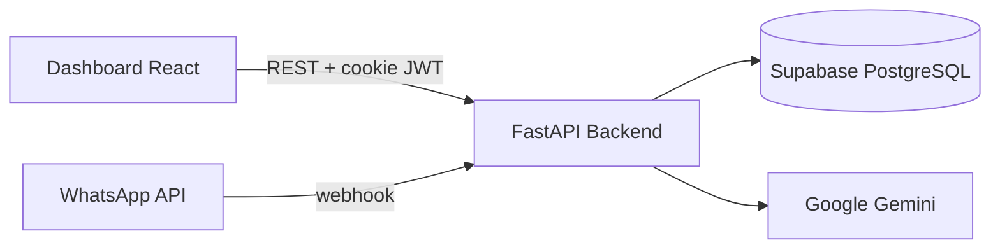

# Flowia Master Engine - Architecture

Este documento descreve a arquitetura do Flowia Master Engine, um sistema multi-tenant para gestão de salões de beleza (MVP `PRODUCT_LINE=salon`).

## Visão Geral



O sistema tem três pilares:

1. **Backend FastAPI** — API REST, agentes LangGraph, webhooks WhatsApp
2. **Dashboard React** — painel administrativo (Agenda, Clientes, Catálogo)
3. **Supabase** — PostgreSQL com RLS, storage para data lake, checkpointer LangGraph

## 1. Monorepo

| Caminho | Responsabilidade |
|---------|------------------|
| [`main.py`](../main.py) | Entry point → `create_salon_app()` |
| [`apps/salon/api/app_factory.py`](../apps/salon/api/app_factory.py) | Composition root (middleware, routers, lifespan) |
| [`apps/salon/domain/`](../apps/salon/domain/) | Catálogo e clientes (produto salão) |
| [`apps/salon/dashboard/`](../apps/salon/dashboard/) | SPA React (Vite) |
| [`packages/auth_core/`](../packages/auth_core/) | Config, DB, JWT, tenant, limiter |
| [`packages/engine/`](../packages/engine/) | LangGraph, chat, métricas, checkpointer |
| [`packages/scheduling/`](../packages/scheduling/) | Agenda e tools de booking |
| [`packages/lakehouse/`](../packages/lakehouse/) | Pipeline Bronze→Gold e RAG |
| [`packages/integrations/`](../packages/integrations/) | Webhook WhatsApp |

**Grafo de dependência:** `models → auth_core → scheduling/lakehouse → engine → integrations` — `apps/salon` compõe todos os pacotes.

## 2. Backend (FastAPI)

### Routers (`/api/v1`)

Registrados em [`apps/salon/api/app_factory.py`](../apps/salon/api/app_factory.py):

| Router | Pacote |
|--------|--------|
| auth | `packages/auth_core` |
| webhook | `packages/integrations` |
| chat | `packages/engine` |
| lakehouse | `packages/lakehouse` |
| metrics | `packages/engine` |
| scheduling | `packages/scheduling` |
| patients, organizations | `apps/salon/domain` |
| dashboard | `apps/salon/api/routers` |

### Autenticação (fonte única)

**Decisão:** FastAPI JWT via cookie HttpOnly é a única fonte de autenticação do dashboard.

- Login: `POST /api/v1/auth/login` → cookie `session_token`
- Sessão: `GET /api/v1/auth/me` decodifica o JWT
- O frontend **não** chama `supabase.auth.signInWithPassword`
- Supabase Auth é usado apenas no backend para validar credenciais

### Multi-tenancy

- Header `x-organization-id` em requisições autenticadas
- `validated_tenant_context` em [`packages/auth_core/dependencies.py`](../packages/auth_core/dependencies.py)
- `super_admin`: pode usar `ALL` ou qualquer org
- `org_admin`: header deve coincidir com `org_id` do JWT (403 se divergir)
- Webhook WhatsApp resolve org via `organizations.whatsapp_phone_id`

### Tratamento de erros

Exceções em [`packages/auth_core/exceptions.py`](../packages/auth_core/exceptions.py), mapeadas em `app_factory`:

| Exceção | HTTP |
|---------|------|
| `DoubleBookingError` | 409 |
| `ResourceNotFoundError` | 404 |
| `BusinessLogicError` | 422 |
| `FlowIAError` (base) | 400 |

### Persistência de conversas (LangGraph)

- Checkpointer em [`packages/engine/checkpointer.py`](../packages/engine/checkpointer.py)
- Produção: `PostgresSaver` via `SUPABASE_DB_URL` (`CHECKPOINTER_BACKEND=auto`)
- CI/testes: `CHECKPOINTER_BACKEND=memory`
- Grafo compilado lazy via proxy `master_engine`

### WhatsApp outbound

- Serviço em [`packages/integrations/webhook/whatsapp.py`](../packages/integrations/webhook/whatsapp.py)
- Credenciais por org: `organizations.whatsapp_phone_id`, `whatsapp_access_token`
- Envio real via Meta Graph API v21; falha silenciosa se credenciais ausentes

## 3. Frontend (Dashboard)

- **Local:** `apps/salon/dashboard/`
- **Framework:** React 18 + Vite 5
- **Roteamento:** React Router v7 com `ProtectedRoute`
- **API client:** `apps/salon/dashboard/src/shared/lib/api.ts`
- **Auth:** `AuthContext` consulta `/auth/me` no mount

### Design (Neo-Swiss Brutalism)

- Tailwind CSS v4, zero border-radius, alto contraste
- Tokens em `apps/salon/dashboard/src/index.css`

## 4. Banco de Dados (Supabase)

Modelo **multi-tenant** com `organization_id` em entidades de negócio.

### Tabelas principais

- `organizations` — tenant root (credenciais WhatsApp)
- `dashboard_users` — usuários do painel
- `patients`, `appointments`, `professionals`, `service_catalog`
- `docs_bronze/silver/gold_vectors` — data lake
- Tabelas LangGraph checkpoint — criadas automaticamente por `PostgresSaver.setup()`

## 5. Topologia de Diretórios

```
/
├── main.py
├── packages/           # motor compartilhado
├── apps/salon/         # produto salão (api, domain, dashboard)
├── supabase/migrations/
├── tests/
├── scripts/
└── deployments/
```

## 6. Integrações

- **WhatsApp:** webhook + outbound Graph API
- **Gemini:** chat engine e OCR do data lake
- **Slack:** handoff (opcional)

## 7. Qualidade e CI

- **Python:** Ruff + pytest (coverage ≥ 30% em `packages/` e `apps/salon/`)
- **Frontend:** ESLint + Vitest + build Vite em `apps/salon/dashboard/`
- **CI:** `.github/workflows/ci.yml`
