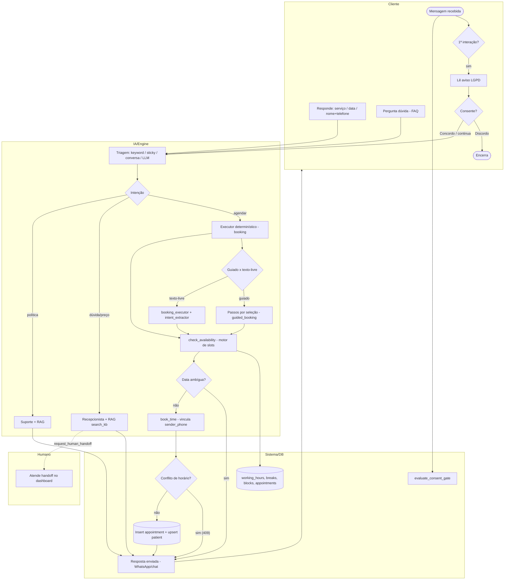
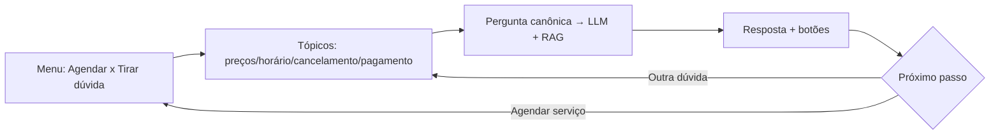
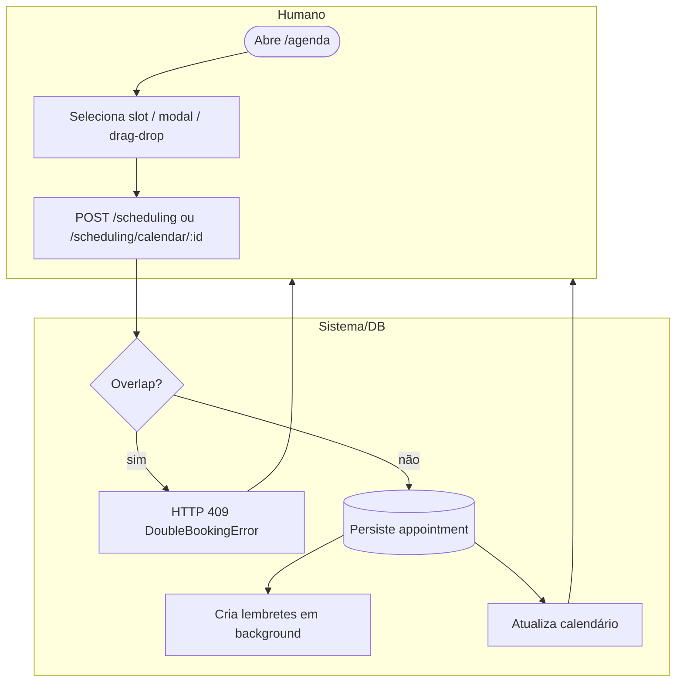
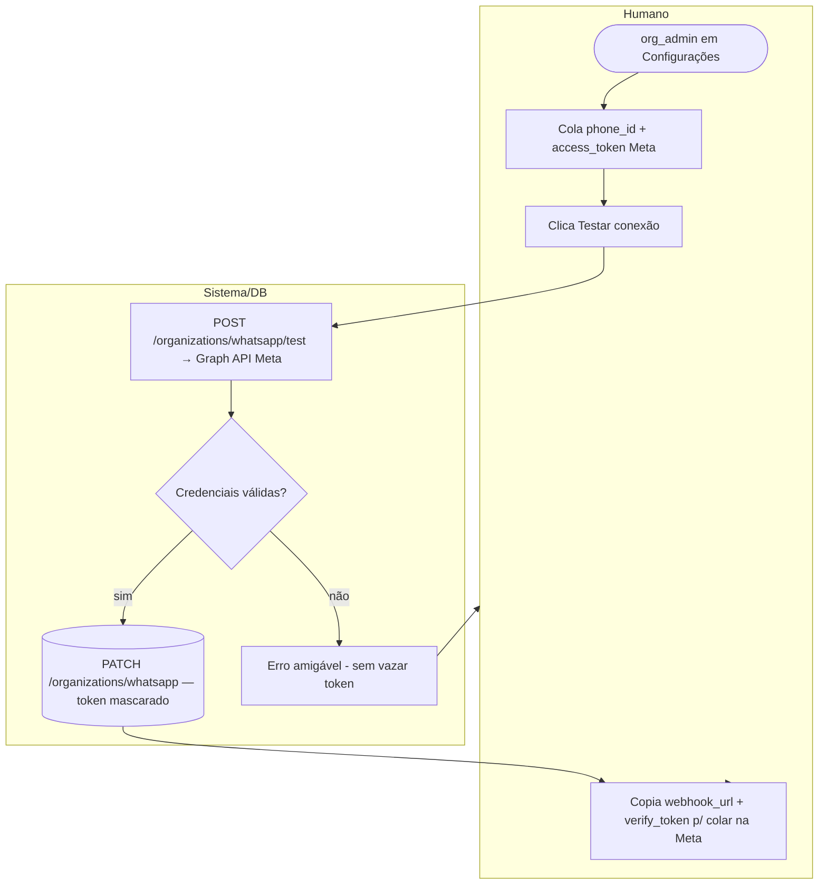
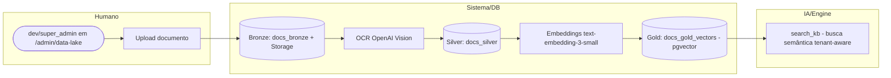
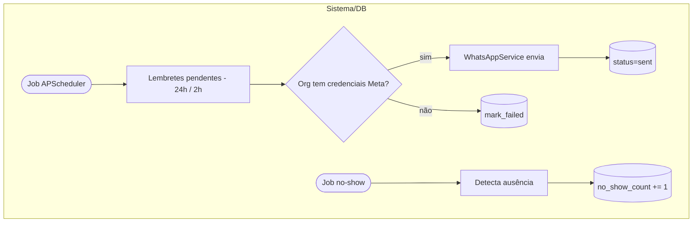

# BPMN — Processos de Negócio (FlowIA Master Engine · MVP salão)

> Processos de negócio do produto ativo (`PRODUCT_LINE=salon`) em notação **BPMN-style**
> (Mermaid `flowchart` com *lanes* via `subgraph`: **Cliente · IA/Engine · Sistema/DB · Humano**).
> Não é BPMN 2.0 XML estrito — é a representação versionável no repositório.
>
> Fonte: [`CLAUDE.md`](../CLAUDE.md) §4, §6, §22–§24. Escopo: **MVP ativo**. Processos futuros
> (jornada do cliente, reagendamento inteligente) → [`CLAUDE.md` Parte VIII](../CLAUDE.md).

Convenção das lanes:
- **Cliente** — pessoa no WhatsApp / chat de teste.
- **IA/Engine** — LangGraph + motor híbrido determinístico (`packages/engine`, `packages/scheduling`).
- **Sistema/DB** — FastAPI, Supabase, APScheduler.
- **Humano** — dono/recepção do salão (handoff, dashboard).

---

## 1. Agendamento conversacional (WhatsApp / chat) — processo principal

**Regras-chave:** consentimento antes de qualquer processamento ([§19](../CLAUDE.md)); `book_time`
vincula ao `sender_phone` (anti prompt-injection); ambiguidade temporal é fail-closed
(`needs_clarification`); conflito de horário → **HTTP 409**; guiado é opt-in (chat dev sempre;
WhatsApp atrás de `GUIDED_BOOKING_WHATSAPP_ENABLED`).

### 1a. Subprocesso — FAQ por tópicos (retorno ao fluxo determinístico)

---

## 2. Agendamento via dashboard (recepção / profissional)

Reagendamento (`POST /scheduling/calendar/{id}`) refaz a checagem de conflito antes de persistir e
atualiza os lembretes. Correção manual de status via `PATCH .../status`
(entra/sai de `no_show` ajusta `patients.no_show_count`).

---

## 3. Onboarding de tenant + conexão WhatsApp self-service

Modelo "cliente traz a própria conta" (credenciais Meta por org). Embedded Signup (1 clique) é
**futuro** ([§36](../CLAUDE.md)).

---

## 4. Pipeline RAG Medallion (Data Lake)

Dedup no Bronze por `content_hash`; concorrência de OCR limitada por `asyncio.Semaphore`.

---

## 5. Lembretes e detecção de no-show (APScheduler)

---

## Processos fora do MVP (somente ponteiro)

Régua pós-atendimento (D+3/D+30/D+45), ficha pré-atendimento, áudio/transcrição, simulação por
selfie e **reagendamento inteligente / recuperação de no-show** são **futuros** —
[`CLAUDE.md` Parte VIII §42 e §49](../CLAUDE.md). Não fazem parte deste BPMN do MVP.
