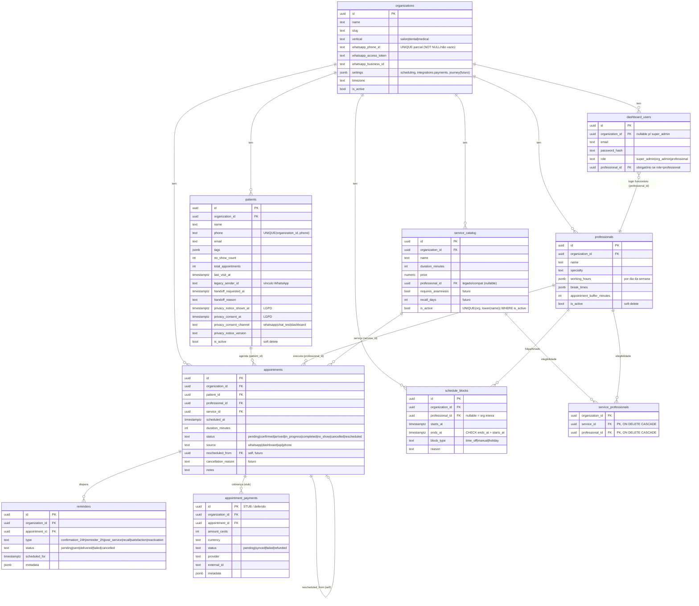
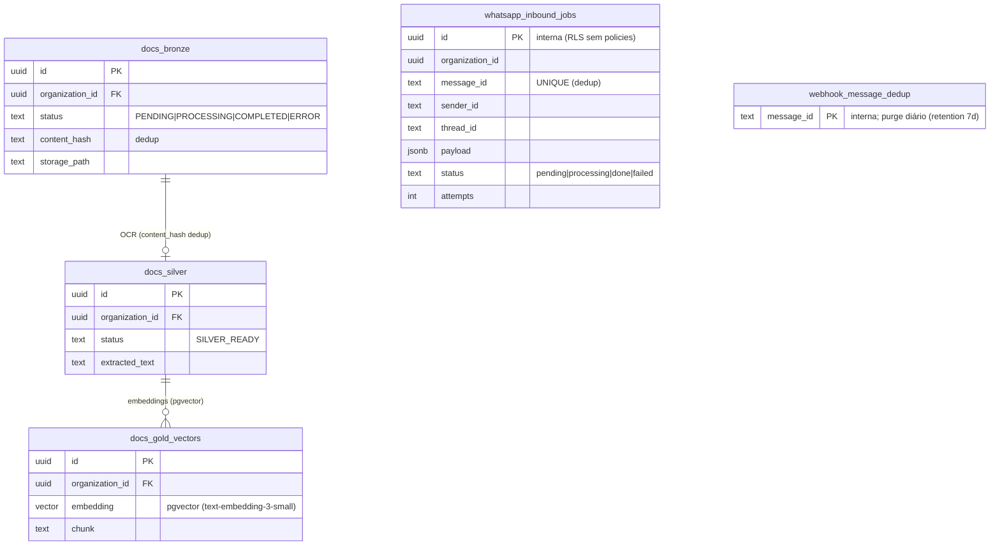

# DER — Modelo de Dados (FlowIA Master Engine · MVP salão)

> Diagrama Entidade-Relacionamento e dicionário de dados do produto ativo
> (`PRODUCT_LINE=salon`). Fonte canônica: [`CLAUDE.md` §14](../CLAUDE.md) + as migrations em
> [`supabase/migrations/`](../supabase/migrations/). Em divergência, **o CLAUDE.md prevalece**.
>
> Escopo: **MVP ativo**. Tabelas de stub/futuro (`appointment_payments`, `anamnesis_*`) aparecem
> marcadas. Visão pós-MVP: [`CLAUDE.md` Parte VIII](../CLAUDE.md).

## 1. Visão geral

Banco **PostgreSQL (Supabase)**, multi-tenant por `organization_id` + **Row Level Security (RLS)**.
O backend usa `SERVICE_ROLE` (ignora RLS) — o isolamento no caminho do agente é reforçado em
aplicação (ver [`SOLUTION_ARCHITECTURE.md`](SOLUTION_ARCHITECTURE.md) §Segurança). Três grupos de
tabelas:

- **Negócio** (têm `organization_id` + RLS): organizations, professionals, service_catalog,
  service_professionals, patients, appointments, reminders, schedule_blocks, appointment_payments (stub).
- **Data Lake** (RAG Medallion): docs_bronze, docs_silver, docs_gold_vectors.
- **Internas** (sem `organization_id`, RLS sem policies, backend-only): checkpoints\*,
  webhook_message_dedup, whatsapp_inbound_jobs.

## 2. DER — entidades de negócio

## 3. DER — Data Lake (RAG Medallion) + internas

> **checkpoints / checkpoint_blobs / checkpoint_writes / checkpoint_migrations** — criadas
> automaticamente pelo `PostgresSaver.setup()` (memória do LangGraph). Internas, RLS sem policies.
> **conversation_metrics** — telemetria por thread (`organization_id`, `scheduling_path`,
> `triage_source`, `channel`, `tools_called`).

## 4. Constraints e integridade (resumo)

| Regra | Onde | Migration |
|-------|------|-----------|
| **Anti double-booking** | `EXCLUDE USING gist` (`appointments_no_overlap`, via `btree_gist`); exclui `cancelled`/`no_show` | `20260607010000_appointment_overlap_guard.sql` |
| **WhatsApp phone único** | UNIQUE parcial em `organizations.whatsapp_phone_id` (NOT NULL e não vazio) | `20260611000000_whatsapp_phone_id_unique.sql` |
| **Serviço ativo único por nome** | `UNIQUE(organization_id, lower(name)) WHERE is_active` | `20260609010000_soft_delete_and_integrity.sql` |
| **Telefone único por org** | `UNIQUE(organization_id, phone)` em `patients` | foundation |
| **M:N serviço↔profissional** | PK composta `(service_id, professional_id)` em `service_professionals` | `20260610010000_service_professionals.sql` |
| **Login funcionário** | `dashboard_users.professional_id` FK | `20260610000000_professional_user_link.sql` |
| **Soft delete** | `is_active=false` (patients, professionals, service_catalog, organizations); listagens filtram | `20260609010000` |
| **FK org = RESTRICT** | `organization_id ON DELETE RESTRICT` nas tabelas de negócio (anti-cascade acidental) | `20260609010000` |
| **updated_at trigger** | `set_updated_at()` + `BEFORE UPDATE` (organizations, patients, appointments, docs_bronze, anamnesis_responses) | `20260609000000_updated_at_triggers.sql` |
| **Dedup webhook** | `webhook_message_dedup` (insert-before-process) + purge diário | `20260607020000` |
| **Fila inbound** | `whatsapp_inbound_jobs` (FIFO, `message_id` UNIQUE) | `20260611010000` |
| **RLS internas** | `ENABLE RLS` + zero policies + `REVOKE anon/authenticated` | `20260608000000_internal_tables_rls.sql` |

## 5. Stub / futuro (schema existe, fluxo não)

- **`appointment_payments`** — pagamentos/PDV (`integrations.payments.enabled=false`). Deferido (Fase 2).
- **`anamnesis_templates` / `anamnesis_responses`**, `service_catalog.requires_anamnesis`,
  `recall_days` — Customer Journey ([`CLAUDE.md` §42](../CLAUDE.md)). **Não implementado.**
- **`appointments.rescheduled_from` / `cancellation_reason`** — Reagendamento Inteligente
  ([`CLAUDE.md` §49](../CLAUDE.md)). Colunas existem; fluxo é futuro.
- Enums `ReminderType.post_service/recall/reactivation/satisfaction` — existem, **ociosos**.

Migrations completas e ordem de aplicação: [`CLAUDE.md` §15](../CLAUDE.md).
