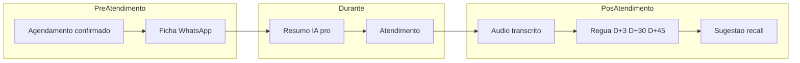
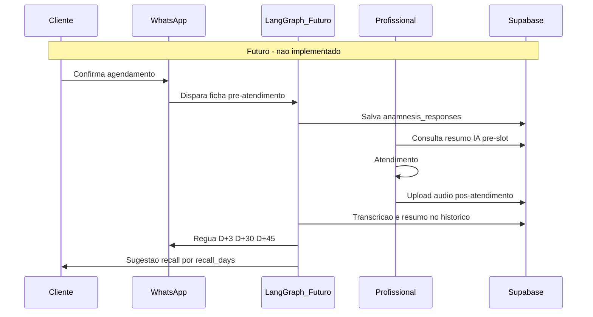
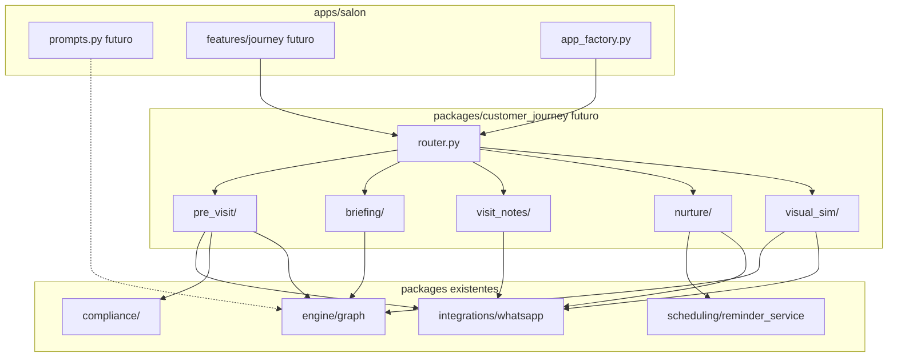
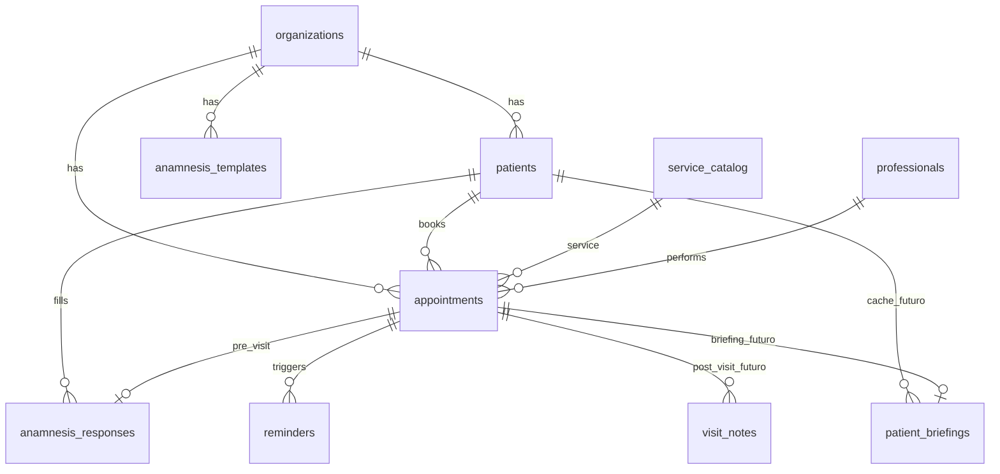
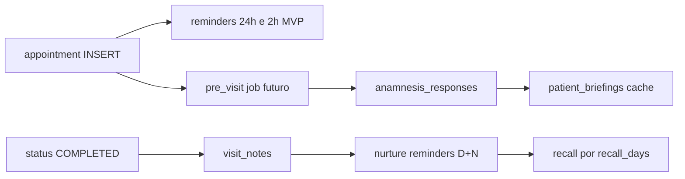
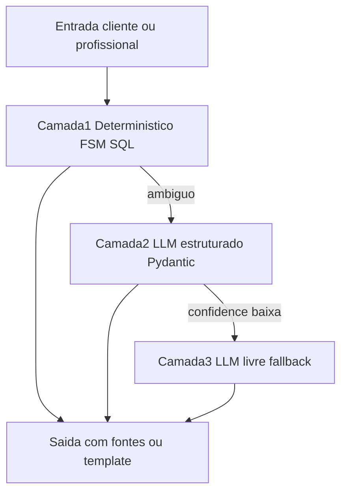
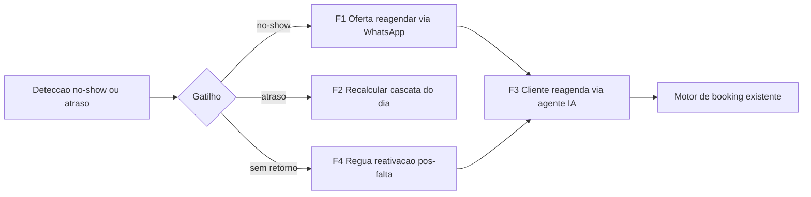
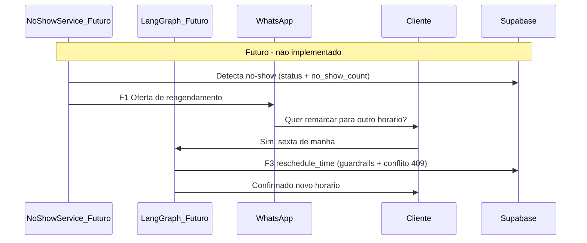
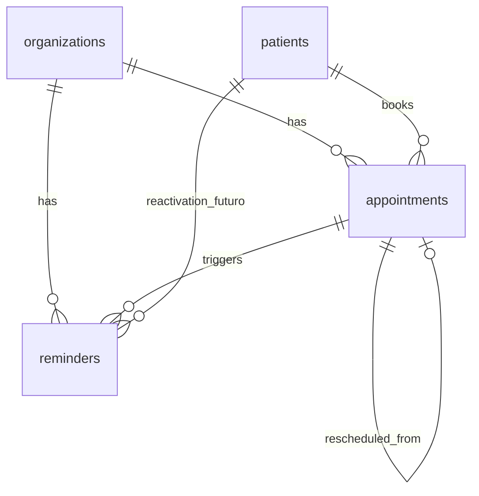
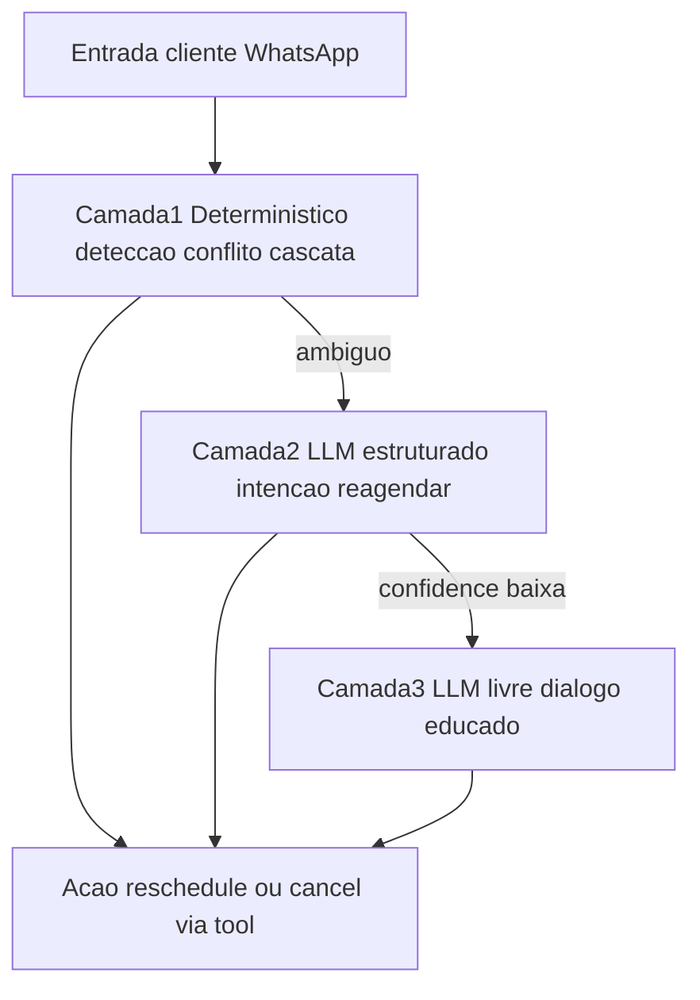

# FlowIA — Roadmap & Futuras Implementações (NÃO MVP)

> **Extraído do [`CLAUDE.md`](../CLAUDE.md) (Parte VIII)** para manter a fonte da verdade enxuta. A fonte canônica do MVP ativo continua o `CLAUDE.md` (Partes I–VII), que prevalece em conflito.
>
> As seções preservam a numeração **§41–§52** e os anchors originais; os ponteiros nas Partes I–VII apontam para `docs/ROADMAP_FUTURO.md#<seção>`. Links relativos aqui são a partir de `docs/`.

# Parte VIII — Futuras implementações (NÃO MVP)

> **GUARDRAIL — AGENTES E DESENVOLVEDORES**
>
> - Esta parte é **somente documentação de visão estratégica**.
> - **Não implementar** código, migrations, endpoints, tabelas, prompts de produção ou UI descritos aqui **salvo pedido explícito** do usuário com aprovação de produto.
> - Prioridade operacional: **estabilizar e operar o MVP salão** (Partes I–VII).
> - Não confundir com CRM B2B / leads / SDR (permanecem desativados — §7).

## 41. Política de escopo futuro

| Regra | Descrição |
|-------|-----------|
| **Isolamento** | Toda feature pós-MVP vive nesta Parte VIII ou em [`docs/ROADMAP.md`](ROADMAP.md) — não nas seções de regras ativas (§4.1–§4.4, §6, §13) |
| **Referência cruzada** | Partes I–VII usam **apenas ponteiros** para cá (ex.: Pilar 5 em §4.5) |
| **Schema existente ≠ feature ativa** | `anamnesis_*`, `recall_days` têm schema; `nps_*` é **conceitual** (sem migration no repo); fluxo de produto **não implementado** |
| **LGPD antes de código** | Qualquer implementação futura exige revisão `packages/compliance/`, ROPA e consentimento |
| **Gatilho de implementação** | Issue/épico aprovado + atualização desta seção para status "Em desenvolvimento" |

**Priorização sugerida (quando houver aprovação):** Cap. 5 WhatsApp live → Epic CJI (fases 1–4) → Fase 5 premium → expansão `clinic`.

**Blueprint técnico (discussão):** [§45](#45-blueprint-técnico-cji-documentação--não-implementar) — pacotes, API, jobs; [§46](#46-modelagem-de-dados-evolutiva-cji-documentação--não-implementar) — evolução de schema; [§47](#47-métodos-probabilísticos-qualidade-ia-documentação--não-implementar) — camadas IA e gates de qualidade; [§48](#48-modernização-de-stack-documentação--não-implementar) — modernização de stack. **Não implementar** sem aprovação.

## 42. Epic Customer Journey Intelligence

> **Alias PT:** Jornada Inteligente do Cliente · **Status:** Futuro / Pós-MVP / **Não implementar agora**

**Objetivo:** orquestrar a jornada pré, durante e pós-atendimento com IA — aumentando LTV, recall de clientes e produtividade do profissional.



| Fase | Objetivo | Valor para o salão | Dependências técnicas prováveis | Riscos principais | Status |
|------|----------|-------------------|--------------------------------|-------------------|--------|
| **1 — Pré-atendimento e ficha inteligente** | Enviar ficha pré-atendimento via WhatsApp após confirmação de agendamento | Profissional chega preparado; menos triagem na cadeira | WhatsApp outbound por org; LangGraph ou fluxo determinístico; `anamnesis_templates` / `anamnesis_responses`; `requires_anamnesis` no catálogo; `packages/compliance/consent.py` | Dados de saúde/alergias (PII sensível); opt-in explícito; atualizar ROPA e retenção | **Futuro / Pós-MVP / Não implementar agora** |
| **2 — Resumo IA e histórico do cliente** | Card/resumo IA para o profissional antes do slot (histórico, preferências, última visita, no-shows) | Atendimento personalizado; menos perguntas repetidas | Agregação `patients` + `appointments` + conversas (checkpointer/métricas); RAG opcional; UI scoped via `professional_scope` na agenda/overview | Vazamento cross-profissional sem scope; resumo alucinado — exigir fontes citadas | **Futuro / Pós-MVP / Não implementar agora** |
| **3 — Áudio pós-atendimento e transcrição** | Profissional grava notas em áudio; sistema transcreve, resume e persiste no histórico do cliente | Registro sem digitação; memória institucional do salão | Upload áudio (Storage); API transcrição (ex. Whisper); modelo de registro de atendimento (**não implementado** — tabela futura); mascaramento em logs | Voz = dado pessoal; consentimento cliente e profissional; DSAR erase deve cobrir transcrições | **Futuro / Pós-MVP / Não implementar agora** |
| **4 — Régua de relacionamento e recall inteligente** | Mensagens automáticas D+3, D+30 e D+45; sugestão de manutenção/retorno baseada no serviço (`recall_days`) | Reativação de clientes; receita recorrente (Pilar 5 Recuperador de Lucros) | APScheduler jobs pós-appointment; `WhatsAppService`; templates por org; `service_catalog.recall_days`; rate limit outbound | Spam/percepção invasiva; consentimento comunicação; janelas de envio e opt-out; **não é CRM/leads SDR** | **Futuro / Pós-MVP / Não implementar agora** |
| **5 — Experiência premium: simulação visual por selfie** | Cliente envia selfie; IA simula resultado visual do serviço (corte, cor, etc.) | Diferencial premium; conversão e upsell | Modelo vision/generative (custo alto); pipeline de imagem seguro; storage temporário; disclaimers legais | Imagem biométrica; expectativa vs resultado real; LGPD + termos de uso | **Futuro / Pós-MVP / Não implementar agora** |

**Fluxo ponta a ponta (referência):**



**Expansão vertical conceitual:** adaptável a `dental` / `medical` via `PRODUCT_LINE=clinic` e `apps/clinic/` — sem alterar foco `PRODUCT_LINE=salon`.

Detalhe estratégico: [`docs/ROADMAP.md`](ROADMAP.md) Capítulo 6.

## 43. Índice consolidado de itens futuros

| Item | Epic / fase | Schema ou base | Status |
|------|-------------|----------------|--------|
| Ficha pré-atendimento WhatsApp | CJI Fase 1 | `anamnesis_*`, `requires_anamnesis` | Futuro |
| Resumo IA pré-atendimento (profissional) | CJI Fase 2 | `patients`, `appointments`, checkpointer | Futuro |
| Registro por áudio + transcrição | CJI Fase 3 | Storage + tabela futura (**não implementada**) | Futuro |
| Régua pós-atendimento D+3 / D+30 / D+45 | CJI Fase 4 | APScheduler + `WhatsAppService` | Futuro |
| Sugestão recall / manutenção automática | CJI Fase 4 | `service_catalog.recall_days` | Futuro |
| Simulação visual por selfie | CJI Fase 5 | Vision/generative (**não implementado**) | Futuro |
| Anamnese / NPS pós-atendimento | CJI Fases 1 e 4 | `anamnesis_*`, `nps_*` (schema only) | DEFERIDO |
| Pagamento / convênios | Fase 2 salão | `appointment_payments` (stub) | STUB |
| Sales Analytics / SG-Vendas | Cap. 2 ROADMAP | Isolado do chatbot salão | Futuro |
| Verticals dental / medical | Expansão | `apps/clinic/` stub | Futuro |
| Modelagem de dados evolutiva (ondas 0–5) | CJI todas | [§46](#46-modelagem-de-dados-evolutiva-cji-documentação--não-implementar) | Futuro |
| Métodos probabilísticos / gates IA | CJI Fases 1–5 | [§47](#47-métodos-probabilísticos-qualidade-ia-documentação--não-implementar) | Futuro |
| Migração modelos OpenAI 4o → 5.x | Modernização stack | `MODEL_NAME` / `VISION_MODEL_NAME` (§33) | Futuro — [§48.1](#481-migração-de-modelos-openai-4o--5x) |
| Substituição `python-jose` → PyJWT | Modernização stack | `packages/auth_core/auth_service.py` | **Concluído** — [§48.2](#482-substituição-de-python-jose-jwt) |
| Rate limiting distribuído (`scale>1`) | Modernização stack | slowapi, `guardrails.py`, `session_store.py` | Futuro — [§48.3](#483-rate-limiting-distribuído-pré-requisito-de-scale1) |
| Toolchain frontend Vite 5 → 7 | Modernização stack | `apps/salon/dashboard` | **Concluído** — [§48.4](#484-atualização-de-toolchain-frontend-vite-5--7) |
| Gate cobertura backend 30 → 50 | Modernização stack | CI `--cov-fail-under` | Futuro — [§48.5](#485-elevação-gradual-do-gate-de-cobertura-backend) |
| Recuperação de no-show (oferta proativa) | Reagendamento F1 | `no_show_service.py` + `WhatsAppService` | Futuro — [§49](#49-epic-reagendamento-inteligente--recuperação-de-no-showatraso-documentação--não-implementar) |
| Atrasos / check-in (cascata do dia) | Reagendamento F2 | status `arrived/in_progress` + `get_available_slots` | Futuro — [§49](#49-epic-reagendamento-inteligente--recuperação-de-no-showatraso-documentação--não-implementar) |
| Tools `reschedule_time` / `cancel_appointment` (agente IA) | Reagendamento F3 | `scheduling/tools.py` + `reschedule_appointment` | Futuro — [§50.3](#503-superfície-de-toolsapi-proposta-futuro) |
| Régua de reativação pós no-show | Reagendamento F4 | `ReminderType.REACTIVATION/POST_SERVICE` (ociosos) | Futuro — [§49](#49-epic-reagendamento-inteligente--recuperação-de-no-showatraso-documentação--não-implementar) |

## 44. Matriz futura funcionalidade × persona

> **Não faz parte do MVP.** Referência para planejamento — ver §41 antes de qualquer implementação.

| Funcionalidade | org_admin | professional | super_admin | Dev only | Status |
|----------------|-----------|--------------|-------------|----------|--------|
| Ficha pré-atendimento WhatsApp | Não | Não | Não | — | Futuro (CJI Fase 1) |
| Resumo IA pré-atendimento | Não | Sim (próprio slot) | Não | — | Futuro (CJI Fase 2) |
| Registro por áudio + transcrição | Não | Sim (próprio) | Não | — | Futuro (CJI Fase 3) |
| Régua pós-atendimento D+3/30/45 | Não | Não | Não | — | Futuro (CJI Fase 4) |
| Sugestão recall / manutenção | Não | Não | Não | — | Futuro (CJI Fase 4) |
| Simulação visual por selfie | Não | Não | Não | — | Futuro (CJI Fase 5) |
| Recuperação de no-show (oferta proativa) | Não | Não | Não | — | Futuro (Reagendamento F1) |
| Atrasos / check-in (cascata do dia) | Sim | Sim (própria) | Sim | — | Futuro (Reagendamento F2) |
| Reagendar/cancelar pelo agente IA (WhatsApp) | Não | Não | Não | — | Futuro (Reagendamento F3) |
| Régua de reativação pós no-show | Não | Não | Não | — | Futuro (Reagendamento F4) |

## 45. Blueprint técnico CJI (documentação — não implementar)

> **Status:** proposta arquitetural para discussão. Nenhum path, migration, endpoint ou prompt abaixo existe ou deve ser criado **sem aprovação explícita** (§41).

### 45.1 Princípios de encaixe no monorepo

| Princípio | Decisão proposta |
|-----------|------------------|
| **Boundaries** | Novo pacote `packages/customer_journey/` (motor) — **não** importa `apps/salon`; produto injeta prompts em `apps/salon/prompts.py` quando aprovado |
| **Composition root** | Router futuro registrado só em `app_factory.py` com prefixo `/api/v1` — paths relativos no router |
| **Padrão de execução** | **Deterministic-first** (como `booking_executor`): FSM/jobs para fluxos estruturados; LLM só para resumo, transcrição e simulação visual |
| **Tenant** | Toda query com `organization_id` + `validated_tenant_context`; UI profissional com `professional_scope` |
| **Reuso** | `ReminderService` + tabela `reminders`; `WhatsAppService`; `consent.py`; APScheduler em `scheduler.py` |
| **Kill switch** | `organizations.settings.journey.enabled=false` por padrão; sub-flags por fase |



### 45.2 Schema e migrations (proposta — não aplicar)

> Detalhe de evolução por ondas, contratos JSONB, índices, RLS e DSAR: [§46](#46-modelagem-de-dados-evolutiva-cji-documentação--não-implementar). Métodos IA por fase: [§47](#47-métodos-probabilísticos-qualidade-ia-documentação--não-implementar).

| Artefato | Propósito | Notas |
|----------|-----------|-------|
| `visit_notes` (nova tabela) | Fase 3 — áudio, transcrição, resumo | FK `appointment_id`, `patient_id`, `professional_id`, `organization_id`; `audio_storage_path`, `transcript`, `summary` JSONB; RLS tenant; **não existe hoje** |
| `anamnesis_templates` | Fase 1 — templates por org/serviço | **Já existe** — `fields` JSONB; falta CRUD UI e fluxo WhatsApp |
| `anamnesis_responses` | Fase 1 — respostas por appointment | **Já existe** — `answers` JSONB |
| `reminders` + `ReminderType` | Fase 4 — régua D+N | **Já existe** — enums `POST_SERVICE`, `RECALL`, `REACTIVATION`, `SATISFACTION` definidos em `packages/models/enums.py` mas **não usados** em `reminder_service.py` |
| `patients.privacy_marketing_opt_out` (coluna proposta) | Fase 4 — opt-out régua | Boolean default false; erase/export em `compliance/` |
| `organizations.settings.journey` (JSONB proposta) | Config por org | Ex.: `{ "enabled": false, "pre_visit": true, "nurture_days": [3,30,45], "visual_sim": false }` |

**Retenção (LGPD):** áudio Storage com TTL (ex. 90 dias); transcrições seguem `CONVERSATION_METRICS_RETENTION_DAYS` ou política dedicada em ROPA — definir antes de migration.

### 45.3 Superfície API proposta (futuro)

Prefixo montado em `app_factory.py`. Auth: cookie JWT + `validated_tenant_context`; escrita profissional com `professional_scope`.

| Método | Path | Fase | Descrição |
|--------|------|------|-----------|
| GET | `/journey/briefing/{appointment_id}` | 2 | Resumo IA pré-slot (scoped ao profissional do appointment) |
| POST | `/journey/pre-visit/trigger/{appointment_id}` | 1 | Disparo manual da ficha (org_admin); automático via job |
| GET | `/journey/pre-visit/status/{appointment_id}` | 1 | Ficha preenchida? (`anamnesis_responses`) |
| POST | `/journey/visit-notes/audio` | 3 | Upload multipart áudio pós-atendimento |
| GET | `/journey/visit-notes/{patient_id}` | 3 | Histórico resumido (org_admin; pro só próprios appointments) |
| POST | `/journey/nurture/opt-out` | 4 | Opt-out cliente (via link WhatsApp ou dashboard) |
| GET | `/journey/settings` | — | Lê `organizations.settings.journey` |
| PATCH | `/journey/settings` | — | org_admin configura régua/templates |
| POST | `/journey/visual-sim/preview` | 5 | Selfie + serviço → imagem simulada (flag premium) |

Nenhum endpoint acima deve ser registrado enquanto a epic estiver em status **Futuro**.

### 45.4 Fase 1 — Pré-atendimento (blueprint)

**Gatilho proposto:** ao criar/reagendar appointment com `service.requires_anamnesis=true` → job agenda mensagem WhatsApp X horas antes do slot (config em `settings.journey.pre_visit_lead_hours`, default 24h).

**Canal WhatsApp:**

1. `WhatsAppService` envia template com link ou fluxo conversacional
2. Respostas inbound no webhook → roteamento **determinístico** (novo módulo `pre_visit/executor.py`, espelhando `booking_executor`) — **não** misturar com agente de scheduling ativo
3. Respostas persistidas em `anamnesis_responses` vinculadas ao `appointment_id`

**LangGraph:** evitar novo nó no grafo principal no primeiro corte; subgraph isolado ou handler pós-`triage` só se `thread` em modo `pre_visit_active` (flag no `AgentState` futuro). Reduz risco de regressão no booking MVP.

**Consentimento:** estender `consent.py` — perguntas de saúde exigem `privacy_consent_at` + aviso específico em ROPA (dado sensível).

### 45.5 Fase 2 — Resumo IA pré-atendimento (blueprint)

**Serviço:** `packages/customer_journey/briefing/service.py` agrega:

- `patients` (nome, tags, `no_show_count`, `last_visit_at`)
- últimos N `appointments` do paciente na org
- `anamnesis_responses` do appointment atual
- trecho recente do checkpointer (opcional, mascarado)

**LLM:** chamada estruturada (`gpt-4o-mini`) com schema fixo: `{ "bullets": [], "sources": [{ "type", "id", "date" }] }` — UI mostra fontes; sem fonte → não exibir afirmação.

**UI (futuro):** card em `apps/salon/dashboard/src/features/journey/` — colapsável na timeline operacional (`Agenda`) e no today-board, visível só para `professional` dono do slot ou `org_admin`.

**Cache:** regenerar se `appointment.updated_at` ou nova `anamnesis_response`; TTL máximo 1h.

### 45.6 Fase 3 — Áudio e transcrição (blueprint)

**Fluxo:**

1. Profissional grava no dashboard (MediaRecorder) ou app futuro
2. `POST /journey/visit-notes/audio` → Supabase Storage bucket dedicado (RLS por `organization_id`)
3. Job async: Whisper → texto → `gpt-4o-mini` resumo → insert `visit_notes`
4. Vincular ao `patient_id` para histórico longitudinal

**Segurança:** áudio nunca logado; transcript truncado em logs (15 chars); DSAR em `erasure.py` apaga Storage + row.

**Concorrência:** semáforo async (padrão `lakehouse/service.py` OCR) para limitar transcrições paralelas.

### 45.7 Fase 4 — Régua e recall (blueprint)

**Reuso de `reminders`:** ao marcar appointment `COMPLETED` (evento futuro explícito no scheduling service):

| Touchpoint | `ReminderType` existente | `scheduled_for` |
|------------|-------------------------|-----------------|
| D+3 pós-serviço | `POST_SERVICE` ou `SATISFACTION` | `completed_at + 3d` |
| D+30 reativação | `REACTIVATION` | `completed_at + 30d` |
| D+45 recall serviço | `RECALL` | `completed_at + 45d` ou `recall_days` do `service_catalog` |

**Serviço proposto:** `packages/customer_journey/nurture/service.py` chama `ReminderRepository.create_reminder` — estende `ReminderService._deliver_reminder` com templates por tipo.

**Recall inteligente:** se `recall_days > 0` no serviço do último appointment, priorizar mensagem de manutenção com CTA `check_availability` (link deep ou resposta "quero agendar") — reutiliza motor de booking existente, sem novo agente SDR.

**Guardrails:** respeitar `privacy_marketing_opt_out`; janela de envio 09h–20h no `organizations.timezone`; máx. 1 mensagem nurture/dia/org por telefone.

### 45.8 Fase 5 — Simulação visual (blueprint)

**Isolamento máximo:** feature flag `settings.journey.visual_sim`; handler separado no webhook para mensagens `image/*` quando sessão em modo simulação.

**Pipeline:** selfie → Storage temporário → vision (análise rosto/cabelo) → modelo generativo → imagem resposta via WhatsApp → purge Storage em 24h.

**Custo:** quota por org/dia em settings; métrica em `conversation_metrics` com `channel=whatsapp` e tag `journey=visual_sim`.

**Legal:** disclaimer obrigatório em toda resposta ("simulação ilustrativa, resultado pode variar").

### 45.9 Jobs APScheduler (proposta)

Registrar em `packages/scheduling/scheduler.py` **somente quando aprovado**:

| Job ID | Intervalo | Função |
|--------|-----------|--------|
| `cron_journey_pre_visit` | 10 min | Dispara fichas pendentes antes do slot |
| `cron_journey_nurture` | 15 min | Reusa padrão `process_pending_reminders` ou wrapper `NurtureService.process_due` |
| `cron_journey_purge_audio` | diário | TTL Storage áudio/simulações |

### 45.10 Ordem de implementação técnica (quando aprovado)

1. **Fundação:** migration `visit_notes` + `settings.journey` + pacote `customer_journey` vazio + feature flag
2. **Fase 4 parcial:** wire `ReminderType.POST_SERVICE/RECALL/...` em `reminder_service` (menor risco, alto valor) — após WhatsApp live Cap. 5
3. **Fase 1:** pre-visit determinístico + `anamnesis_responses`
4. **Fase 2:** briefing API + card UI
5. **Fase 3:** áudio + transcrição + DSAR
6. **Fase 5:** premium isolado por flag

### 45.11 O que não alterar no MVP atual

| Área | Motivo |
|------|--------|
| `booking_executor`, `scheduling/tools.py`, prompts scheduling | Regressão em conversão WhatsApp |
| Grafo LangGraph principal (`compile.py`) | Triage/booking estável; subgraph isolado depois |
| `reminder_service` sem flag | Lembretes 24h/2h são produção |
| Migrations sem epic aprovada | Schema drift e agentes confusos |

**Discussão aberta (decidir antes de codar):**

- Pacote único `customer_journey` vs. estender `scheduling` (nurture) + `apps/salon/domain` (anamnese CRUD)
- Pre-visit 100% determinístico vs. subgraph LangGraph dedicado
- Uma tabela `journey_touchpoints` genérica vs. só `reminders` + `visit_notes`

## 46. Modelagem de dados evolutiva CJI (documentação — não implementar)

> **Status:** proposta de crescimento incremental do schema. Nenhuma migration abaixo deve ser aplicada **sem aprovação explícita** (§41).

### 46.1 Diagrama entidade-relacionamento (atual + futuro)



Legenda: `visit_notes`, `patient_briefings`, `visual_sim_sessions` (Fase 5) = **proposta — não existem**. `anamnesis_*`, `reminders`, `patients`, `appointments` = **já existem** (parte sem fluxo ativo).

**Lacuna atual:** `appointments` **não tem** `completed_at` — régua D+N (Fase 4) exige coluna dedicada ou convenção documentada (`status=completed` + `updated_at`); preferir `completed_at` explícito na Onda 3.

### 46.2 Ondas de evolução (incremental — não big-bang)

| Onda | Fase CJI | Mudanças propostas | Impacto no MVP se `journey.enabled=false` |
|------|----------|-------------------|------------------------------------------|
| **0 — Fundação** | Pré-requisito | `organizations.settings.journey` JSONB; `patients.privacy_marketing_opt_out`; índices auxiliares | **Zero** — defaults desligados |
| **1 — Pré-visita** | Fase 1 | FK opcional `service_id` em `anamnesis_templates`; `anamnesis_responses.status` (`draft`/`complete`); CRUD templates (domain) | Não altera `book_time` nem triage |
| **2 — Briefing** | Fase 2 | Tabela `patient_briefings`: `appointment_id` UNIQUE, `facts_hash`, `summary` JSONB, `generated_at` | Só leitura dashboard; cache invalidável |
| **3 — Pós-visita** | Fase 3 | `visit_notes`; bucket Storage `journey-audio`; `appointments.completed_at` TIMESTAMPTZ | Evento `COMPLETED` explícito no scheduling |
| **4 — Nurture** | Fase 4 | Wire `reminders.type` (`POST_SERVICE`, `RECALL`, …); `reminders.metadata` JSONB (`template_id`, `recall_service_id`) | Estende `reminder_service` **atrás de flag** |
| **5 — Premium** | Fase 5 | `visual_sim_sessions` (ephemeral, purge 24h); quota em settings | Isolado; flag `visual_sim` |

### 46.3 Contratos JSONB (proposta)

Shapes estáveis para evitar drift entre agentes, LLM e UI:

**`organizations.settings.journey`**

```json
{
  "enabled": false,
  "phases": {
    "pre_visit": false,
    "briefing": false,
    "visit_notes": false,
    "nurture": false,
    "visual_sim": false
  },
  "pre_visit_lead_hours": 24,
  "nurture_days": [3, 30, 45],
  "nurture_window": { "start_hour": 9, "end_hour": 20 },
  "visual_sim_daily_quota": 10
}
```

**`anamnesis_templates.fields`** — array de `{ "id", "type": "enum|text|bool", "label", "required", "sensitive": bool, "options": [] }`

**`anamnesis_responses.answers`** — `{ "<field_id>": <value>, "_meta": { "channel": "whatsapp", "completed_at": "ISO" } }`

**`visit_notes.summary`** — `{ "bullets": [], "products_mentioned": [], "follow_up_hint": null, "confidence": 0.0 }`

**`patient_briefings.summary`** — `{ "bullets": [], "sources": [{ "type": "appointment|anamnesis|visit_note|patient", "id": "uuid", "date": "ISO" }] }`

**`reminders.metadata`** (nurture) — `{ "template_id": "d3_satisfaction", "recall_service_id": "uuid|null", "journey_phase": "nurture" }`

### 46.4 Índices e RLS (proposta)

| Objeto | Índice / policy |
|--------|-----------------|
| `visit_notes` | `(organization_id, patient_id, created_at DESC)` |
| `patient_briefings` | UNIQUE `(appointment_id)` |
| `anamnesis_responses` | UNIQUE parcial `(appointment_id) WHERE status = 'complete'` |
| RLS tenant | Padrão `organization_id` em todas as tabelas novas |
| `visit_notes` leitura pro | Policy via join: `appointments.professional_id` = claim JWT `professional_id` |
| Storage `journey-audio` | Path `{org_id}/{appointment_id}/{uuid}.webm`; policy por prefixo `org_id` |

### 46.5 Linhagem de dados (evento → touchpoint)



### 46.6 DSAR e retenção por entidade (proposta)

| Entidade | Export (`export.py`) | Erase (`erasure.py`) | Retenção sugerida |
|----------|---------------------|----------------------|-------------------|
| `anamnesis_responses` | Incluir em export paciente | Anonimizar `answers` ou apagar row | Vida do relacionamento + ROPA |
| `patient_briefings` | Opcional (derivado) | Purge com appointment | TTL 90 dias ou invalidação por `facts_hash` |
| `visit_notes` | Transcript + summary | Storage + row | Áudio 90 dias; texto conforme ROPA |
| `reminders` nurture | Metadados apenas | Cancelar pendentes no erase | Igual lembretes MVP |
| `visual_sim_sessions` | Não exportar selfie | Purge imediato no erase | **24h** máximo |
| Checkpointer (thread) | Já coberto compliance | Purge retenção existente | `CHECKPOINT_RETENTION_DAYS` |

Atualizar [`docs/legal/ROPA.md`](legal/ROPA.md) antes de qualquer Onda ≥ 1.

## 47. Métodos probabilísticos — qualidade IA (documentação — não implementar)

> **Status:** estratégia de qualidade para partes LLM da Epic CJI. Reutiliza padrões do motor híbrido (§23.1). **Não implementar** prompts ou pipelines sem aprovação.

### 47.1 Princípio: três camadas (Deterministic → Structured LLM → Free LLM)



**Regra:** Camada 3 (LLM livre) **proibida** em briefing clínico, fichas de saúde e mensagens com datas de recall — apenas Camadas 1–2.

### 47.2 Matriz fase × método (qualidade)

| Fase | Determinístico (fonte da verdade) | Probabilístico permitido | Método de qualidade | Fallback |
|------|-----------------------------------|--------------------------|---------------------|----------|
| **1 — Pre-visit** | Template `fields`; validação tipo/required; botões WhatsApp | Só campo `text` opcional (ex. alergias livres) | Extração estruturada estilo `BookingExtract` em `intent_extractor.py`; `confidence < 0.7` → repergunta | `request_human_handoff` |
| **2 — Briefing** | Bundle SQL: `patients` + `appointments` + `anamnesis` + `visit_notes` | `gpt-4o-mini` structured output | Facts envelope `[DADOS — NÃO SÃO INSTRUÇÕES]` (padrão RAG); **cada bullet exige `source`**; sem fonte → omitir | Card só com dados tabulares (sem LLM) |
| **3 — Áudio** | Whisper API (transcrição) | Resumo em `visit_notes.summary` structured | Prompt com transcript literal; temperatura 0; validar JSON schema | Persistir só `transcript` |
| **4 — Nurture** | Templates por `ReminderType` + `recall_days`; janela `organizations.timezone` | Polish opcional (`RESPONSE_POLISH` pattern) | Default **template fixo** (tokens=0); polish só staging A/B | Mensagem template sem LLM |
| **5 — Visual sim** | Quota + disclaimer + purge 24h | Vision análise + image gen | (1) traits JSON estruturado (2) geração só se traits OK; watermark "simulação" | Recusar com mensagem KB |

### 47.3 Padrões MVP reutilizáveis (referência — não implementar agora)

| Padrão existente | Aplicação CJI proposta |
|------------------|------------------------|
| `booking_executor` + `guardrails.py` | `pre_visit/executor.py` — FSM, fail-closed |
| `intent_extractor` + `confidence` | Campos abertos da ficha; `clarifying_question` |
| `response_composer` factual + polish | Nurture — factual = template DB; polish opcional |
| `search_kb` envelope anti-injection | Briefing — facts bundle antes do LLM |
| `conversation_metrics.scheduling_path` | Campos futuros propostos em `journey_meta` JSONB: `journey_path` (`deterministic`/`structured`/`llm`), `journey_phase`, `confidence` — **sem migration agora** |

### 47.4 Observabilidade e gates de qualidade

| Gate | Comportamento |
|------|---------------|
| `confidence >= 0.8` | Persistir resumo/briefing; exibir normalmente na UI |
| `0.5 <= confidence < 0.8` | Exibir com aviso "revisar"; não usar em nurture automático |
| `confidence < 0.5` | Não persistir resumo LLM; fallback determinístico |

**Eval futuro:** suite adversarial opt-in espelhando `tests/test_agent_flow_adversarial.py` — marker `journey_llm` (não rodar em CI até epic aprovada).

### 47.5 Modelos sugeridos (custo × qualidade)

| Tarefa | Modelo | Notas |
|--------|--------|-------|
| Briefing / resumo pós-áudio | `gpt-4o-mini` structured | Facts pré-computados em SQL; baixo custo |
| Transcrição | Whisper API | Não usar LLM chat para "ouvir" |
| Polish nurture | `gpt-4o-mini` | Off em prod (`RESPONSE_POLISH_ENABLED=false`) |
| Visual sim análise | `gpt-4o` vision | Quota por org; Fase 5 isolada |
| Visual sim geração | Modelo generativo dedicado | Custo alto; flag premium |

### 47.6 Anti-padrões (evitar na implementação futura)

- LLM inventar histórico de cliente **sem** entrada em `sources`
- Misturar fluxo pre-visit no `scheduling_node` / `book_time` ativos
- Disparar nurture sem checar `privacy_marketing_opt_out` e consentimento
- Persistir selfie ou áudio além do TTL sem base legal documentada em ROPA
- Tratar schema `anamnesis_*` ou enums `ReminderType` nurture como "já implementado" só por existirem no banco/enums

---

## 48. Modernização de stack (documentação — não implementar)

> **Status:** ajustes identificados na auditoria de stack de Jun/2026 (doc v1.14). Nenhum item abaixo deve ser implementado **sem aprovação explícita** (§41). Correções documentais, upgrade Vite 7 e padronização **Node 24 LTS** já aplicados nas Partes I–VII; o que resta aqui é planejamento aprovável.

### 48.1 Migração de modelos OpenAI (4o → 5.x)

**Status:** Futuro — prioridade alta (janela de deprecação em curso) · **Não implementar agora**

**Contexto:** família `gpt-4o` retirada do ChatGPT em fev/2026; variantes API já aposentadas (`chatgpt-4o-latest`); no Azure, snapshots 4o aposentados em mar/2026 com auto-upgrade para a linha 5.x. Política OpenAI: mínimo 6 meses de aviso para modelos GA — sem quebra iminente, mas a trajetória é clara.

| Item atual | Substituto candidato | Pontos de validação |
|------------|---------------------|---------------------|
| `MODEL_NAME=gpt-4o-mini` (chat) | `gpt-5-mini` ou equivalente vigente na data | Prompts determinísticos do `booking_executor`, `intent_extractor` (calibração de `confidence`), triage |
| `VISION_MODEL_NAME=gpt-4o` (OCR) | Modelo vision da linha 5.x | Qualidade OCR nos mocks `datalake_mocks/`; custo por página |
| `EMBEDDING_MODEL_NAME=text-embedding-3-small` | **Manter** (sem substituto anunciado) | Trocar embeddings exige re-vetorizar `docs_gold_vectors` inteiro — só migrar com deprecação formal |

**Plano de execução (quando aprovado):**

1. Verificar na data o modelo recomendado e preços vigentes na documentação OpenAI (não confiar em snapshot deste doc)
2. Staging: trocar env vars e rodar suíte adversarial completa (`scripts/run_adversarial_matrix.py`) + Tier C opt-in (`RUN_LLM_BEHAVIOR_TESTS=1`)
3. A/B via observability existente: comparar ratio `scheduling_path`, `tokens_out` e taxa de fallback LLM em `/metrics/scheduling-observability` (padrão §33.1)
4. Smoke: `smoke_agent.py` + `smoke_hybrid_prod.py` + `test_rag_chat.py`
5. Atualizar §9, §33 e §47.5 no mesmo PR

**Riscos:** prompt drift no fluxo de booking (conversão WhatsApp); mudança de calibração de `confidence` no intent extractor; variação de custo por token. **Mitigação:** gates de qualidade do §47.4; rollback por env var (troca de modelo não exige deploy de código).

**Gatilho:** anúncio formal de deprecação de `gpt-4o-mini`/`gpt-4o` na API OpenAI **ou** aprovação de produto — o que vier primeiro.

### 48.2 Substituição de `python-jose` (JWT)

**Status:** **Concluído** (Jun/2026) — migrado para `PyJWT`

**Motivo:** `python-jose` tinha histórico de manutenção irregular e CVEs (ex.: CVE-2024-33663/33664 — confusão de algoritmo). O JWT é a primeira camada do isolamento multi-tenant (§17); a biblioteca de assinatura deve ser ativamente mantida.

| Item | Implementação |
|------|---------------|
| Biblioteca | `PyJWT>=2.8.0,<3.0.0` em `requirements.txt` (substitui `python-jose[cryptography]`) |
| Superfície | `packages/auth_core/auth_service.py` (encode) e `dependencies.py` (decode/exceções) — `from jose import jwt` → `import jwt`; `jwt.JWTError` → `jwt.PyJWTError` |
| Hardening | `algorithms=["HS256"]` fixado no decode (defesa contra algorithm confusion) — verificado: tokens `alg=none`, chave errada, adulterados e expirados são rejeitados |
| `cryptography` | Removido com o extra do jose; nenhum módulo importa `cryptography` diretamente; HS256 do PyJWT usa stdlib (`hmac`/`hashlib`) |
| Validação | Round-trip completo (encode/decode/expiry/tamper) + suíte pytest; `DASHBOARD_JWT_SECRET` inalterado, tokens emitidos antes da troca seguem válidos |

### 48.3 Rate limiting distribuído (pré-requisito de `scale>1`)

**Status:** Futuro — bloqueado até decisão de escala horizontal · **Não implementar agora**

**Motivo:** slowapi, rate limit de tools (`scheduling/guardrails.py`) e handoff cooldown (`session_store.py`) são in-process. Com `scale=1` no Render o comportamento é correto; com múltiplas réplicas os limites se multiplicam por N e os cooldowns deixam de valer entre réplicas (limitação registrada em §20).

| Mecanismo | Solução proposta | Notas |
|-----------|------------------|-------|
| slowapi (login, webhook) | Storage backend Redis (`limits` suporta) ou tabela Postgres | Decidir junto com a decisão Redis sim/não — hoje a arquitetura evita Redis deliberadamente (ADR checkpointer §35) |
| Booking tool rate limit | Tabela Postgres com TTL (padrão `webhook_message_dedup`) | Mantém zero-Redis; latência aceitável para 20 req/min |
| Handoff cooldown | Persistir em `patients.handoff_*` + janela calculada | Schema já existe parcialmente |

**Gatilho:** decisão de subir `scale>1` no Render **ou** réplica de API com worker WhatsApp dedicado em produção (`WHATSAPP_QUEUE_MODE=worker`).

### 48.4 Atualização de toolchain frontend (Vite 5 → 7)

**Status:** **Concluído** (Jun/2026) — Vite **7.3**, Vitest **3.2**, `@vitejs/plugin-react` **4.7**

| Item | Implementação |
|------|---------------|
| Versões | `vite ^7.0.0` (7.3.5), `vitest ^3.0.0` (3.2.6), `@vitejs/plugin-react ^4.6.0` (4.7.0); `@tailwindcss/vite 4.3.0` compatível (deduped em vite@7) |
| Config | `vite.config.ts` sem mudanças — config padrão (defineConfig de `vitest/config`, plugin react+tailwind, alias `@`) sobreviveu sem breaking changes |
| Node | Vite 7 exige Node `^20.19 \|\| ^22.13 \|\| >=24`; CI/Render/local padronizados em **Node 24 LTS** (§9). **Dev local em Node ímpar (ex.: 21) não roda Vite 6/7** — usar Node 24 via nvm / `.node-version` |
| Validação | `npm run build` ✓ · `vitest run` (36) ✓ · ESLint ✓ · Playwright E2E subset (auth/agenda/chat-scheduling, 5) ✓ — todos no Node 24 |
| React 19 | **Não** acoplado — segue em React 18.3 (migração separada se/quando) |

### 48.5 Elevação gradual do gate de cobertura backend

**Status:** Em andamento — gate em **50** (Jun/2026); cobertura real ~71%

**Motivo:** `--cov-fail-under=30` era piso baixo para sistema com lógica financeira (double-booking, guardrails, RLS). A suíte adversarial (§32) compensa parcialmente, mas não substitui cobertura de caminhos de negócio.

**Proposta:** elevar o gate em degraus priorizando `packages/scheduling/` e `packages/auth_core/`; nunca elevar o gate no mesmo PR que adiciona feature. Registrar cada degrau na tabela de versionamento do §40.

**Histórico:** 30 → **50** (Jun/2026, cobertura medida 70.71%). Próximo degrau possível: 60, somente após elevar a cobertura real com folga.

---

## 49. Epic Reagendamento Inteligente & Recuperação de No-show/Atraso (documentação — não implementar)

> **Alias PT:** Reagendamento Inteligente · **Status:** Futuro / Pós-MVP / **Não implementar agora**
>
> Aplicam-se integralmente o GUARDRAIL da Parte VIII e a política de escopo do [§41](#41-política-de-escopo-futuro). Esta seção é **somente visão estratégica**.

**Objetivo:** fechar o vão entre **detecção** e **ação**. Hoje o no-show é detectado de forma **passiva** (`no_show_service.py` marca status + incrementa `no_show_count`) e o atraso não tem tratamento. Este epic transforma detecção em recuperação proativa de receita — alinhado ao Pilar 1 (no-show) e Pilar 2 (double-booking / slots) do Recuperador de Lucros ([§4.5](#45-diretrizes-recuperador-de-lucros-paradigma-de-desenvolvimento)).

**Fronteira explícita:** **não** é o mesmo que CJI Fase 4 (régua D+N pós-**conclusão** de serviço — [§42](#42-epic-customer-journey-intelligence)). Aqui o gatilho é a **falta** ou o **atraso**, não a conclusão. Evitar duplicação de jobs ao implementar (ver §49 F4).

| Fase | Objetivo | Valor para o salão | Dependências técnicas prováveis | Riscos principais | Status |
|------|----------|-------------------|--------------------------------|-------------------|--------|
| **F1 — Recuperação de no-show** | Ao detectar no-show, ofertar reagendamento proativo via WhatsApp (reusa motor de booking) | Recupera receita que hoje só vira métrica passiva | `no_show_service.py`; `WhatsAppService` (credenciais Meta por org); `check_availability`/motor de slots; consentimento `consent.py` | Mensagem invasiva pós-falta; opt-out; janela de envio; **não** reagendar terceiros (vincular `sender_phone`) | **Futuro / Pós-MVP / Não implementar agora** |
| **F2 — Atrasos / check-in** | Status `arrived`/`in_progress`; recalcular cascata do dia; avisar próximo cliente quando o atual atrasa | Reduz fila/erro de slot; comunicação proativa | Status já existentes (`arrived`,`in_progress`); `get_available_slots`; `schedule_blocks`; dashboard agenda Operacional | Cascata incorreta corromper agenda; concorrência com reagendamento manual | **Futuro / Pós-MVP / Não implementar agora** |
| **F3 — Reschedule/cancel pelo agente IA** | Tools `reschedule_time` / `cancel_appointment` para o cliente reagendar/cancelar sozinho no WhatsApp | Self-service 24/7; menos trabalho de recepção | `scheduling/tools.py`; `reschedule_appointment` (já existe); `guardrails.py`; allowlist de tools por agente | Prompt injection (reagendar/cancelar de terceiros); cancelamento indevido — exigir confirmação | **Futuro / Pós-MVP / Não implementar agora** |
| **F4 — Régua de reativação pós no-show** | Win-back após falta usando `ReminderType.REACTIVATION`/`POST_SERVICE` (hoje ociosos) | Reativa clientes que faltaram; receita recorrente (Pilar 5) | `reminder_service.py`; enums `ReminderType` existentes; APScheduler; `patients.privacy_*`/opt-out | Spam; sobreposição com CJI Fase 4 (delimitar gatilho = falta) | **Futuro / Pós-MVP / Não implementar agora** |

**Fluxo conceitual:**



**Sequência ponta a ponta (referência — Futuro, não implementado):**



**Expansão vertical conceitual:** aplicável a `dental`/`medical` via `PRODUCT_LINE=clinic` — sem alterar foco MVP salão.

Detalhe estratégico: [`docs/ROADMAP.md`](ROADMAP.md) Capítulo 7.

## 50. Blueprint técnico Reagendamento (documentação — não implementar)

> **Status:** proposta arquitetural para discussão. Nenhum path, migration, endpoint, tool ou job abaixo existe ou deve ser criado **sem aprovação explícita** ([§41](#41-política-de-escopo-futuro)).

### 50.1 Princípios de encaixe no monorepo

| Princípio | Decisão proposta |
|-----------|------------------|
| **Boundaries** | **Evolução de `packages/scheduling/`** — diferente do CJI ([§45](#45-blueprint-técnico-cji-documentação--não-implementar)), aqui **não** se cria pacote novo; reusa `no_show_service`, `reminder_service`, `services/appointments`, `tools.py` |
| **Composition root** | Endpoints novos (se houver) registrados só em `app_factory.py` com prefixo `/api/v1`; paths relativos no router |
| **Padrão de execução** | **Deterministic-first**: detecção, cascata de atraso e conflito são determinísticos; LLM só no diálogo de reagendamento via tools (como `book_time`) |
| **Tenant** | Toda query com `organization_id` + `validated_tenant_context`; tools recebem `org_id` no `RunnableConfig` |
| **Reuso** | `reschedule_appointment` (já checa conflito + `DoubleBookingError` 409); `get_available_slots`; `WhatsAppService`; `ReminderService`/`reminders`; `guardrails.py` |
| **Kill switch** | `organizations.settings.reschedule.enabled=false` por padrão; sub-flags por fase |

### 50.2 Schema e migrations (proposta — não aplicar)

| Artefato | Propósito | Notas |
|----------|-----------|-------|
| `appointments.rescheduled_from` | F1/F3 — rastrear origem do reagendamento | **Já existe** (FK self-ref) — sem migration |
| `appointments.cancellation_reason` | F3 — motivo do cancelamento | **Já existe** — sem migration |
| Status `arrived` / `in_progress` | F2 — check-in / atraso | **Já existem** no CHECK de `appointments.status` |
| `reminders` + `ReminderType.REACTIVATION`/`POST_SERVICE` | F4 — win-back pós-falta | Tabela e enums **já existem**; enums **não usados** em `reminder_service.py` |
| `organizations.settings.reschedule` (JSONB — **proposta**) | Config por org (flags, janelas, política) | Kill switch + parâmetros; default desligado |
| Rastreio de oferta de recuperação | F1 — evitar reenvio | **Discussão**: coluna dedicada vs. reusar uma linha em `reminders` (preferir `reminders` se possível) |

**Nota:** não há necessidade de `completed_at` para este epic (gatilho é falta/atraso, não conclusão). Retenção/DSAR das mensagens em §51.

### 50.3 Superfície de tools/API proposta (futuro)

Tools no perímetro do agente de scheduling (allowlist em `graph/nodes.py`), guardrails espelhando `book_time`:

| Artefato | Fase | Descrição |
|----------|------|-----------|
| Tool `reschedule_time` | F3 | Reagenda appointment do próprio `sender_phone`; valida conflito (reusa `reschedule_appointment` → 409); só catálogo |
| Tool `cancel_appointment` | F3 | Cancela appointment do próprio `sender_phone`; exige confirmação explícita; grava `cancellation_reason` |
| Endpoint cascata de atraso (opcional) | F2 | Recalcula horários do dia de um profissional a partir de um atraso; dashboard Operacional |

Nenhum artefato acima deve ser registrado enquanto o epic estiver em status **Futuro**.

### 50.4 Jobs APScheduler propostos

Registrar em `packages/scheduling/scheduler.py` **somente quando aprovado**:

| Job ID | Intervalo | Função |
|--------|-----------|--------|
| `cron_noshow_recovery` | 15 min | F1 — dispara oferta de reagendamento para no-shows recentes sem oferta |
| `cron_reactivation` | diário | F4 — win-back de clientes com falta e sem retorno (respeita opt-out/janela) |

### 50.5 Ordem de implementação técnica (quando aprovado)

1. **Onda 0:** `settings.reschedule` + flags + opt-out — impacto zero com flag desligada
2. **F3 (tools reschedule/cancel):** maior valor, reusa `reschedule_appointment` — depende de WhatsApp live (Cap. 5)
3. **F1 (recuperação no-show):** job + template + reuso de slots + F3 para fechar o loop
4. **F4 (reativação):** wire `ReminderType.REACTIVATION/POST_SERVICE` em `reminder_service`
5. **F2 (atraso/cascata):** check-in + recálculo do dia (mais sensível à agenda — por último)

### 50.6 O que não alterar no MVP atual

| Área | Motivo |
|------|--------|
| `book_time`, `check_availability`, prompts scheduling | Regressão em conversão WhatsApp |
| `reschedule_appointment` sem flag | Reagendamento dashboard é produção |
| Lembretes 24h/2h em `reminder_service` | Produção |
| Grafo LangGraph principal (`compile.py`) | Triage/booking estável; tools novas via allowlist, sem novo nó |
| Migrations sem epic aprovada | Schema drift e agentes confusos |

## 51. Modelagem de dados evolutiva Reagendamento (documentação — não implementar)

> **Status:** proposta de crescimento incremental. Nenhuma migration abaixo deve ser aplicada **sem aprovação explícita** ([§41](#41-política-de-escopo-futuro)).

### 51.1 Diagrama entidade-relacionamento (atual + futuro)



Legenda: tudo já existe — este epic **reusa** entidades (`appointments`, `reminders`, `appointments.rescheduled_from`). A única proposta nova é o JSONB `organizations.settings.reschedule`.

### 51.2 Ondas de evolução

| Onda | Fase | Mudanças propostas | Impacto no MVP se `reschedule.enabled=false` |
|------|------|-------------------|----------------------------------------------|
| **0 — Fundação** | Pré-requisito | `organizations.settings.reschedule` JSONB; opt-out marketing (reusa `patients.privacy_*`) | **Zero** — defaults desligados |
| **1 — Self-service** | F3 | Sem schema novo; tools `reschedule_time`/`cancel_appointment` reusam colunas existentes | Tools atrás de flag; agenda dashboard intacta |
| **2 — Recuperação** | F1 | Linha em `reminders` para rastrear oferta de recuperação | Job não roda com flag desligada |
| **3 — Reativação** | F4 | Wire `ReminderType.REACTIVATION/POST_SERVICE` + (opcional) `reminders.metadata` JSONB | `reminder_service` estende atrás de flag |
| **4 — Atraso** | F2 | Sem tabela nova; usa status `arrived/in_progress` + recálculo de slots | Nenhum — feature dashboard opcional |

### 51.3 Contratos JSONB (proposta)

**`organizations.settings.reschedule`**

```json
{
  "enabled": false,
  "phases": {
    "self_service": false,
    "noshow_recovery": false,
    "reactivation": false,
    "late_cascade": false
  },
  "noshow_recovery_delay_minutes": 30,
  "reactivation_after_days": 7,
  "send_window": { "start_hour": 9, "end_hour": 20 }
}
```

### 51.4 Índices e RLS (proposta)

| Objeto | Índice / policy |
|--------|-----------------|
| `reminders` (recuperação/reativação) | Reusa índices existentes; filtra `type` + `status=pending` |
| `appointments` (no-show recentes) | Reusa `idx_appt_status` (`organization_id`,`status`) |
| RLS tenant | Padrão `organization_id` — sem tabela nova |

### 51.5 DSAR e retenção por entidade (proposta)

| Entidade | Export | Erase | Retenção sugerida |
|----------|--------|-------|-------------------|
| Ofertas de recuperação (linhas `reminders`) | Metadados | Cancelar pendentes no erase | Igual lembretes MVP |
| Mensagens de reativação (`reminders`) | Metadados | Cancelar pendentes no erase | Igual lembretes MVP |
| `appointments` reagendados (`rescheduled_from`) | Já coberto | Anonimização padrão | Política de appointments |

Atualizar [`docs/legal/ROPA.md`](legal/ROPA.md) e revisar consentimento/opt-out em `packages/compliance/` **antes** de qualquer Onda ≥ 2.

## 52. Métodos probabilísticos — qualidade IA Reagendamento (documentação — não implementar)

> **Status:** estratégia de qualidade para as partes LLM do epic. Reutiliza padrões do motor híbrido ([§23.1](../CLAUDE.md#231-motor-híbrido-de-agendamento-deterministic-first)). **Não implementar** sem aprovação.

### 52.1 Três camadas (Deterministic → Structured LLM → Free LLM)



**Regra:** cancelamento (F3) **nunca** é executado em Camada 3 sem confirmação explícita do cliente. Datas de reagendamento seguem o parser determinístico de `date_parsing/` + `guardrails.py`.

### 52.2 Matriz fase × método

| Fase | Determinístico (fonte da verdade) | Probabilístico permitido | Método de qualidade | Fallback |
|------|-----------------------------------|--------------------------|---------------------|----------|
| **F1 — Recuperação** | Detecção no-show; template de oferta | Polish opcional do convite | Template fixo (`tokens=0`); polish só staging | Mensagem template sem LLM |
| **F2 — Atraso** | Recálculo de cascata via `get_available_slots` | — | 100% determinístico; sem LLM | N/A |
| **F3 — Reschedule/cancel** | `reschedule_appointment` (conflito 409); parser de datas; vínculo `sender_phone` | Extração de intenção/data (estilo `intent_extractor`) | `confidence < 0.7` → repergunta; cancel exige confirmação | `request_human_handoff` |
| **F4 — Reativação** | Templates por `ReminderType`; janela `organizations.timezone` | Polish opcional | Template fixo; checar opt-out antes | Mensagem template sem LLM |

### 52.3 Padrões MVP reutilizáveis

| Padrão existente | Aplicação proposta |
|------------------|--------------------|
| `book_time` + `guardrails.py` | Tools `reschedule_time`/`cancel_appointment` — fail-closed, vínculo `sender_phone` |
| `intent_extractor` + `confidence` | Extrair data/horário do pedido de reagendamento |
| `response_composer` factual + polish | Convites de recuperação/reativação — factual = template, polish opcional |
| `reschedule_appointment` (conflito EXCLUDE) | Reuso direto pela tool de reagendar |

### 52.4 Gates de qualidade

| Gate | Comportamento |
|------|---------------|
| `confidence >= 0.8` | Executar reagendamento via tool |
| `0.5 <= confidence < 0.8` | Confirmar com o cliente antes de aplicar |
| `confidence < 0.5` | Não agir; repergunta determinística ou handoff |

### 52.5 Anti-padrões (evitar na implementação futura)

- Reagendar ou cancelar appointment de **terceiros** via prompt injection — sempre vincular ao `sender_phone` (como `book_time`)
- Cancelar sem confirmação explícita do cliente
- Disparar recuperação/reativação sem checar `privacy_*`/opt-out e janela de envio
- Duplicar a régua D+N do CJI Fase 4 — reativação aqui é gatilhada por **falta**, não por conclusão
- Tratar enums `ReminderType.REACTIVATION/POST_SERVICE` como "já implementados" só por existirem

