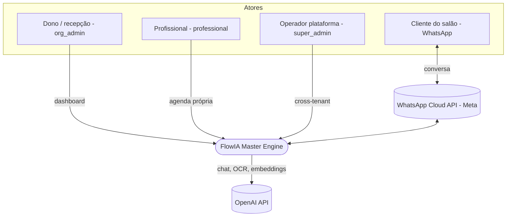
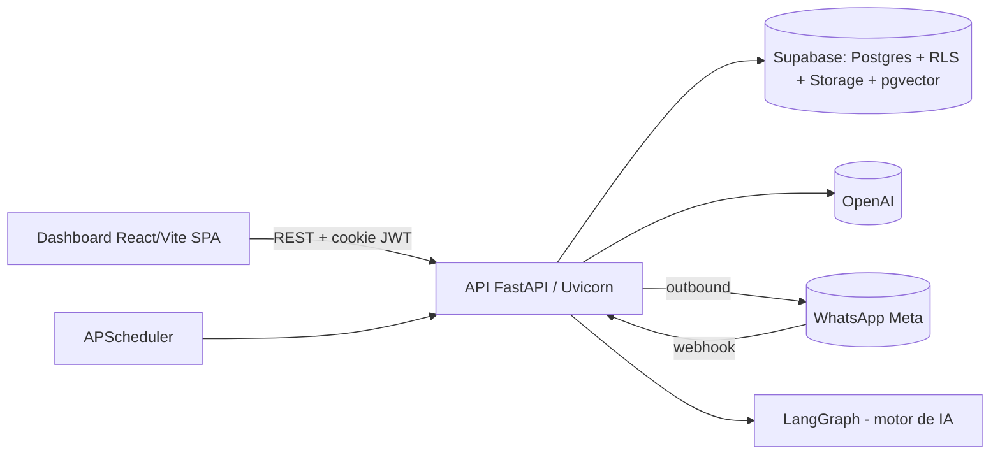
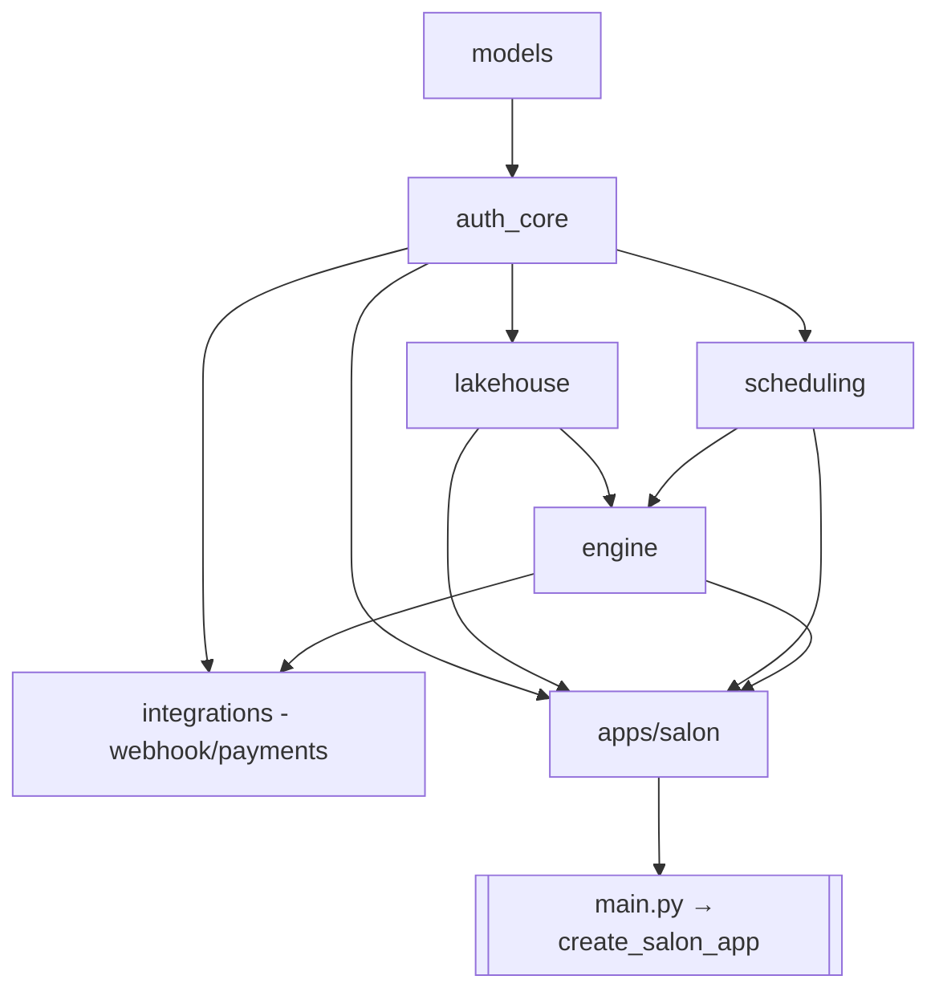
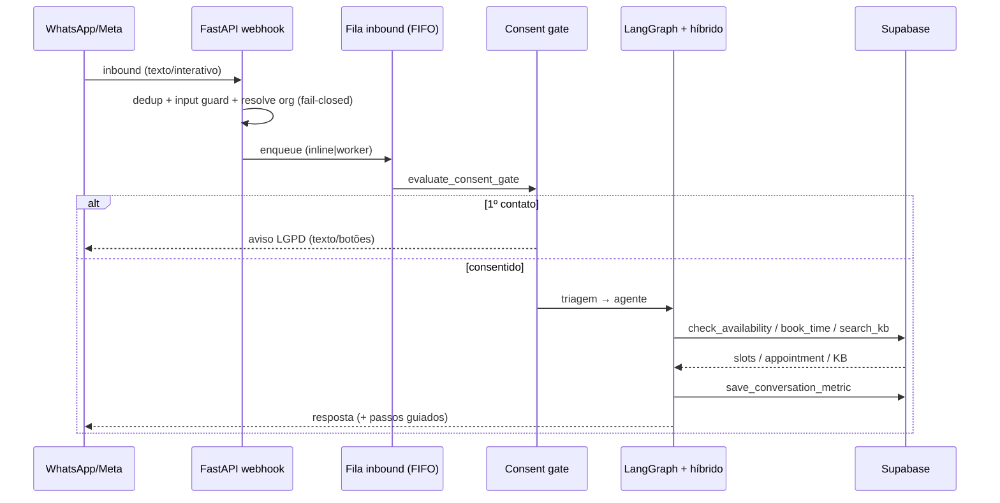
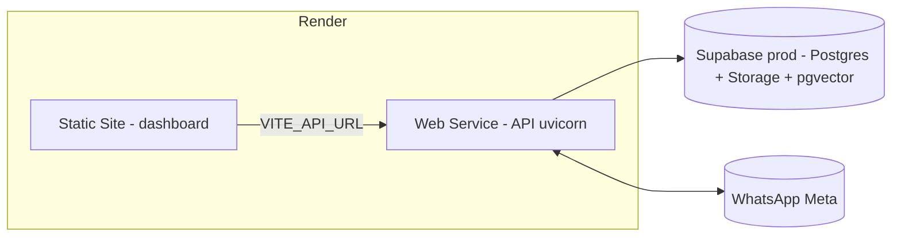

# Arquitetura de Solução — FlowIA Master Engine (MVP salão)

> Visão de arquitetura em níveis (estilo **C4**) do produto ativo (`PRODUCT_LINE=salon`).
> Fonte canônica: [`CLAUDE.md`](../CLAUDE.md) §8–§35. Complementa o [`ARCHITECTURE.md`](ARCHITECTURE.md)
> (mais enxuto) e os documentos [`BPMN.md`](BPMN.md), [`DER.md`](DER.md) e [`TECH_STACK.md`](TECH_STACK.md).
> Em divergência, **o CLAUDE.md prevalece**.

## 1. Nível 1 — Contexto

**Proposta de valor:** automatizar recepção, agendamento e suporte via IA, com isolamento rigoroso
por salão (tenant). Modelo comercial: 1 codebase · 1 Supabase · **N organizations** (RLS).

## 2. Nível 2 — Contêineres

| Contêiner | Tecnologia | Responsabilidade |
|-----------|------------|------------------|
| Dashboard | React 18 + Vite 7 + TS + Tailwind v4 | Overview, Agenda, Clientes, Catálogo, Configurações, Admin dev |
| API | FastAPI + Uvicorn | REST `/api/v1`, webhooks, composição, exceções→HTTP |
| Motor IA | LangGraph + LangChain + OpenAI | Triagem, agentes, tools de booking, RAG |
| Persistência | Supabase (Postgres) | Dados de negócio (RLS), Storage (data lake), pgvector |
| Jobs | APScheduler | Lembretes, no-show, purge LGPD/dedup |

Detalhe de deploy: §6.

## 3. Nível 3 — Componentes (monorepo)

Pacotes e dependências (regra: `packages/*` **não** importa `apps/salon`; ver
[`PACKAGE_BOUNDARIES.md`](PACKAGE_BOUNDARIES.md) e [`CLAUDE.md` §11](../CLAUDE.md)).

| Pacote | Responsabilidade |
|--------|------------------|
| `models` | Enums/DTOs compartilhados |
| `auth_core` | Config, Supabase handler, JWT cookie, tenant context, rate limit, exceções |
| `scheduling` | Motor de disponibilidade, tools `check_availability`/`book_time`, guardrails, datas PT-BR, guiado, jobs |
| `lakehouse` | Pipeline Medallion, OCR, embeddings, RAG, governance SQL |
| `engine` | Grafo LangGraph, motor híbrido (routing/executor/composer/extractor), chat test, métricas, RAG tools |
| `integrations` | Webhook Meta (router/processor/fila), outbound WhatsApp, stub pagamentos |
| `apps/salon` | Composition root (`app_factory`), domínio (catálogo/clientes), dashboard router, prompts white-label |

## 4. Runtime — fluxo conversacional (motor híbrido *deterministic-first*)

O caminho determinístico responde com `tokens=0` (templates do composer); o LLM entra só quando as
heurísticas + extractor não bastam ([`CLAUDE.md` §23.1](../CLAUDE.md)).

## 5. Segurança e multi-tenant (defesa em camadas)

1. **JWT** cookie HttpOnly (`org_id`, `role`, `professional_id`) — única auth do dashboard.
2. **Header** `x-organization-id` validado contra o JWT (`org_admin` → 403 se divergir).
3. **Dependency** `validated_tenant_context` + `professional_scope`.
4. **RLS** PostgreSQL por `organization_id`/claims.
5. **Webhook fail-closed** — org resolvida por `whatsapp_phone_id`; sem resolução → ignora.
6. **Input guard** + **tool allowlist** por agente + **tenant guard** (`_require_org_id`).

> O backend usa `SERVICE_ROLE` (ignora RLS): o no-leak no caminho do agente depende do filtro
> `organization_id` em código (RAG `filter_org_id`, catálogo/agenda por org, `thread_id={org}:{phone}`).
> Cobertura: `tests/test_agent_tenant_isolation.py`. Detalhes: [`CLAUDE.md` §16–§17](../CLAUDE.md).

## 6. Deploy

- **Render Web** (API, `scale=1`, health `/health`) + **Render Static** (dashboard) + **Supabase prod**.
- Cookies cross-subdomínio: `COOKIE_SECURE=true` + `SameSite=None`.
- Escala: rate-limit/cooldowns são in-process → **pré-requisito** de `scale>1` é mover para store
  compartilhado ([`CLAUDE.md` §20, §48.3](../CLAUDE.md)). Smoke: `scripts/smoke_*`.
- IaC e runbook: [`render.yaml`](../render.yaml), [`RENDER.md`](RENDER.md), [`PRODUCTION.md`](PRODUCTION.md),
  [`TENANCY_AND_SCALE.md`](TENANCY_AND_SCALE.md).

## 7. Decisões arquiteturais (ADRs implícitos)

| Decisão | Escolha | Motivo |
|---------|---------|--------|
| Auth dashboard | JWT FastAPI cookie HttpOnly | Controle total; frontend não usa Supabase Auth |
| Multi-tenant | `organization_id` + RLS | N orgs no mesmo Supabase |
| Checkpointer | PostgresSaver (prod) / MemorySaver (testes) | Persistência sem Redis |
| Data Lake | Medallion micro-escala no Supabase | Sem Databricks |
| WhatsApp | Credenciais por organization | White-label real |
| Motor de booking | Determinístico-first, LLM como fallback | Menos tokens/erros de data |
| Composition root | `app_factory` único, prefixo `/api/v1` central | Routers desacoplados |

Trade-offs por tecnologia: [`TECH_STACK.md`](TECH_STACK.md). Processos: [`BPMN.md`](BPMN.md). Dados:
[`DER.md`](DER.md). Limitações conhecidas: [`CLAUDE.md` §20](../CLAUDE.md).
