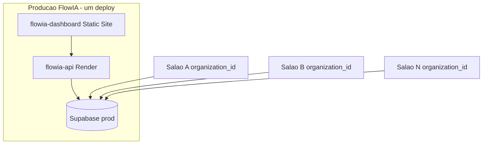

# Tenancy, ambientes e escala — FlowIA Salão

> **Playbook canônico:** como separar **ambiente** (dev/prod) de **cliente** (salão), onboardar novos pagantes e escalar até 200+ orgs **sem trocar stack**.  
> Fonte técnica detalhada: [`CLAUDE.md`](../CLAUDE.md) §2, §16–17.

---

## Em 30 segundos

| Pergunta | Resposta |
|----------|----------|
| Novo salão pagante = novo Render? | **Não** |
| Novo salão = novo Supabase? | **Não** (padrão SaaS) |
| O que fazer? | Criar **organization** + dono + catálogo + KB + WhatsApp da org |
| Como os dados não vazam? | `organization_id` + JWT + API + **RLS no Postgres** |
| 200 salões = tirar RLS? | **Não** — RLS permanece; sobe plano/capacidade |
| Cliente quer banco isolado? | **Tier enterprise** — cobrar mais; Supabase dedicado |

---

## Glossário

| Termo | Significado FlowIA |
|-------|-------------------|
| **Ambiente** | Onde a **plataforma** roda: dev local, staging (opcional), **prod** (Render + Supabase prod) |
| **Cliente / salão / tenant** | Uma linha em `organizations` + dados com mesmo `organization_id` |
| **SaaS compartilhado (padrão)** | 1 Render + 1 Supabase prod + N organizations |
| **Instância dedicada (enterprise)** | Supabase (e opcionalmente host) **próprios** por contrato — [`deployments/tenants/{slug}/`](../deployments/tenants/beauty-express/) |

**Não confundir:** pasta `deployments/multi-tenant/` = template da **plataforma** SaaS, **não** “um deploy por salão”.

---

## Analogia (negócio + técnico)

**Condomínio comercial** = Render + Supabase prod (um prédio).

- Cada salão = **loja** (`organizations`).
- Clientes, agenda, KB = **estoque da loja** (tabelas com `organization_id`).
- **RLS** = fechadura: o banco só entrega prateleiras da loja certa.
- **Dev local** = seu escritório de obra — endereço diferente do prédio dos clientes.

Crescer de 10 para 200 lojas = **mais lojas no mesmo prédio**, não 200 prédios novos.

---

## Modelo padrão — SaaS compartilhado



| Recurso | Quantidade (padrão) |
|---------|---------------------|
| Render Web Service | 1 |
| Render Static Site | 1 |
| Supabase projeto prod | 1 |
| URL dashboard | 1 (todos os salões) |
| Webhook WhatsApp | 1 URL na API; credenciais **por org** |

Todos acessam `https://flowia-dashboard.onrender.com`. O dono (`org_admin`) **só vê a org do JWT** — sem seletor de outro salão.

---

## Isolamento — cinco camadas (defesa em profundidade)

| # | Camada | O que faz |
|---|--------|-----------|
| 1 | **Schema** | Tabelas de negócio têm `organization_id` FK |
| 2 | **JWT + cookie** | Login grava `org_id` e `role` no token |
| 3 | **API** | `validated_tenant_context`: `org_admin` com header ≠ JWT → **403** |
| 4 | **Código** | Services/repositories filtram por org nas queries |
| 5 | **RLS Postgres** | Políticas bloqueiam linhas de outra org mesmo se (4) falhar |

WhatsApp: org resolvida por `organizations.whatsapp_phone_id` — não confia no sender para escolher tenant.

### Pitch para equipe de negócios

> “Vendemos acesso ao **mesmo sistema na nuvem**, como ERP ou agenda online. Cada salão tem **conta isolada**: dados deles não aparecem para o vizinho. A trava não é só ‘confiar no app’ — o **próprio banco** impede mistura. Novo cliente = **novo cadastro**, não **novo datacenter**.”

### Riscos residuais (honestidade)

- Bug que ignora `organization_id` → mitigado por RLS + code review + testes tenant
- `super_admin` FlowIA vê cross-tenant **por design** (operação) — restrito à equipe
- Piloto com Supabase dev = risco **operacional**, não vazamento entre salões em prod

---

## Onboarding — novo salão pagante (checklist)

**Sem** novo Render/Supabase. Executar na ordem:

| # | Ação | Como |
|---|------|------|
| 0 | Prod real | Supabase **prod separado** do dev; secrets novos — [`PRODUCTION.md`](PRODUCTION.md) |
| 1 | Organization | `POST /api/v1/organizations/` (`vertical=salon`, slug único) — `super_admin` |
| 2 | Dono / recepção | `python scripts/create_salon_user.py --email ... --password ... --org <UUID>` (role `org_admin`) |
| 3 | Catálogo | Serviços + profissionais (dashboard ou API) — criar os profissionais antes do passo 3b |
| 3b | Funcionários (opcional) | Para cada profissional com login próprio: `python scripts/create_salon_user.py --email ... --password ... --org <UUID> --role professional --professional-id <UUID do profissional>`. O usuário vê apenas Visão Geral + a própria agenda. |
| 4 | KB | Upload ou `python scripts/seed_datalake.py --org <UUID> --ensure-org` |
| 5 | WhatsApp | Preencher `organizations.whatsapp_phone_id`, `whatsapp_access_token`, etc. |
| 6 | Smoke | Login dashboard + criar cliente/agendamento; chat quando Meta ativo |

Webhook prod (único): `https://flowia-api.onrender.com/api/v1/webhook/whatsapp`

Referência scripts: [`CLAUDE.md`](../CLAUDE.md) §35 · Deploy: [`RENDER.md`](RENDER.md)

---

## Ambientes da plataforma FlowIA

| Ambiente | Render | Supabase | Uso |
|----------|--------|----------|-----|
| **dev** | local | projeto dev | desenvolvimento |
| **staging** | opcional preview | clone ou projeto staging | QA |
| **prod** | `flowia-api` + `flowia-dashboard` | **projeto prod dedicado** | clientes pagantes |

**Nunca** misturar dev e prod após go-live comercial. Piloto Jun/2026 compartilha Supabase dev — migrar antes do 1º pagante.

---

## Tier enterprise — ambiente isolado (cobrar mais)

Use quando o contrato exige **banco ou infra dedicada** (compliance, franquia grande, SLA premium).

| Aspecto | SaaS padrão | Enterprise |
|---------|-------------|------------|
| Supabase | 1 compartilhado | **1 projeto por cliente** |
| Render | compartilhado | compartilhado ou dedicado (negociável) |
| Código | mesmo repo | mesmo repo — [`deployments/tenants/{slug}/`](../deployments/tenants/beauty-express/) |
| RLS | sim | sim (ou single-tenant no DB dedicado) |
| Preço | mensalidade padrão | **premium** (cobre infra + ops) |

**Não** usar tier enterprise para cada salão SMB — inviável operar 200 Supabase projects.

### Árvore de decisão

```text
Cliente SMB (salão individual ou pequena rede)?
  → SaaS compartilhado (organization + RLS)

Cliente exige DB isolado / contrato enterprise / compliance?
  → deployments/tenants/{slug}/ + Supabase dedicado + precificação premium
```

---

## Escala — o que muda (e o que NÃO muda)

### Mitos vs realidade

| Mito | Realidade |
|------|-----------|
| “200 salões → vários Supabase” | **1 Supabase prod**, mais linhas |
| “Cresceu → tabela por salão” | **Mesmas tabelas**, coluna `organization_id` |
| “Cresceu → remove RLS” | **RLS permanece** — padrão SaaS maduro |
| “Vetores pesados → FAISS no Render” | **pgvector no Supabase** (já implementado) |

### Gatilhos por fase

| Salões ativos | Infra (mesma stack) | Ações |
|---------------|---------------------|-------|
| **1–10** | Render Starter, Supabase Free/Pro, API scale=1 | Separar Supabase prod; WhatsApp por org |
| **10–50** | Supabase Pro | Monitoramento; índices pgvector; alertas custo Gemini |
| **50–200** | API autoscale ou +instâncias | Background Worker para scheduler (lembretes, dedup purge) |
| **200+** | Pooler Postgres, retenção Bronze | Opcional read replica; **mesmo** modelo multi-tenant |

Gargalos prováveis: burst webhook, conexões DB (checkpointer + API), custo tokens — **não** RLS em si.

---

## O que NÃO fazer ao escalar

- Novo Render/Supabase **por salão SMB**
- Tabelas duplicadas por cliente (`patients_salao_x`)
- FAISS ou índice vetorial na RAM do dyno
- Fork de código por cliente
- Desligar RLS “por performance”

---

## Links relacionados

| Documento | Conteúdo |
|-----------|----------|
| [`CLAUDE.md`](../CLAUDE.md) | Fonte da verdade — RBAC, RLS, API |
| [`PRODUCTION.md`](PRODUCTION.md) | URLs prod, smoke, piloto vs prod |
| [`RENDER.md`](RENDER.md) | Deploy Render |
| [`deployments/multi-tenant/README.md`](../deployments/multi-tenant/README.md) | Template SaaS |
| [`SECRET_ROTATION.md`](SECRET_ROTATION.md) | Rotação secrets |

---

*FlowIA — build to earn: um motor, N salões, RLS sempre.*
