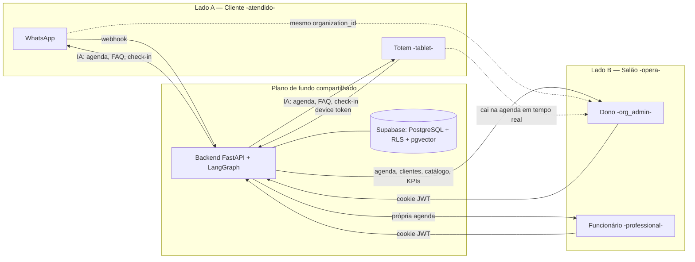

# FlowIA — Visão Geral (os dois lados do produto)

> Documento de orientação. A **fonte canônica** continua o [`CLAUDE.md`](../CLAUDE.md); em caso de divergência, prevalece ele.
>
> Objetivo: explicar o FlowIA pela ótica de **quem usa**. O produto tem dois lados — quem é **atendido** (o cliente do salão) e quem **opera** (o salão: dono e funcionário) — sobre uma **fundação técnica compartilhada**. Dentro de cada lado seguimos o sub-eixo **Negócio (o que faz) → Técnico (como funciona)**.

---

## Mapa dos dois lados

A seta pontilhada é **a costura**: o cliente agenda por um canal e isso aparece na agenda do salão no mesmo instante, porque os dois lados operam sobre o **mesmo `organization_id`**.

---

## 🧑 Lado A — O Cliente (quem é atendido)

O consumidor final do salão. **Não tem login e não vê o dashboard.** É identificado pelo **telefone** e atendido pelo motor de IA.

### Negócio — o que o cliente faz
- **Agenda** um serviço (escolhe serviço, data, horário, profissional).
- **Faz check-in** de um horário já marcado (no totem do balcão).
- **Tira dúvidas** — preços, serviços, políticas (cancelamento, atraso, pagamento).
- **Reagenda ou cancela** o próprio horário.

### Negócio — por onde (canais)
- **WhatsApp** — atendimento remoto, no número do próprio salão.
- **Totem** — autoatendimento em tablet no balcão do salão.
- *(Ensaie seu assistente / chat-test é interno do salão para testar — não é canal de cliente real.)*

### Técnico — como funciona
- **Identidade do cliente:** `thread_id = {organization_id}:{telefone}`. O mesmo telefone é reconhecido entre canais; cliente recorrente **não** é re-perguntado.
- **Consentimento LGPD:** aviso no 1º contato; recusa é persistida; só avança com consentimento.
- **Motor de IA (LangGraph):** triage classifica a intenção → agente especializado (recepcionista · suporte · agendamento) com tools.
- **Booking guiado channel-agnostic:** o motor emite `StructuredStep`; cada canal só **renderiza** (WhatsApp = botões/lista interativos; Totem = telas do PWA).
- **RAG:** dúvidas são respondidas pela base de conhecimento (`search_kb`), com envelope anti-injeção — nunca "inventa" preço.
- **Anti-injeção:** tools de agendar/reagendar/cancelar agem **só** no agendamento do próprio telefone do remetente.

### Especificidade do canal Totem
- **Autenticação do device:** `x-device-token` → `organization_id` (fail-closed 403). Token de alta entropia, guardado só como **hash SHA-256** (`kiosk_devices`).
- **Privacidade:** o tablet só manuseia um `session_id` opaco — o telefone nunca volta ao device.
- **Reset:** por inatividade (90s) e ao concluir — sem dados entre clientes.
- **Check-in:** reusa `update_appointment_status(..., ARRIVED)`.

---

## 💈 Lado B — O Salão (quem opera)

Quem toca o negócio. Acessa o **dashboard** com login (cookie JWT). Dois papéis, com visões distintas.

### Negócio — Dono (`org_admin`)
Visão completa do salão:
- **Overview** — painel operacional do dia.
- **Agenda** — Operacional (timeline por profissional) + Semana (1 profissional).
- **Clientes** — cadastro, histórico, no-show.
- **Catálogo** — serviços (duração/preço), profissionais (horários/folgas), elegibilidade M:N.
- **Configurações** — conecta os canais do cliente: **WhatsApp** (self-service) e **Totem** (provisiona o device token).
- **Financeiro / KPIs** — faturado, a faturar, perdas; KPI por profissional.
- **Ensaie seu assistente** — testa o próprio assistente antes de soltar para o cliente.

### Negócio — Funcionário (`professional`)
Visão restrita à própria operação:
- **Overview** resumida + **Agenda apenas da própria coluna**.
- **Não** vê Clientes, Catálogo nem Configurações (nav esconde).

### Técnico — como funciona
- **Auth:** login → JWT em cookie HttpOnly; `AuthContext` consulta `/auth/me` no mount.
- **Escopo por papel:** o JWT carrega `role`, `organization_id` e (para funcionário) `professional_id`; as queries de agenda/overview filtram automaticamente pelo profissional.
- **Dashboard (`apps/salon/dashboard/`):** SPA React/Vite — `pages/` + `features/` (overview, agenda, catalog, clients, admin, settings), rotas protegidas (`ProtectedRoute`, `OrgAdminRoute`, `AdminDevRoute`).
- **Provisionamento do Totem:** `GET|POST|DELETE /organizations/kiosk-devices` + UI `TotemDevices`; o POST retorna o token **uma única vez**.
- **Design system:** identidade GAUSSIX (dark · glass · glow).

---

## 🔗 A costura — onde os dois lados se encontram

O que faz a história fechar: **mesmo `organization_id`, mesmo backend, mesmos dados.**

- O cliente agenda no **WhatsApp/Totem** → o agendamento **cai na agenda do dono em tempo real**.
- O dono define **catálogo, horários e serviços** → isso vira **o que o cliente vê e pode marcar** no canal.
- O check-in do cliente no totem muda o **status no painel operacional** que o salão acompanha.
- O no-show detectado alimenta o **histórico do cliente** e os **KPIs** do dono.

Sem essa costura seriam dois sistemas; com ela, é **um produto** — automação no lado do cliente que vira resultado no lado do salão.

---

## ⚙️ Plano de fundo compartilhado (serve os dois lados)

A fundação técnica que sustenta cliente e salão sem ser duplicada.

- **Backend FastAPI** — API REST (`/api/v1`), composition root único (`create_salon_app`), mapeamento de exceções de domínio (409 double-booking, 403 tenant, etc.).
- **Supabase** — PostgreSQL + RLS, Storage (data lake), pgvector (RAG), checkpointer LangGraph.
- **Multi-tenant** — tudo isolado por `organization_id`; o backend usa `SERVICE_ROLE` (ignora RLS), então o no-leak depende do **filtro de org no código** + testes de isolamento.
- **Segurança** — camadas JWT → header → `validated_tenant_context` → RLS → webhook fail-closed → input guard → tool allowlist → tenant guard no agente.
- **IA core** — LangGraph (grafo + triage + motor híbrido determinístico-first), prompts white-label por salão, métricas de token/custo.
- **Operação** — deploy Render (API + dashboard) + Supabase; PWA do totem como serviço estático; CI com ruff · bandit · pip-audit · tenant-scoped-writes guard · pytest.

---

## Onde aprofundar

| Tema | Documento |
|------|-----------|
| Fonte da verdade (tudo) | [`CLAUDE.md`](../CLAUDE.md) |
| Arquitetura de solução (C4) | [`docs/SOLUTION_ARCHITECTURE.md`](SOLUTION_ARCHITECTURE.md) |
| Processos de negócio (BPMN) | [`docs/BPMN.md`](BPMN.md) |
| Modelo de dados (DER) | [`docs/DER.md`](DER.md) |
| Stack tecnológica | [`docs/TECH_STACK.md`](TECH_STACK.md) |
