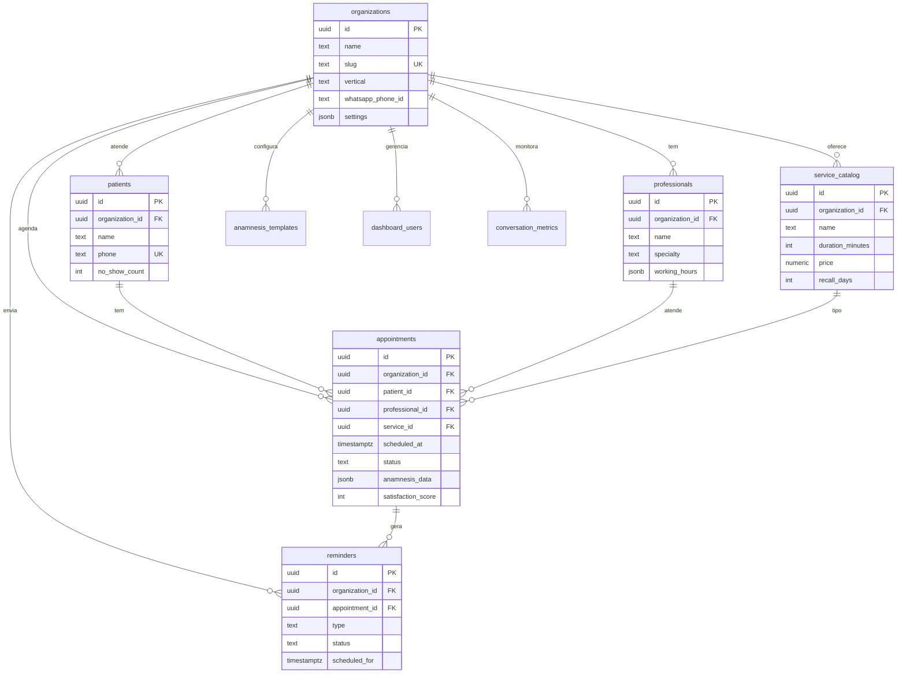

# FlowIA — Plano de Implementação: Sistema de Agendamento Inteligente Multi-Vertical

> **Arquivo histórico** — plano executado. Fonte da verdade atual: [`CLAUDE.md`](../../CLAUDE.md). Roadmap futuro: [`ROADMAP.md`](../ROADMAP.md).

---

## 📌 DECISÕES APROVADAS

| # | Decisão | Resolução |
|:--|:---|:---|
| 1 | Multi-Tenancy | Cada cliente = 1 `organization`. 1 codebase, 1 banco, dados isolados por `organization_id` via RLS |
| 2 | Tabelas Legadas | Arquivar `fato_faturamento`, `fato_carteira_v2`, `contratos`, `servicos` |
| 3 | Tabela `leads` | Migrar para `patients` como base de testes + criar complementos |
| 4 | Colunas duplicadas | Unificar para EN (remover duplicação PT/EN) |
| 5 | RLS | Corrigir policies de `false` para isolamento real por tenant |
| 6 | Foreign Keys | Criar relações entre tabelas para BI/Analytics |
| 7 | WhatsApp | Cada cliente tem seu próprio número/token WhatsApp Business |
| 8 | Pagamento/Convênios | 🔵 Fase 2 futura (não implementar agora) |
| 9 | Escala inicial | ~10 organizações, ~50 agendamentos/dia |
| 10 | Dashboard | React 18 + Vite 5 + Tailwind v4 em `apps/salon/dashboard/` (Neo-Swiss Brutalism) |

---

## 🏗️ ARQUITETURA: PRODUTO vs PLATAFORMA

### Visão Geral

```
┌──────────────────────────────────────────────────────────────────┐
│                    🏢 PLATAFORMA FLOWIA (ADMIN)                  │
│         Equipe FlowIA acessa esta camada                         │
│                                                                  │
│   ┌──────────┐  ┌──────────┐  ┌──────────┐  ┌──────────┐       │
│   │ Monitor  │  │ BI &     │  │ Gestão   │  │ Config   │       │
│   │ em Tempo │  │ Analytics│  │ de Orgs  │  │ Central  │       │
│   │ Real     │  │          │  │          │  │          │       │
│   └────┬─────┘  └────┬─────┘  └────┬─────┘  └────┬─────┘       │
│        └──────────────┴──────────────┴──────────────┘             │
│                    Visualiza TODOS os tenants                     │
└──────────────────────────────┬───────────────────────────────────┘
                               │
                    ┌──────────┴──────────┐
                    │  SUPABASE (1 banco)  │
                    │  Dados isolados por  │
                    │   organization_id    │
                    └──────────┬──────────┘
                               │
        ┌──────────────────────┼──────────────────────┐
        │                      │                      │
┌───────┴────────┐  ┌─────────┴──────────┐  ┌────────┴───────┐
│ 💇 PRODUTO     │  │ 🦷 PRODUTO         │  │ 🏥 PRODUTO     │
│ "Studio Maria" │  │ "Clínica Sorriso"  │  │ "Dr. Silva"    │
│ WhatsApp: X    │  │ WhatsApp: Y        │  │ WhatsApp: Z    │
│ Dados isolados │  │ Dados isolados     │  │ Dados isolados │
└────────────────┘  └────────────────────┘  └────────────────┘
```

### Princípios

- **1 codebase, 1 banco Supabase, N clientes**
- Cada cliente é uma `organization` no banco
- Isolamento por `organization_id` em TODA query (RLS)
- `super_admin` (equipe FlowIA) vê cross-tenant para BI/Analytics
- `org_admin` (cliente) vê apenas seus dados

### As Duas Camadas

| Aspecto | 🛍️ PRODUTO (Sistema do Cliente) | 🏢 PLATAFORMA (Admin FlowIA) |
|:---|:---|:---|
| **Quem usa** | Dono do salão/clínica e seus pacientes | Equipe FlowIA |
| **Acesso** | WhatsApp (paciente) + Dashboard do cliente | Dashboard administrativo central |
| **Escopo de dados** | APENAS dados da sua organização | TODOS os dados de TODAS as orgs |
| **Funcionalidades** | Agendar, pré/pós atendimento, recall | Monitorar, BI, analytics, config |

---

## 🎯 PROBLEMAS QUE O SISTEMA RESOLVE (70% dos 3 nichos)

| # | Problema | Impacto | % Afetados | Módulo |
|:--|:---|:---|:---|:---|
| 1 | No-Show (faltas sem aviso) | -20% a -30% faturamento | ~85% | 📅 Agendamento + Lembretes |
| 2 | Agendamento manual | Double-booking, sobrecarga | ~70% | 📅 Agendamento |
| 3 | Sem lembrete automático | Esquecimento = falta | ~75% | 📅 Lembretes (24h + 2h) |
| 4 | Sem pré-atendimento digital | Tempo perdido na recepção | ~80% | 📋 Pré-Atendimento |
| 5 | Sem pós-atendimento | Perda de recorrência | ~90% | ⭐ Pós-Atendimento |
| 6 | Sem manutenção preventiva | Paciente some | ~85% | 🔄 Recall |
| 7 | Sem histórico centralizado | Profissional não lembra | ~70% | 👤 Ficha do Paciente |
| 8 | Conflitos de agenda | Ociosidade + estresse | ~65% | 📅 Agenda Inteligente |

### Diferenças por Nicho

| Feature | 💇 Salão | 🦷 Dentista | 🏥 Clínica Médica |
|:---|:---|:---|:---|
| Anamnese | Alergia a produtos | Histórico odontológico | Histórico médico completo |
| Duração serviço | 30min-3h | 30min-2h | 15min-1h |
| Recall típico | "Retoque raiz 30 dias" | "Limpeza semestral" | "Retorno em 6 meses" |
| Múltiplos profissionais | Cabeleireiro, manicure | Geral, ortodontista | Clínico, especialista |

---

## 📐 SCHEMA DO BANCO DE DADOS

### Diagrama Relacional



### DDL — Tabelas Novas

#### `organizations`
```sql
CREATE TABLE organizations (
    id UUID PRIMARY KEY DEFAULT gen_random_uuid(),
    name TEXT NOT NULL,
    slug TEXT UNIQUE NOT NULL,
    vertical TEXT NOT NULL CHECK (vertical IN ('salon', 'dental', 'medical')),
    phone TEXT,
    email TEXT,
    address JSONB,
    timezone TEXT DEFAULT 'America/Sao_Paulo',
    settings JSONB DEFAULT '{}',
    whatsapp_phone_id TEXT,
    whatsapp_access_token TEXT,
    whatsapp_business_id TEXT,
    is_active BOOLEAN DEFAULT TRUE,
    subscription_plan TEXT DEFAULT 'basic',
    created_at TIMESTAMPTZ DEFAULT NOW(),
    updated_at TIMESTAMPTZ DEFAULT NOW()
);
```

#### `professionals`
```sql
CREATE TABLE professionals (
    id UUID PRIMARY KEY DEFAULT gen_random_uuid(),
    organization_id UUID NOT NULL REFERENCES organizations(id) ON DELETE CASCADE,
    name TEXT NOT NULL,
    specialty TEXT,
    phone TEXT,
    email TEXT,
    is_active BOOLEAN DEFAULT TRUE,
    avatar_url TEXT,
    working_hours JSONB DEFAULT '{
        "mon": {"start": "08:00", "end": "18:00"},
        "tue": {"start": "08:00", "end": "18:00"},
        "wed": {"start": "08:00", "end": "18:00"},
        "thu": {"start": "08:00", "end": "18:00"},
        "fri": {"start": "08:00", "end": "18:00"}
    }',
    break_times JSONB DEFAULT '[{"start": "12:00", "end": "13:00"}]',
    appointment_buffer_minutes INT DEFAULT 15,
    created_at TIMESTAMPTZ DEFAULT NOW()
);
```

#### `service_catalog`
```sql
CREATE TABLE service_catalog (
    id UUID PRIMARY KEY DEFAULT gen_random_uuid(),
    organization_id UUID NOT NULL REFERENCES organizations(id) ON DELETE CASCADE,
    name TEXT NOT NULL,
    description TEXT,
    duration_minutes INT NOT NULL,
    price NUMERIC(10,2),
    category TEXT,
    requires_anamnesis BOOLEAN DEFAULT FALSE,
    recall_days INT,
    is_active BOOLEAN DEFAULT TRUE,
    created_at TIMESTAMPTZ DEFAULT NOW()
);
```

#### `patients`
```sql
CREATE TABLE patients (
    id UUID PRIMARY KEY DEFAULT gen_random_uuid(),
    organization_id UUID NOT NULL REFERENCES organizations(id) ON DELETE CASCADE,
    name TEXT NOT NULL,
    phone TEXT NOT NULL,
    email TEXT,
    cpf TEXT,
    birth_date DATE,
    gender TEXT,
    notes TEXT,
    tags JSONB DEFAULT '[]',
    insurance_plan TEXT,
    insurance_number TEXT,
    no_show_count INT DEFAULT 0,
    total_appointments INT DEFAULT 0,
    last_visit_at TIMESTAMPTZ,
    legacy_sender_id TEXT,
    created_at TIMESTAMPTZ DEFAULT NOW(),
    updated_at TIMESTAMPTZ DEFAULT NOW(),
    UNIQUE(organization_id, phone)
);
```

#### `appointments`
```sql
CREATE TABLE appointments (
    id UUID PRIMARY KEY DEFAULT gen_random_uuid(),
    organization_id UUID NOT NULL REFERENCES organizations(id) ON DELETE CASCADE,
    patient_id UUID NOT NULL REFERENCES patients(id),
    professional_id UUID NOT NULL REFERENCES professionals(id),
    service_id UUID NOT NULL REFERENCES service_catalog(id),
    scheduled_at TIMESTAMPTZ NOT NULL,
    duration_minutes INT NOT NULL,
    status TEXT NOT NULL DEFAULT 'pending' CHECK (status IN (
        'pending', 'confirmed', 'arrived', 'in_progress',
        'completed', 'no_show', 'cancelled', 'rescheduled'
    )),
    anamnesis_completed BOOLEAN DEFAULT FALSE,
    anamnesis_data JSONB,
    pre_service_notes TEXT,
    post_service_notes TEXT,
    treatment_plan TEXT,
    satisfaction_score INT CHECK (satisfaction_score BETWEEN 1 AND 5),
    feedback_text TEXT,
    recall_scheduled_at TIMESTAMPTZ,
    recall_sent BOOLEAN DEFAULT FALSE,
    source TEXT DEFAULT 'whatsapp' CHECK (source IN ('whatsapp', 'dashboard', 'api', 'phone')),
    cancellation_reason TEXT,
    rescheduled_from UUID REFERENCES appointments(id),
    created_at TIMESTAMPTZ DEFAULT NOW(),
    updated_at TIMESTAMPTZ DEFAULT NOW()
);
```

#### `reminders`
```sql
CREATE TABLE reminders (
    id UUID PRIMARY KEY DEFAULT gen_random_uuid(),
    organization_id UUID NOT NULL REFERENCES organizations(id) ON DELETE CASCADE,
    appointment_id UUID NOT NULL REFERENCES appointments(id) ON DELETE CASCADE,
    patient_id UUID NOT NULL REFERENCES patients(id),
    type TEXT NOT NULL CHECK (type IN (
        'confirmation_24h', 'reminder_2h', 'post_service',
        'recall', 'satisfaction', 'reactivation'
    )),
    channel TEXT DEFAULT 'whatsapp',
    scheduled_for TIMESTAMPTZ NOT NULL,
    sent_at TIMESTAMPTZ,
    delivered_at TIMESTAMPTZ,
    status TEXT DEFAULT 'pending' CHECK (status IN ('pending', 'sent', 'delivered', 'failed', 'cancelled')),
    response TEXT,
    error_message TEXT,
    created_at TIMESTAMPTZ DEFAULT NOW()
);
```

#### `anamnesis_templates`
```sql
CREATE TABLE anamnesis_templates (
    id UUID PRIMARY KEY DEFAULT gen_random_uuid(),
    organization_id UUID NOT NULL REFERENCES organizations(id) ON DELETE CASCADE,
    vertical TEXT NOT NULL,
    name TEXT NOT NULL,
    fields JSONB NOT NULL,
    is_default BOOLEAN DEFAULT FALSE,
    created_at TIMESTAMPTZ DEFAULT NOW()
);
```

### DDL — Modificações em Tabelas Existentes

```sql
-- dashboard_users: multi-org + roles
ALTER TABLE dashboard_users
    ADD COLUMN organization_id UUID REFERENCES organizations(id),
    ADD COLUMN role TEXT DEFAULT 'org_admin' CHECK (role IN ('super_admin', 'org_admin', 'professional'));

-- conversation_metrics: vincular a org
ALTER TABLE conversation_metrics ADD COLUMN organization_id UUID REFERENCES organizations(id);

-- KB por organização
ALTER TABLE knowledge_chunks ADD COLUMN organization_id UUID REFERENCES organizations(id);
ALTER TABLE knowledge_gaps ADD COLUMN organization_id UUID REFERENCES organizations(id);
ALTER TABLE docs_bronze ADD COLUMN organization_id UUID REFERENCES organizations(id);
ALTER TABLE docs_silver ADD COLUMN organization_id UUID REFERENCES organizations(id);
ALTER TABLE docs_gold_vectors ADD COLUMN organization_id UUID REFERENCES organizations(id);

-- Arquivar legadas
ALTER TABLE fato_faturamento RENAME TO _archive_fato_faturamento;
ALTER TABLE fato_carteira_v2 RENAME TO _archive_fato_carteira_v2;
ALTER TABLE contratos RENAME TO _archive_contratos;
ALTER TABLE servicos RENAME TO _archive_servicos;
```

### DDL — Índices

```sql
CREATE INDEX idx_appt_org_date ON appointments(organization_id, scheduled_at);
CREATE INDEX idx_appt_prof_date ON appointments(professional_id, scheduled_at);
CREATE INDEX idx_appt_patient ON appointments(patient_id);
CREATE INDEX idx_appt_status ON appointments(organization_id, status);
CREATE INDEX idx_rem_pending ON reminders(status, scheduled_for) WHERE status = 'pending';
CREATE INDEX idx_pat_org_phone ON patients(organization_id, phone);
CREATE INDEX idx_prof_org_active ON professionals(organization_id) WHERE is_active = TRUE;
CREATE INDEX idx_svc_org_active ON service_catalog(organization_id) WHERE is_active = TRUE;
CREATE INDEX idx_cm_org ON conversation_metrics(organization_id);
CREATE INDEX idx_cm_thread ON conversation_metrics(thread_id);
```

### DDL — RLS Policies

```sql
-- Padrão para TODAS as tabelas com organization_id:
-- O backend seta: SET LOCAL app.current_org_id = '<uuid>';

-- Exemplo para appointments (replicar para cada tabela)
CREATE POLICY "tenant_read" ON appointments FOR SELECT USING (
    organization_id = current_setting('app.current_org_id', true)::UUID
    OR current_setting('app.user_role', true) = 'super_admin'
);

CREATE POLICY "tenant_write" ON appointments FOR INSERT WITH CHECK (
    organization_id = current_setting('app.current_org_id', true)::UUID
);

CREATE POLICY "tenant_update" ON appointments FOR UPDATE USING (
    organization_id = current_setting('app.current_org_id', true)::UUID
);
```

---

## 🔧 ESTRUTURA DE CÓDIGO ALVO

```
src/
├── api/
│   ├── routes.py                    # [MODIFY] Webhook WhatsApp (multi-org)
│   ├── dashboard_routes.py          # [MODIFY] Dashboard do Cliente (Produto)
│   ├── lakehouse_routes.py          # [KEEP]   Workspace analítico
│   ├── scheduling_routes.py         # [NEW]    API de Agendamento (Produto)
│   ├── patient_routes.py            # [NEW]    API de Pacientes (Produto)
│   ├── admin_routes.py              # [NEW]    API da Plataforma (Admin FlowIA)
│   └── organization_routes.py       # [NEW]    Config da Organização (Produto)
├── core/
│   ├── config.py                    # [MODIFY] Novas configs
│   ├── limiter.py                   # [KEEP]
│   └── tenant.py                    # [NEW]    Tenant context manager
├── handlers/
│   └── database.py                  # [MODIFY] Tenant-aware handler
├── models/
│   ├── schemas.py                   # [MODIFY] Novos schemas Pydantic
│   └── enums.py                     # [NEW]    Enums (AppointmentStatus, Vertical, etc.)
├── services/
│   ├── graph_engine.py              # [MODIFY] Novos nós + prompts dinâmicos
│   ├── agent_prompts.py             # [NEW]    Prompts parametrizados por vertical
│   ├── scheduling_tools.py          # [NEW]    Tools LangGraph para agendamento
│   ├── scheduling_service.py        # [NEW]    Lógica de agendamento
│   ├── pre_service.py               # [NEW]    Pré-atendimento + anamnese
│   ├── post_service.py              # [NEW]    Pós-atendimento + feedback
│   ├── reminder_service.py          # [NEW]    Motor de lembretes
│   ├── whatsapp_service.py          # [NEW]    Envio via WhatsApp Cloud API
│   ├── scheduler_cron.py            # [NEW]    Background jobs
│   ├── analytics_service.py         # [MODIFY] Métricas de agendamento
│   ├── tools.py                     # [MODIFY] Manter search_kb, remover save_lead_to_db
│   ├── auth_service.py              # [MODIFY] Adicionar roles
│   ├── data_lake_service.py         # [KEEP]   Pipeline RAG
│   ├── finance_service.py           # [KEEP]   BACEN + custo tokens
│   └── lakehouse_governance.py      # [MODIFY] Atualizar dicionário
└── static/                          # [MODIFY] Dashboard expandido
```

---

## 🛍️ PRODUTO — Serviços e APIs

### Serviço: `scheduling_service.py`
| Função | Descrição |
|:---|:---|
| `get_available_slots(org_id, professional_id, date)` | Calcula slots livres |
| `create_appointment(...)` | Valida conflitos + cria + dispara lembretes |
| `cancel_appointment(appointment_id, reason)` | Cancela + cancela lembretes pendentes |
| `reschedule_appointment(appointment_id, new_datetime)` | Marca original como rescheduled, cria novo |
| `get_daily_agenda(professional_id, date)` | Agenda do dia |
| `mark_arrived(appointment_id)` | Check-in do paciente |
| `detect_no_shows()` | Cron: marca no_show para appointments passados |

### Serviço: `pre_service.py`
| Função | Descrição |
|:---|:---|
| `get_anamnesis_template(org_id, vertical)` | Template de ficha |
| `send_anamnesis_via_whatsapp(appointment_id)` | Envia perguntas pelo WhatsApp |
| `save_anamnesis(appointment_id, data)` | Salva respostas |
| `check_pre_requirements(appointment_id)` | Verifica se completo |

### Serviço: `post_service.py`
| Função | Descrição |
|:---|:---|
| `complete_appointment(appointment_id, notes, plan)` | Finaliza com anotações |
| `request_feedback(appointment_id)` | Agenda pesquisa de satisfação |
| `save_feedback(appointment_id, score, text)` | Processa nota + texto |
| `schedule_recall(appointment_id, days)` | Cria lembrete de retorno |

### Serviço: `reminder_service.py`
| Função | Descrição |
|:---|:---|
| `create_appointment_reminders(appointment_id)` | Cria 24h + 2h |
| `process_pending_reminders()` | Cron: envia pendentes |
| `handle_reminder_response(phone, response)` | Processa confirmação/cancelamento |
| `process_recall_reminders()` | Cron: recalls de manutenção |
| `process_reactivation()` | Cron: pacientes inativos >90 dias |

### Serviço: `whatsapp_service.py`
| Função | Descrição |
|:---|:---|
| `send_message(org_id, to_phone, message)` | Envia via Cloud API (token da org) |
| `send_template_message(org_id, to_phone, template, params)` | Template aprovado |
| `send_interactive_message(org_id, to_phone, buttons)` | Botões interativos |

### APIs do Produto
```
# Agendamento
GET  /api/v1/scheduling/agenda/{professional_id}/{date}
GET  /api/v1/scheduling/availability/{professional_id}
POST /api/v1/scheduling/appointments
PUT  /api/v1/scheduling/appointments/{id}/status
PUT  /api/v1/scheduling/appointments/{id}/cancel
PUT  /api/v1/scheduling/appointments/{id}/reschedule
POST /api/v1/scheduling/appointments/{id}/feedback

# Pacientes
GET  /api/v1/patients
GET  /api/v1/patients/{id}
POST /api/v1/patients
PUT  /api/v1/patients/{id}
GET  /api/v1/patients/{id}/appointments

# Organização
GET  /api/v1/org/profile
PUT  /api/v1/org/profile
GET  /api/v1/org/services
POST /api/v1/org/services
PUT  /api/v1/org/services/{id}
GET  /api/v1/org/professionals
POST /api/v1/org/professionals
PUT  /api/v1/org/professionals/{id}
GET  /api/v1/org/dashboard-kpis
```

---

## 🏢 PLATAFORMA — APIs Admin

```
# Gestão de Organizações (super_admin only)
GET    /admin/organizations
POST   /admin/organizations
GET    /admin/organizations/{id}
PUT    /admin/organizations/{id}
PUT    /admin/organizations/{id}/toggle

# Observability & Monitoramento
GET    /admin/monitor/health
GET    /admin/monitor/appointments/today
GET    /admin/monitor/no-shows/today
GET    /admin/monitor/reminders/pending
GET    /admin/monitor/errors

# BI & Analytics (Cross-Tenant)
GET    /admin/analytics/overview
GET    /admin/analytics/by-org
GET    /admin/analytics/by-vertical
GET    /admin/analytics/no-show-rate
GET    /admin/analytics/satisfaction
GET    /admin/analytics/recall-effectiveness
GET    /admin/analytics/token-consumption
GET    /admin/analytics/active-patients

# Onboarding Wizard
POST   /admin/onboard
```

---

## 🛠️ Agent IA — Graph Redesign

### Novo Fluxo
```
START → tenant_resolver → router_node → {
    scheduling_node    → tools → scheduling_node (loop)
    pre_service_node   → tools → pre_service_node
    post_service_node  → tools → post_service_node
    recall_node        → tools → recall_node
    support_node       → tools → support_node (KB/RAG)
}
```

### Prompts Dinâmicos por Vertical (`agent_prompts.py`)
- Prompt base com `SECURITY_GUARDRAILS` (mantido)
- Contexto injetado: `org.name`, `org.vertical`, `org.settings`
- Vocabulary adaptado: "paciente" (médico/dental) vs "cliente" (salão)

### Novas Tools LangGraph (`scheduling_tools.py`)
- `check_available_slots` — Busca horários livres
- `book_appointment` — Agenda consulta/serviço
- `cancel_my_appointment` — Cancela agendamento
- `reschedule_my_appointment` — Reagenda
- `get_my_appointments` — Lista agendamentos do paciente
- `complete_anamnesis` — Preenche ficha pré-consulta

---

## ⏱️ Background Jobs (`scheduler_cron.py`)

| Job | Frequência | Descrição |
|:---|:---|:---|
| `cron_send_reminders` | Cada 5 min | Envia lembretes pendentes (24h, 2h) |
| `cron_detect_no_shows` | Cada 15 min | Marca no_show em appointments passados |
| `cron_recall_reminders` | Cada 1 hora | Envia recalls de manutenção |
| `cron_reactivation` | 1x/dia (00:00) | Reativa pacientes inativos >90 dias |

---

## 📋 KANBAN BOARD & FASEAMENTO

### Visão Geral do Projeto (Kanban)

| 📋 TO DO (A Fazer) | 🚧 IN PROGRESS (Em Andamento) | ✅ DONE (Concluído) |
|:---|:---|:---|
| **Fase 5** — Plataforma Admin<br>**Fase 6** — Verificação & Polish | **Fase 4** — Agent IA (Graph Redesign) | **Fase 1** — Fundação (DB + Core)<br>**Fase 2** — Serviços de Agendamento<br>**Fase 3** — Pré e Pós-Atendimento |

---

### FASE 1 — Fundação (DB + Core) `P0` ✅
| # | Task | Status |
|:--|:---|:---|
| 1.1 | Migration: tabelas novas (organizations, professionals, service_catalog, patients, appointments, reminders, anamnesis_templates) | ✅ |
| 1.2 | Migration: ALTER tabelas existentes (dashboard_users, conversation_metrics, knowledge_*, docs_*) | ✅ |
| 1.3 | Migration: Índices + RLS policies | ✅ |
| 1.4 | Arquivar tabelas legadas | ✅ |
| 1.5 | Implementar `src/core/tenant.py` | ✅ |
| 1.6 | Modificar `database.py` com tenant context | ✅ |
| 1.7 | Criar `src/models/enums.py` + atualizar `schemas.py` | ✅ |
| 1.8 | Script de migração `leads` → `patients` | ✅ |

### FASE 2 — Serviços de Agendamento `P0` ✅
| # | Task | Status |
|:--|:---|:---|
| 2.1 | `scheduling_service.py` (disponibilidade, CRUD, conflitos) | ✅ |
| 2.2 | `reminder_service.py` (criação + processamento) | ✅ |
| 2.3 | `whatsapp_service.py` (envio via Cloud API) | ✅ |
| 2.4 | `scheduler_cron.py` (background jobs) | ✅ |
| 2.5 | `scheduling_routes.py` + `patient_routes.py` + `organization_routes.py` | ✅ |
| 2.6 | Testes unitários + integração | ✅ |

### FASE 3 — Pré e Pós-Atendimento `P1` ✅
| # | Task | Status |
|:--|:---|:---|
| 3.1 | `pre_service.py` (anamnese templates + envio) | ✅ |
| 3.2 | `post_service.py` (feedback + recall) | ✅ |
| 3.3 | Templates padrão de anamnese por vertical | ✅ |

### FASE 4 — Agent IA (Graph Redesign) `P1` ✅
| # | Task | Status |
|:--|:---|:---|
| 4.1 | `agent_prompts.py` (prompts dinâmicos) | ✅ |
| 4.2 | `scheduling_tools.py` (tools LangGraph) | ✅ |
| 4.3 | Modificar `graph_engine.py` (novos nós + router) | ✅ |
| 4.4 | Modificar `routes.py` (webhook multi-org) | ✅ |

### FASE 5 — Dashboard Web Administrativo (Front-end) `P2`
| # | Task | Status |
|:--|:---|:---|
| 5.1 | Inicializar aplicação Front-end (Next.js ou Vite) | ✅ |
| 5.2 | Criar Design System base (`index.css`) com micro-interações e cores premium | ✅ |
| 5.3 | Autenticação (Supabase Auth) integrada ao Backend | ✅ |
| 5.4 | Tela de Calendário / Agenda de Agendamentos (com suporte a drag & drop) | ✅ |
| 5.5 | Gestão de Organização (Catálogo de Serviços e Profissionais) | ✅ |
| 5.6 | Tela de Pacientes e Histórico | ✅ |

---

## 🎨 ARQUITETURA FRONT-END (Fase 5)

### Visão Geral do Dashboard
O Dashboard será o painel de controle do dono da Clínica/Salão (Org Admin). Ele terá um design premium (Glassmorphism, Dark/Light modes fluidos, Micro-interações) e irá consumir as APIs do FastAPI desenvolvidas nas Fases anteriores, conectando-se diretamente ao Supabase para autenticação e Realtime.

### Decisões de Tecnologia e Design (Aprovadas)

- **Framework**: Vite + React
- **Estilização CSS**: TailwindCSS (v4)
- **Localização**: Dentro deste repositório (Monorepo), na pasta `/dashboard`.

*Nota: A estrutura inicial já foi criada em um passo anterior, contendo o roteamento básico (`App.tsx`), TailwindCSS v4, shadcn/ui e AuthContext.*

### FASE 6 — Verificação & Polish `P2`
| # | Task | Status |
|:--|:---|:---|
| 6.1 | Testes E2E (fluxo completo por vertical) | ✅ Playwright em `apps/salon/dashboard/e2e/` |
| 6.2 | Auditoria de segurança (RLS cross-tenant) | ✅ Parcial — pytest tenant + `tests/test_tenant.py` |
| 6.3 | Governança lakehouse | ✅ `packages/lakehouse/governance.py` |
| 6.4 | Atualizar `ROADMAP.md` | ✅ |

---

## ✅ VERIFICAÇÃO FINAL

### Testes Automatizados
- [x] Unitários: scheduling_service, reminder_service, no_show (stub delivery)
- [x] Integração: APIs de agendamento, patients, catalog (mock Supabase)
- [x] Double-booking prevention (conflito de horários) — service + HTTP 409
- [x] Tenant header: org A token + org B header → 403
- [ ] RLS Postgres real (requer Supabase test project)
- [x] No-show detection (cron stub em `packages/scheduling/no_show_service.py`)

### Verificação Manual
- [ ] Criar 3 orgs de teste (1 salão, 1 dentista, 1 clínica)
- [ ] Fluxo WhatsApp: agendar → lembrete 24h → 2h → check-in → pós → recall
- [ ] Dashboard Cliente vs Dashboard Admin (dados corretos em cada visão)
- [ ] Cenário no-show com detecção automática
- [ ] Auditoria: acessar dados org A via token org B (deve falhar)
- [ ] Templates anamnese por vertical

---

## 🔵 FASE 2 FUTURA (Não implementar agora)

- Integração com gateway de pagamento (Stripe/PagSeguro)
- Cobrança de taxa de no-show / pré-pagamento
- Validação automatizada de convênio (dental/médico)
- Migração do dashboard para framework (Next.js/Vite)
- Escalabilidade >100 organizações (Redis queue, CDC)

---

*Documento vivo — atualizar status das tasks conforme execução*
