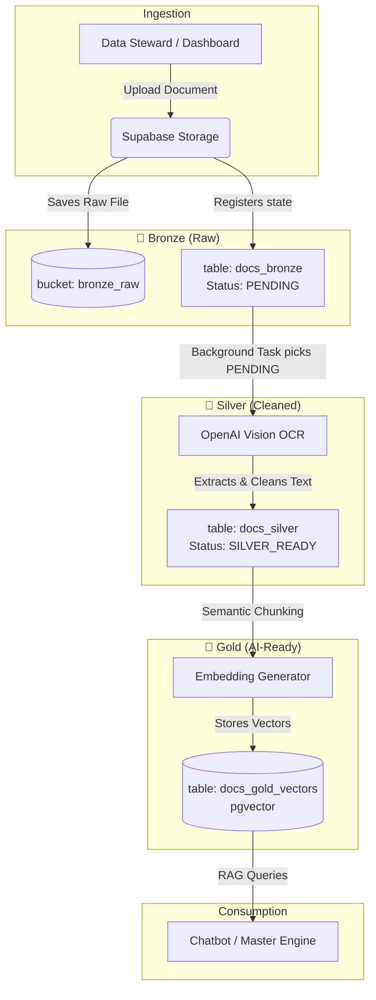

# Fase 4 - Data Lake & Auto-Vetorização (IMPLEMENTADO)

Pipeline Medallion Bronze → Silver → Gold com Supabase Storage, OpenAI Vision OCR e pgvector.

## Como usar

1. Aplique a migration: `supabase/migrations/20260605000000_phase4_data_lake.sql`
2. Habilite a extensão **pgvector** no Supabase Dashboard
3. Acesse `/admin/data-lake` no dashboard salão (somente dev + super_admin) ou use a API:
   - `POST /api/v1/lakehouse/upload` — upload multipart (max 10MB)
   - `POST /api/v1/lakehouse/sync` — reprocessar pendentes
   - `GET /api/v1/lakehouse/status` — contadores por camada
   - `POST /api/v1/lakehouse/search` — busca semântica RAG

## Mocks de desenvolvimento

Conteudo por vertical (salao, clinica odontologica, clinica medica):

```bash
python scripts/seed_dev.py
```

| Vertical | Organizacao | Exemplo de busca RAG |
|----------|-------------|----------------------|
| `salon` (MVP) | Salao Beauty Express (`22222222-...`) | "quanto custa corte feminino" |

Org de referência: `apps/salon/seeds/vertical_orgs.py`

## Proposed Changes

Aprovado o uso de uma **Arquitetura Medallion em Micro Escala** (estilo "Blacktail da Ada Wong" - precisa, letal e sem o peso do Databricks). O fluxo utilizará o ecossistema atual (Supabase + Python) dividido em camadas lógicas:

### 1. Mock Data Generation (Fase Inicial)
Mocks sintéticos para dev: `apps/salon/seeds/datalake_mocks/generate.py` (texto; usado por `scripts/seed_datalake.py`).

### 2. Pipeline de Dados (Micro-Databricks)



#### 🥉 Camada Bronze (Ingestão Raw)
- **O que faz:** Recebe o arquivo exatamente como ele é.
- **Como:** Upload via Dashboard (Data Steward).
- **Storage:** O PDF/Imagem é salvo no Supabase Storage (ex: bucket `bronze_raw`).
- **DB:** Um registro é criado na tabela `docs_bronze` com status `PENDING`.

#### 🥈 Camada Silver (Processamento & Limpeza)
- **O que faz:** Extrai o texto e limpa ruídos.
- **Como:** Uma rotina no backend pega os registros `PENDING` da camada Bronze e envia para o **OpenAI Vision (OCR)** (`gpt-4o`). O texto bruto retornado é limpo (remoção de caracteres inválidos, formatação Markdown consistente).
- **DB:** O texto limpo é salvo na tabela `docs_silver` (ou na mesma tabela com status `SILVER_READY`).

#### 🥇 Camada Gold (Vetorização & RAG-Ready)
- **O que faz:** Prepara o dado para consumo pela IA.
- **Como:** O texto da camada Silver é "chunkado" (dividido em parágrafos lógicos). Cada chunk é transformado em vetor via **`text-embedding-3-small`** (`EMBEDDING_MODEL_NAME`).
- **DB:** Salvo na tabela `docs_gold_vectors` utilizando o **pgvector** no Supabase. O Chatbot consumirá exclusivamente esta tabela.

### 3. Orquestração (Controle de Estado)
Em vez de usar Redis/Celery pesados, usaremos as **BackgroundTasks nativas** ou um **Cron Simples**, com o Supabase atuando como nosso controle de estado. Se um processamento falhar entre Bronze e Silver, o registro no banco continua como `PENDING` ou `ERROR`, permitindo reprocessamento fácil.

## Verification Plan

### Manual Verification
- Validar as opções escolhidas e responder às Open Questions acima.
